# GitHub Environment Deployment Protection Implementation Summary

## Overview

This document summarizes the implementation of GitHub Environment deployment protection rules for the HalluciFix application. The implementation provides comprehensive deployment protection across development, staging, and production environments with appropriate security controls, approval workflows, and monitoring capabilities.

## Implementation Components

### 1. Environment Configuration Files

**Location**: `.github/environments/`

- **`development.yml`**: Development environment configuration
- **`staging.yml`**: Staging environment configuration  
- **`production.yml`**: Production environment configuration

Each configuration file defines:
- Environment metadata (name, description, URL)
- Deployment protection rules (reviewers, wait timers, self-review prevention)
- Branch policies (allowed branches for deployment)
- Environment variables (non-sensitive configuration)
- Access control (team-based permissions)
- Validation requirements (required/optional secrets)
- Monitoring configuration (health checks, alerting)
- Audit and compliance settings

### 2. Application Scripts

**Location**: `.github/scripts/`

- **`apply-environment-configurations.js`**: Applies environment configurations to GitHub
- **`validate-environment-protection.js`**: Validates applied protection rules

### 3. Automation Workflows

**Location**: `.github/workflows/`

- **`apply-environment-protection.yml`**: Workflow to apply and validate environment protection rules
- **`deploy.yml`**: Updated deployment workflow that uses the configured environments

## Environment Protection Rules

### Development Environment

- **Auto Deploy**: ✅ Enabled (from `develop` branch)
- **Required Reviewers**: None
- **Wait Timer**: 0 minutes
- **Prevent Self Review**: No
- **Branch Policy**: Custom branches (`develop`, `feature/*`, `hotfix/*`)
- **Purpose**: Rapid development iteration with minimal barriers

### Staging Environment

- **Auto Deploy**: ❌ Disabled (manual approval required)
- **Required Reviewers**: staging-approvers, devops-team
- **Wait Timer**: 5 minutes
- **Prevent Self Review**: No
- **Branch Policy**: Protected branches (`main`, `develop`)
- **Purpose**: Pre-production validation with controlled access

### Production Environment

- **Auto Deploy**: ❌ Disabled (strict manual approval required)
- **Required Reviewers**: production-approvers, security-team, devops-lead
- **Wait Timer**: 30 minutes
- **Prevent Self Review**: ✅ Yes
- **Branch Policy**: Protected branches (`main` only)
- **Purpose**: Live production deployment with maximum security

## Security Features

### Access Control Matrix

| Role | Development | Staging | Production |
|------|-------------|---------|------------|
| Developers | Admin | Read | None |
| DevOps Team | Admin | Admin | Read |
| QA Team | Write | Read | None |
| Security Team | Read | Read | Admin |
| Production Approvers | None | Read | Admin |
| Compliance Team | None | None | Read |

### Secret Management

- Environment-specific secrets with validation patterns
- Security level classifications (low, medium, high, critical)
- Automatic rotation schedules
- Cross-environment isolation
- Pattern validation for critical secrets (e.g., Stripe keys)

### Audit and Compliance

- **Development**: 30-day retention, basic logging
- **Staging**: 90-day retention, comprehensive logging
- **Production**: 7-year retention, full audit trail

## Deployment Flow

```mermaid
graph TD
    A[Developer Push] --> B{Branch?}
    B -->|develop| C[Development Environment]
    B -->|main| D[Staging Environment]
    
    C --> C1[Auto Deploy ✅]
    C1 --> C2[Smoke Tests]
    C2 --> C3[Notify Dev Team]
    
    D --> D1[Manual Approval Required ⏳]
    D1 --> D2{Reviewers Approved?}
    D2 -->|No| D3[Wait for Approval]
    D3 --> D2
    D2 -->|Yes| D4[5 Min Wait Timer ⏱️]
    D4 --> D5[Deploy to Staging]
    D5 --> D6[Comprehensive Tests]
    D6 --> D7[Generate Report]
    D7 --> D8[Notify Staging Team]
    
    D8 --> E[Production Deployment Request]
    E --> E1[Multiple Approvals Required 👥]
    E1 --> E2{All Teams Approved?}
    E2 -->|No| E3[Wait for All Approvals]
    E3 --> E2
    E2 -->|Yes| E4[30 Min Wait Timer ⏱️]
    E4 --> E5[Business Hours Check 🕒]
    E5 --> E6[Deploy to Production]
    E6 --> E7[Critical Health Checks]
    E7 --> E8[Audit Logging]
    E8 --> E9[Notify All Teams]
```



## Monitoring and Alerting

### Development
- Basic health checks
- Slack notifications (#dev-deployments)
- Issue creation on failure

### Staging
- Comprehensive testing suite
- Performance monitoring
- Security scanning
- Slack notifications (#staging-deployments)
- Deployment reports

### Production
- Critical health checks
- Business metrics monitoring
- Security monitoring
- Payment processing validation
- Multi-channel notifications (Slack, Email, PagerDuty)
- Comprehensive audit logging
- Disaster recovery procedures

## Usage Instructions

### Applying Environment Configurations

1. **Manual Application**:
   ```bash
   # Apply all environments
   node .github/scripts/apply-environment-configurations.js
   
   # Validate configurations
   node .github/scripts/validate-environment-protection.js
   ```

2. **Automated Application**:
   - Trigger the "Apply Environment Protection Rules" workflow
   - Configurations are automatically applied when environment files are modified

### Updating Environment Configurations

1. Modify the appropriate YAML file in `.github/environments/`
2. Commit and push changes to trigger automatic application
3. Validate changes in development and staging before production

### Deployment Process

1. **Development**: Push to `develop` branch → automatic deployment
2. **Staging**: Push to `main` branch → manual approval required → deployment
3. **Production**: Manual workflow dispatch → multiple approvals → extended wait timer → deployment

## Compliance and Requirements Mapping

### Requirements Coverage

- **Requirement 4.1**: ✅ Separate environments defined (development, staging, production)
- **Requirement 4.2**: ✅ Manual approval required for production deployments
- **Requirement 4.3**: ✅ Designated reviewers configured for staging and production
- **Requirement 4.4**: ✅ Deployment protection rules with time-based restrictions
- **Requirement 4.5**: ✅ Audit logs maintained for all environment deployments

### Security Controls

- Branch protection rules enforced
- Multi-level approval workflows
- Wait timers for deployment safety
- Self-review prevention in production
- Comprehensive audit logging
- Access control based on environment sensitivity

## Maintenance and Updates

### Regular Tasks

- [ ] Weekly review of deployment metrics
- [ ] Monthly review of protection rules effectiveness
- [ ] Quarterly access control audit
- [ ] Annual disaster recovery testing

### Configuration Updates

To update environment protection rules:
1. Modify configuration files in `.github/environments/`
2. Run the "Apply Environment Protection Rules" workflow
3. Validate changes in development and staging
4. Apply to production with proper approvals

## Files Created/Modified

### New Files
- `.github/environments/development.yml`
- `.github/environments/staging.yml`
- `.github/environments/production.yml`
- `.github/scripts/apply-environment-configurations.js`
- `.github/scripts/validate-environment-protection.js`
- `.github/workflows/apply-environment-protection.yml`
- `.github/ENVIRONMENT_DEPLOYMENT_SUMMARY.md`

### Modified Files
- `.github/workflows/deploy.yml` (updated to use configured environments)

## Next Steps

1. **Configure Repository Secrets**: Set up environment-specific secrets as defined in the validation requirements
2. **Set Up Team Permissions**: Configure GitHub teams for reviewers (staging-approvers, production-approvers, security-team, devops-lead)
3. **Test Deployment Workflows**: Validate the deployment process in each environment
4. **Set Up Monitoring**: Configure health check endpoints and monitoring systems
5. **Train Team Members**: Ensure team members understand the new approval workflows

## Support and Troubleshooting

### Common Issues

1. **Environment Not Found**: Run the apply-environment-configurations script
2. **Approval Timeout**: Check reviewer availability and escalation procedures
3. **Validation Failures**: Review secret requirements and configuration patterns
4. **Access Denied**: Verify team membership and permissions

### Getting Help

- Review the generated validation reports in `.github/reports/`
- Check workflow logs for detailed error messages
- Consult the environment configuration documentation
- Contact the DevOps team for assistance

---

*Implementation completed: October 27, 2025*
*Status: ✅ All subtasks completed successfully*
*Compliance: ✅ All requirements met*