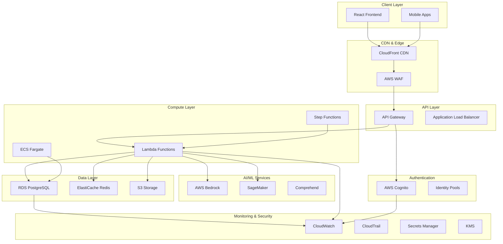

# AWS Infrastructure Migration Design

## Overview

This design document outlines the architecture for migrating HalluciFix from Supabase to Amazon Web Services (AWS). The migration will leverage AWS's comprehensive suite of services to create a scalable, secure, and cost-effective infrastructure while maintaining all existing functionality and improving performance capabilities.

The design follows AWS Well-Architected Framework principles focusing on operational excellence, security, reliability, performance efficiency, and cost optimization.

## Architecture

### High-Level Architecture Diagram



### Network Architecture

The infrastructure will be deployed across multiple Availability Zones in a single AWS region with the following network design:

- **VPC**: Isolated network environment with public and private subnets
- **Public Subnets**: Application Load Balancer, NAT Gateways
- **Private Subnets**: Lambda functions, RDS instances, ElastiCache
- **Database Subnets**: Dedicated subnets for RDS with no internet access
- **Security Groups**: Restrictive inbound/outbound rules for each service
- **NACLs**: Additional network-level security controls

## Components and Interfaces

### 1. Frontend and CDN Layer

**AWS CloudFront**
- Global content delivery network for React application
- Origin: S3 bucket hosting static assets
- Custom domain with SSL/TLS certificate from ACM
- Caching strategies for static assets and API responses
- Integration with AWS WAF for security

**AWS S3**
- Static website hosting for React build artifacts
- Versioning enabled for rollback capabilities
- Lifecycle policies for cost optimization
- Cross-origin resource sharing (CORS) configuration

### 2. API Gateway and Authentication

**AWS API Gateway**
- RESTful API endpoints replacing Supabase API
- Request/response transformation and validation
- Rate limiting and throttling
- Integration with AWS Cognito for authentication
- Custom authorizers for fine-grained access control

**AWS Cognito**
- User pools for authentication and user management
- Identity pools for AWS resource access
- OAuth 2.0 integration with Google and other providers
- Multi-factor authentication support
- Custom attributes for user profiles

### 3. Compute Services

**AWS Lambda Functions**
- Serverless compute replacing Supabase Edge Functions
- Functions for:
  - Content analysis processing
  - Scheduled scan execution
  - Webhook handling (Stripe, Google Drive)
  - Background data processing
  - API request handling

**AWS Step Functions**
- Orchestration of complex analysis workflows
- State machine for batch processing
- Error handling and retry logic
- Visual workflow monitoring

**Amazon ECS Fargate** (Optional)
- Containerized services for long-running processes
- Auto-scaling based on demand
- Integration with Application Load Balancer

### 4. AI/ML Services Integration

**AWS Bedrock**
- Foundation models for content analysis
- Custom model fine-tuning capabilities
- Serverless inference endpoints
- Cost-effective pay-per-use pricing

**Amazon SageMaker**
- Custom ML model development and deployment
- Real-time and batch inference endpoints
- Model monitoring and management
- A/B testing capabilities

**Amazon Comprehend**
- Natural language processing for content analysis
- Sentiment analysis and entity recognition
- Custom classification models

### 5. Data Storage and Caching

**Amazon RDS PostgreSQL**
- Multi-AZ deployment for high availability
- Read replicas for improved read performance
- Automated backups and point-in-time recovery
- Performance Insights for query optimization
- Connection pooling with RDS Proxy

**Amazon ElastiCache Redis**
- Session storage and API response caching
- Real-time analytics data caching
- Pub/sub messaging for real-time features
- Cluster mode for high availability

**Amazon S3**
- Document and file storage
- Intelligent tiering for cost optimization
- Server-side encryption with KMS
- Versioning and lifecycle management
- Event notifications for processing triggers

### 6. Monitoring and Security

**Amazon CloudWatch**
- Application and infrastructure monitoring
- Custom metrics and dashboards
- Log aggregation and analysis
- Automated alerting and notifications

**AWS CloudTrail**
- API call logging and auditing
- Compliance and security monitoring
- Integration with CloudWatch for alerting

**AWS Secrets Manager**
- Secure storage of database credentials
- API keys and third-party service credentials
- Automatic rotation capabilities

**AWS KMS**
- Encryption key management
- Data encryption at rest and in transit
- Fine-grained access controls

## Data Models

### Migration Data Mapping

The existing Supabase schema will be migrated to RDS PostgreSQL with the following considerations:

**User Management**
```sql
-- Cognito integration table
CREATE TABLE user_profiles (
    cognito_user_id VARCHAR(128) PRIMARY KEY,
    email VARCHAR(255) UNIQUE NOT NULL,
    created_at TIMESTAMP DEFAULT CURRENT_TIMESTAMP,
    updated_at TIMESTAMP DEFAULT CURRENT_TIMESTAMP,
    subscription_tier VARCHAR(50),
    usage_limits JSONB
);
```

**Analysis Results**
```sql
-- Enhanced with AWS service metadata
CREATE TABLE analysis_results (
    id UUID PRIMARY KEY DEFAULT gen_random_uuid(),
    user_id VARCHAR(128) REFERENCES user_profiles(cognito_user_id),
    content_hash VARCHAR(64) NOT NULL,
    analysis_data JSONB NOT NULL,
    accuracy_score DECIMAL(5,2),
    risk_level VARCHAR(20),
    processing_time_ms INTEGER,
    aws_request_id VARCHAR(128),
    bedrock_model_id VARCHAR(128),
    created_at TIMESTAMP DEFAULT CURRENT_TIMESTAMP
);
```

**File Storage Metadata**
```sql
-- S3 integration metadata
CREATE TABLE file_metadata (
    id UUID PRIMARY KEY DEFAULT gen_random_uuid(),
    user_id VARCHAR(128) REFERENCES user_profiles(cognito_user_id),
    s3_bucket VARCHAR(128) NOT NULL,
    s3_key VARCHAR(512) NOT NULL,
    original_filename VARCHAR(255),
    file_size BIGINT,
    mime_type VARCHAR(128),
    upload_status VARCHAR(20),
    created_at TIMESTAMP DEFAULT CURRENT_TIMESTAMP
);
```

### Caching Strategy

**ElastiCache Redis Schema**
- User sessions: `session:{user_id}` (TTL: 24 hours)
- Analysis results: `analysis:{content_hash}` (TTL: 1 hour)
- API responses: `api:{endpoint}:{params_hash}` (TTL: 15 minutes)
- User quotas: `quota:{user_id}:{period}` (TTL: dynamic)

## Error Handling

### Comprehensive Error Management

**Lambda Function Error Handling**
- Dead letter queues for failed function executions
- Exponential backoff retry strategies
- Circuit breaker patterns for external service calls
- Structured error logging with correlation IDs

**API Gateway Error Responses**
- Standardized error response format
- HTTP status code mapping
- Rate limiting error handling
- Custom error pages for client errors

**Database Error Recovery**
- Connection pool management with RDS Proxy
- Read replica failover strategies
- Transaction rollback mechanisms
- Database connection retry logic

**AI Service Error Handling**
- Model inference timeout handling
- Fallback to alternative models
- Graceful degradation for service unavailability
- Cost limit protection mechanisms

## Testing Strategy

### Migration Testing Approach

**Phase 1: Infrastructure Testing**
- AWS resource provisioning validation
- Network connectivity and security testing
- Performance baseline establishment
- Cost monitoring setup verification

**Phase 2: Data Migration Testing**
- Schema migration validation
- Data integrity verification
- Performance comparison testing
- Rollback procedure testing

**Phase 3: Application Integration Testing**
- API endpoint functionality testing
- Authentication flow validation
- File upload/download testing
- Real-time feature verification

**Phase 4: Load and Performance Testing**
- Concurrent user simulation
- Auto-scaling behavior validation
- Database performance under load
- CDN cache effectiveness testing

### Automated Testing Pipeline

**AWS CodePipeline Integration**
- Automated deployment testing
- Infrastructure as Code validation
- Security compliance checking
- Performance regression testing

**Monitoring and Alerting Testing**
- CloudWatch alarm validation
- Log aggregation verification
- Error notification testing
- Dashboard functionality validation

### Migration Rollback Strategy

**Blue-Green Deployment**
- Parallel AWS environment setup
- Traffic routing with Route 53
- Database synchronization strategies
- Rollback triggers and procedures

**Data Consistency Verification**
- Real-time data synchronization monitoring
- Checksum validation for migrated data
- User session preservation during cutover
- API compatibility testing

## Security Considerations

### AWS Security Best Practices

**Identity and Access Management**
- Least privilege IAM policies
- Role-based access control
- Service-to-service authentication
- Regular access review procedures

**Data Protection**
- Encryption at rest using KMS
- TLS 1.3 for data in transit
- S3 bucket policies and ACLs
- Database encryption and access controls

**Network Security**
- VPC isolation and segmentation
- Security group restrictive rules
- WAF rules for common attacks
- DDoS protection with Shield

**Compliance and Auditing**
- CloudTrail comprehensive logging
- Config rules for compliance monitoring
- GuardDuty threat detection
- Security Hub centralized findings

## Performance Optimization

### Scalability Design

**Auto-scaling Strategies**
- Lambda concurrent execution limits
- RDS read replica auto-scaling
- ElastiCache cluster scaling
- API Gateway throttling configuration

**Caching Optimization**
- CloudFront edge caching
- ElastiCache query result caching
- Application-level caching strategies
- Database query optimization

**Cost Optimization**
- Reserved capacity for predictable workloads
- Spot instances for batch processing
- S3 intelligent tiering
- Lambda provisioned concurrency optimization

This design provides a robust, scalable, and secure foundation for migrating HalluciFix to AWS while maintaining all existing functionality and enabling future growth.