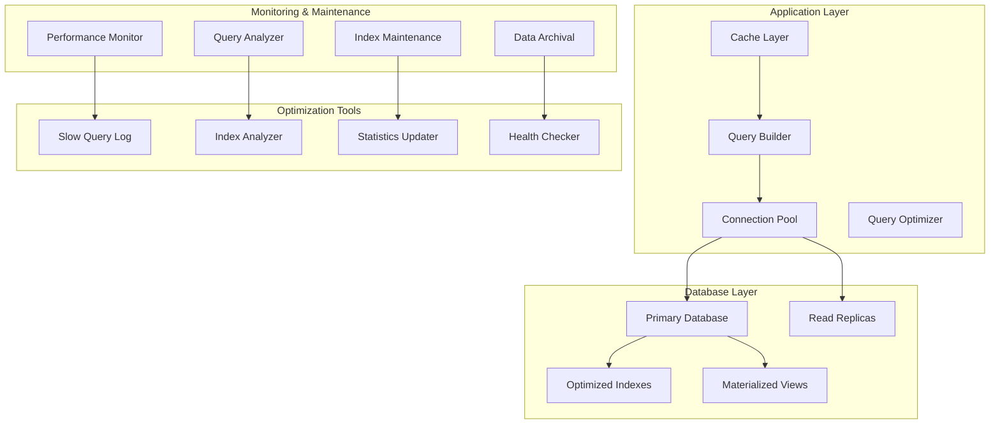
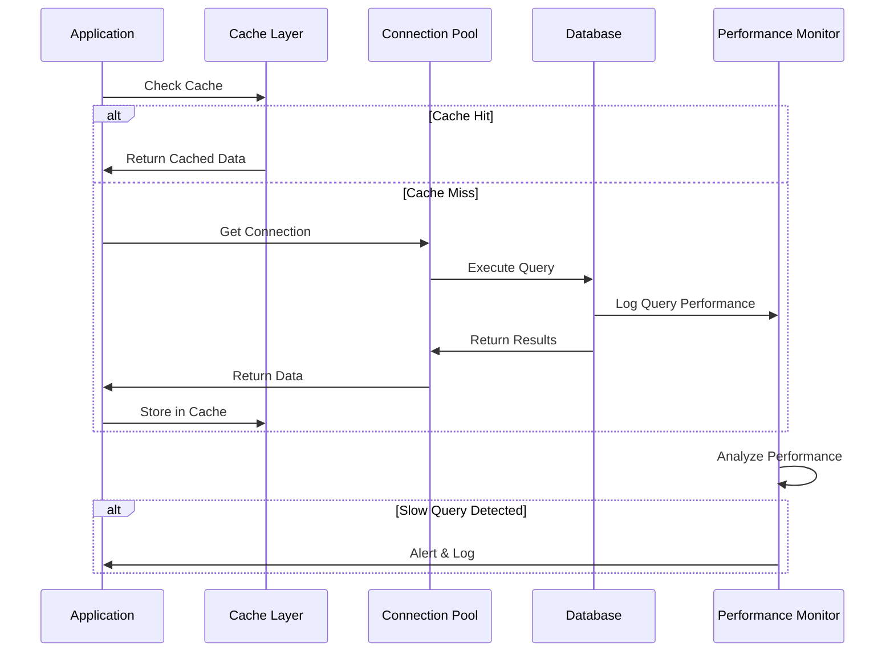

# Design Document

## Overview

This design outlines a comprehensive database optimization strategy that ensures high performance, scalability, and maintainability through proper indexing, query optimization, monitoring, and automated maintenance. The system will support large-scale usage while maintaining fast response times and providing proactive performance management.

## Architecture

### Database Optimization Architecture



### Query Performance Flow



## Components and Interfaces

### 1. Database Schema Optimization

#### Optimized Table Structures
```sql
-- Users table with optimized indexes
CREATE TABLE users (
    id UUID PRIMARY KEY DEFAULT gen_random_uuid(),
    email VARCHAR(255) NOT NULL UNIQUE,
    name VARCHAR(255) NOT NULL,
    role_id VARCHAR(50) NOT NULL,
    status VARCHAR(20) NOT NULL DEFAULT 'active',
    created_at TIMESTAMP WITH TIME ZONE DEFAULT NOW(),
    updated_at TIMESTAMP WITH TIME ZONE DEFAULT NOW(),
    last_active TIMESTAMP WITH TIME ZONE DEFAULT NOW()
);

-- Optimized indexes for users table
CREATE INDEX CONCURRENTLY idx_users_email ON users(email);
CREATE INDEX CONCURRENTLY idx_users_status ON users(status);
CREATE INDEX CONCURRENTLY idx_users_role_status ON users(role_id, status);
CREATE INDEX CONCURRENTLY idx_users_created_at ON users(created_at);
CREATE INDEX CONCURRENTLY idx_users_last_active ON users(last_active);

-- Analysis results table with partitioning consideration
CREATE TABLE analysis_results (
    id UUID PRIMARY KEY DEFAULT gen_random_uuid(),
    user_id UUID NOT NULL REFERENCES users(id) ON DELETE CASCADE,
    content TEXT NOT NULL,
    content_hash VARCHAR(64) NOT NULL, -- For deduplication
    accuracy DECIMAL(5,2) NOT NULL,
    risk_level VARCHAR(20) NOT NULL,
    hallucinations JSONB DEFAULT '[]',
    verification_sources INTEGER DEFAULT 0,
    processing_time INTEGER NOT NULL,
    analysis_type VARCHAR(20) NOT NULL DEFAULT 'single',
    filename VARCHAR(255),
    created_at TIMESTAMP WITH TIME ZONE DEFAULT NOW(),
    
    -- Add constraints for data integrity
    CONSTRAINT chk_accuracy CHECK (accuracy >= 0 AND accuracy <= 100),
    CONSTRAINT chk_risk_level CHECK (risk_level IN ('low', 'medium', 'high', 'critical')),
    CONSTRAINT chk_processing_time CHECK (processing_time > 0)
);

-- Comprehensive indexing strategy for analysis_results
CREATE INDEX CONCURRENTLY idx_analysis_results_user_id ON analysis_results(user_id);
CREATE INDEX CONCURRENTLY idx_analysis_results_created_at ON analysis_results(created_at DESC);
CREATE INDEX CONCURRENTLY idx_analysis_results_risk_level ON analysis_results(risk_level);
CREATE INDEX CONCURRENTLY idx_analysis_results_accuracy ON analysis_results(accuracy);
CREATE INDEX CONCURRENTLY idx_analysis_results_content_hash ON analysis_results(content_hash);

-- Composite indexes for common query patterns
CREATE INDEX CONCURRENTLY idx_analysis_results_user_date 
ON analysis_results(user_id, created_at DESC);

CREATE INDEX CONCURRENTLY idx_analysis_results_user_risk 
ON analysis_results(user_id, risk_level, created_at DESC);

CREATE INDEX CONCURRENTLY idx_analysis_results_user_accuracy 
ON analysis_results(user_id, accuracy DESC, created_at DESC);

-- Full-text search index for content
ALTER TABLE analysis_results 
ADD COLUMN content_search tsvector 
GENERATED ALWAYS AS (to_tsvector('english', content)) STORED;

CREATE INDEX CONCURRENTLY idx_analysis_results_content_search 
ON analysis_results USING GIN(content_search);

-- JSON indexes for hallucinations
CREATE INDEX CONCURRENTLY idx_analysis_results_hallucinations 
ON analysis_results USING GIN(hallucinations);

-- Partial indexes for active data
CREATE INDEX CONCURRENTLY idx_analysis_results_recent 
ON analysis_results(user_id, created_at DESC) 
WHERE created_at > NOW() - INTERVAL '30 days';
```

#### Table Partitioning Strategy
```sql
-- Partition analysis_results by date for better performance
CREATE TABLE analysis_results_partitioned (
    LIKE analysis_results INCLUDING ALL
) PARTITION BY RANGE (created_at);

-- Create monthly partitions
CREATE TABLE analysis_results_2024_01 PARTITION OF analysis_results_partitioned
FOR VALUES FROM ('2024-01-01') TO ('2024-02-01');

CREATE TABLE analysis_results_2024_02 PARTITION OF analysis_results_partitioned
FOR VALUES FROM ('2024-02-01') TO ('2024-03-01');

-- Function to automatically create new partitions
CREATE OR REPLACE FUNCTION create_monthly_partition(table_name TEXT, start_date DATE)
RETURNS VOID AS $$
DECLARE
    partition_name TEXT;
    end_date DATE;
BEGIN
    partition_name := table_name || '_' || to_char(start_date, 'YYYY_MM');
    end_date := start_date + INTERVAL '1 month';
    
    EXECUTE format('CREATE TABLE %I PARTITION OF %I FOR VALUES FROM (%L) TO (%L)',
                   partition_name, table_name, start_date, end_date);
    
    -- Create indexes on the new partition
    EXECUTE format('CREATE INDEX CONCURRENTLY %I ON %I(user_id, created_at DESC)',
                   'idx_' || partition_name || '_user_date', partition_name);
END;
$$ LANGUAGE plpgsql;
```

### 2. Query Optimization Framework

#### Query Builder with Optimization
```typescript
interface QueryOptions {
  select?: string[];
  where?: Record<string, any>;
  orderBy?: { column: string; direction: 'ASC' | 'DESC' }[];
  limit?: number;
  offset?: number;
  cursor?: string;
  include?: string[];
}

class OptimizedQueryBuilder {
  private tableName: string;
  private supabase: SupabaseClient;

  constructor(tableName: string, supabase: SupabaseClient) {
    this.tableName = tableName;
    this.supabase = supabase;
  }

  // Cursor-based pagination for better performance
  async findWithCursor(options: QueryOptions): Promise<{
    data: any[];
    nextCursor?: string;
    hasMore: boolean;
  }> {
    let query = this.supabase.from(this.tableName);

    // Select specific columns to reduce data transfer
    if (options.select) {
      query = query.select(options.select.join(','));
    } else {
      query = query.select('*');
    }

    // Apply where conditions
    if (options.where) {
      Object.entries(options.where).forEach(([key, value]) => {
        if (Array.isArray(value)) {
          query = query.in(key, value);
        } else if (typeof value === 'object' && value.operator) {
          query = query.filter(key, value.operator, value.value);
        } else {
          query = query.eq(key, value);
        }
      });
    }

    // Cursor-based pagination
    if (options.cursor) {
      query = query.lt('created_at', options.cursor);
    }

    // Order by (always include created_at for cursor pagination)
    if (options.orderBy) {
      options.orderBy.forEach(({ column, direction }) => {
        query = query.order(column, { ascending: direction === 'ASC' });
      });
    } else {
      query = query.order('created_at', { ascending: false });
    }

    // Limit (fetch one extra to determine if there are more results)
    const limit = options.limit || 20;
    query = query.limit(limit + 1);

    const { data, error } = await query;

    if (error) {
      throw error;
    }

    const hasMore = data.length > limit;
    const results = hasMore ? data.slice(0, limit) : data;
    const nextCursor = hasMore ? results[results.length - 1].created_at : undefined;

    return {
      data: results,
      nextCursor,
      hasMore
    };
  }

  // Optimized aggregation queries
  async getAggregatedData(
    userId: string,
    timeRange: { start: Date; end: Date }
  ): Promise<{
    totalAnalyses: number;
    averageAccuracy: number;
    riskDistribution: Record<string, number>;
    dailyTrends: Array<{ date: string; count: number; avgAccuracy: number }>;
  }> {
    // Use a single query with multiple aggregations
    const { data, error } = await this.supabase.rpc('get_user_analytics', {
      p_user_id: userId,
      p_start_date: timeRange.start.toISOString(),
      p_end_date: timeRange.end.toISOString()
    });

    if (error) {
      throw error;
    }

    return data;
  }

  // Batch operations for better performance
  async batchInsert(records: any[], batchSize: number = 1000): Promise<void> {
    for (let i = 0; i < records.length; i += batchSize) {
      const batch = records.slice(i, i + batchSize);
      
      const { error } = await this.supabase
        .from(this.tableName)
        .insert(batch);

      if (error) {
        throw error;
      }
    }
  }
}
```

#### Materialized Views for Analytics
```sql
-- Create materialized view for user analytics
CREATE MATERIALIZED VIEW user_analytics_summary AS
SELECT 
    user_id,
    COUNT(*) as total_analyses,
    AVG(accuracy) as avg_accuracy,
    COUNT(CASE WHEN risk_level = 'low' THEN 1 END) as low_risk_count,
    COUNT(CASE WHEN risk_level = 'medium' THEN 1 END) as medium_risk_count,
    COUNT(CASE WHEN risk_level = 'high' THEN 1 END) as high_risk_count,
    COUNT(CASE WHEN risk_level = 'critical' THEN 1 END) as critical_risk_count,
    MAX(created_at) as last_analysis_date,
    MIN(created_at) as first_analysis_date
FROM analysis_results
GROUP BY user_id;

-- Create unique index on materialized view
CREATE UNIQUE INDEX idx_user_analytics_summary_user_id 
ON user_analytics_summary(user_id);

-- Create function to refresh materialized view
CREATE OR REPLACE FUNCTION refresh_user_analytics()
RETURNS void AS $$
BEGIN
    REFRESH MATERIALIZED VIEW CONCURRENTLY user_analytics_summary;
END;
$$ LANGUAGE plpgsql;

-- Schedule automatic refresh (using pg_cron extension)
SELECT cron.schedule('refresh-user-analytics', '0 */6 * * *', 'SELECT refresh_user_analytics();');

-- Create daily analytics materialized view
CREATE MATERIALIZED VIEW daily_analytics AS
SELECT 
    DATE(created_at) as analysis_date,
    COUNT(*) as total_analyses,
    AVG(accuracy) as avg_accuracy,
    COUNT(DISTINCT user_id) as active_users,
    AVG(processing_time) as avg_processing_time
FROM analysis_results
WHERE created_at >= CURRENT_DATE - INTERVAL '90 days'
GROUP BY DATE(created_at)
ORDER BY analysis_date DESC;

CREATE UNIQUE INDEX idx_daily_analytics_date ON daily_analytics(analysis_date);
```

### 3. Performance Monitoring System

#### Query Performance Monitor
```typescript
interface QueryMetrics {
  query: string;
  executionTime: number;
  rowsReturned: number;
  timestamp: Date;
  userId?: string;
  endpoint?: string;
}

class DatabasePerformanceMonitor {
  private metrics: QueryMetrics[] = [];
  private slowQueryThreshold: number = 1000; // 1 second

  async trackQuery<T>(
    queryName: string,
    queryFn: () => Promise<T>,
    context?: { userId?: string; endpoint?: string }
  ): Promise<T> {
    const startTime = Date.now();
    
    try {
      const result = await queryFn();
      const executionTime = Date.now() - startTime;
      
      // Log slow queries
      if (executionTime > this.slowQueryThreshold) {
        console.warn(`Slow query detected: ${queryName} took ${executionTime}ms`);
        
        // Send to monitoring service
        await this.reportSlowQuery({
          query: queryName,
          executionTime,
          rowsReturned: Array.isArray(result) ? result.length : 1,
          timestamp: new Date(),
          ...context
        });
      }
      
      // Store metrics for analysis
      this.metrics.push({
        query: queryName,
        executionTime,
        rowsReturned: Array.isArray(result) ? result.length : 1,
        timestamp: new Date(),
        ...context
      });
      
      return result;
    } catch (error) {
      const executionTime = Date.now() - startTime;
      
      // Log failed queries
      console.error(`Query failed: ${queryName} after ${executionTime}ms`, error);
      
      throw error;
    }
  }

  private async reportSlowQuery(metrics: QueryMetrics): Promise<void> {
    // Send to external monitoring service
    if (config.monitoring.datadog?.apiKey) {
      await this.sendToDatadog(metrics);
    }
    
    // Store in database for analysis
    await this.storeMetrics(metrics);
  }

  private async sendToDatadog(metrics: QueryMetrics): Promise<void> {
    const payload = {
      series: [
        {
          metric: 'database.query.execution_time',
          points: [[Math.floor(metrics.timestamp.getTime() / 1000), metrics.executionTime]],
          tags: [
            `query:${metrics.query}`,
            `user_id:${metrics.userId || 'unknown'}`,
            `endpoint:${metrics.endpoint || 'unknown'}`
          ]
        }
      ]
    };

    await fetch('https://api.datadoghq.com/api/v1/series', {
      method: 'POST',
      headers: {
        'Content-Type': 'application/json',
        'DD-API-KEY': config.monitoring.datadog.apiKey
      },
      body: JSON.stringify(payload)
    });
  }

  private async storeMetrics(metrics: QueryMetrics): Promise<void> {
    await supabase.from('query_performance_log').insert({
      query_name: metrics.query,
      execution_time: metrics.executionTime,
      rows_returned: metrics.rowsReturned,
      user_id: metrics.userId,
      endpoint: metrics.endpoint,
      timestamp: metrics.timestamp
    });
  }

  getPerformanceReport(): {
    slowQueries: QueryMetrics[];
    averageExecutionTime: number;
    totalQueries: number;
  } {
    const slowQueries = this.metrics.filter(m => m.executionTime > this.slowQueryThreshold);
    const averageExecutionTime = this.metrics.reduce((sum, m) => sum + m.executionTime, 0) / this.metrics.length;
    
    return {
      slowQueries,
      averageExecutionTime,
      totalQueries: this.metrics.length
    };
  }
}

export const dbMonitor = new DatabasePerformanceMonitor();
```

#### Database Health Checker
```typescript
interface HealthCheckResult {
  status: 'healthy' | 'warning' | 'critical';
  checks: {
    connection: boolean;
    queryPerformance: boolean;
    indexUsage: boolean;
    diskSpace: boolean;
    connectionPool: boolean;
  };
  metrics: {
    avgQueryTime: number;
    activeConnections: number;
    indexHitRatio: number;
    diskUsagePercent: number;
  };
  recommendations: string[];
}

class DatabaseHealthChecker {
  async performHealthCheck(): Promise<HealthCheckResult> {
    const checks = {
      connection: await this.checkConnection(),
      queryPerformance: await this.checkQueryPerformance(),
      indexUsage: await this.checkIndexUsage(),
      diskSpace: await this.checkDiskSpace(),
      connectionPool: await this.checkConnectionPool()
    };

    const metrics = await this.collectMetrics();
    const recommendations = this.generateRecommendations(checks, metrics);
    
    const status = this.determineOverallStatus(checks, metrics);

    return {
      status,
      checks,
      metrics,
      recommendations
    };
  }

  private async checkConnection(): Promise<boolean> {
    try {
      const { data, error } = await supabase
        .from('users')
        .select('count')
        .limit(1);
      return !error;
    } catch {
      return false;
    }
  }

  private async checkQueryPerformance(): Promise<boolean> {
    const report = dbMonitor.getPerformanceReport();
    return report.averageExecutionTime < 500; // 500ms threshold
  }

  private async checkIndexUsage(): Promise<boolean> {
    try {
      const { data } = await supabase.rpc('get_index_usage_stats');
      const indexHitRatio = data?.[0]?.index_hit_ratio || 0;
      return indexHitRatio > 0.95; // 95% index hit ratio
    } catch {
      return false;
    }
  }

  private async checkDiskSpace(): Promise<boolean> {
    try {
      const { data } = await supabase.rpc('get_disk_usage');
      const diskUsage = data?.[0]?.disk_usage_percent || 0;
      return diskUsage < 80; // 80% disk usage threshold
    } catch {
      return true; // Assume OK if we can't check
    }
  }

  private async checkConnectionPool(): Promise<boolean> {
    try {
      const { data } = await supabase.rpc('get_connection_stats');
      const activeConnections = data?.[0]?.active_connections || 0;
      const maxConnections = data?.[0]?.max_connections || 100;
      return (activeConnections / maxConnections) < 0.8; // 80% pool usage
    } catch {
      return true;
    }
  }

  private async collectMetrics(): Promise<HealthCheckResult['metrics']> {
    const report = dbMonitor.getPerformanceReport();
    
    const { data: indexData } = await supabase.rpc('get_index_usage_stats');
    const { data: diskData } = await supabase.rpc('get_disk_usage');
    const { data: connectionData } = await supabase.rpc('get_connection_stats');

    return {
      avgQueryTime: report.averageExecutionTime,
      activeConnections: connectionData?.[0]?.active_connections || 0,
      indexHitRatio: indexData?.[0]?.index_hit_ratio || 0,
      diskUsagePercent: diskData?.[0]?.disk_usage_percent || 0
    };
  }

  private generateRecommendations(
    checks: HealthCheckResult['checks'],
    metrics: HealthCheckResult['metrics']
  ): string[] {
    const recommendations: string[] = [];

    if (!checks.queryPerformance) {
      recommendations.push('Consider optimizing slow queries or adding indexes');
    }

    if (!checks.indexUsage) {
      recommendations.push('Review and optimize database indexes');
    }

    if (!checks.diskSpace) {
      recommendations.push('Archive old data or increase disk space');
    }

    if (!checks.connectionPool) {
      recommendations.push('Consider increasing connection pool size');
    }

    if (metrics.avgQueryTime > 1000) {
      recommendations.push('Investigate and optimize queries taking over 1 second');
    }

    return recommendations;
  }

  private determineOverallStatus(
    checks: HealthCheckResult['checks'],
    metrics: HealthCheckResult['metrics']
  ): HealthCheckResult['status'] {
    const failedChecks = Object.values(checks).filter(check => !check).length;
    
    if (failedChecks === 0 && metrics.avgQueryTime < 200) {
      return 'healthy';
    } else if (failedChecks <= 1 && metrics.avgQueryTime < 1000) {
      return 'warning';
    } else {
      return 'critical';
    }
  }
}

export const healthChecker = new DatabaseHealthChecker();
```

### 4. Automated Maintenance System

#### Database Maintenance Scheduler
```sql
-- Create maintenance functions
CREATE OR REPLACE FUNCTION perform_database_maintenance()
RETURNS void AS $$
BEGIN
    -- Update table statistics
    ANALYZE;
    
    -- Reindex if needed (check for index bloat first)
    PERFORM reindex_if_needed();
    
    -- Clean up old data
    PERFORM cleanup_old_data();
    
    -- Refresh materialized views
    PERFORM refresh_materialized_views();
    
    -- Log maintenance completion
    INSERT INTO maintenance_log (operation, completed_at, status)
    VALUES ('full_maintenance', NOW(), 'completed');
END;
$$ LANGUAGE plpgsql;

CREATE OR REPLACE FUNCTION reindex_if_needed()
RETURNS void AS $$
DECLARE
    index_record RECORD;
BEGIN
    -- Check for indexes with high bloat
    FOR index_record IN
        SELECT schemaname, tablename, indexname
        FROM pg_stat_user_indexes
        WHERE idx_scan < 100 -- Low usage indexes
        OR pg_relation_size(indexrelid) > 100 * 1024 * 1024 -- Large indexes
    LOOP
        -- Reindex concurrently to avoid blocking
        EXECUTE format('REINDEX INDEX CONCURRENTLY %I.%I',
                      index_record.schemaname, index_record.indexname);
    END LOOP;
END;
$$ LANGUAGE plpgsql;

CREATE OR REPLACE FUNCTION cleanup_old_data()
RETURNS void AS $$
BEGIN
    -- Archive analysis results older than 2 years
    INSERT INTO analysis_results_archive
    SELECT * FROM analysis_results
    WHERE created_at < NOW() - INTERVAL '2 years';
    
    -- Delete archived data from main table
    DELETE FROM analysis_results
    WHERE created_at < NOW() - INTERVAL '2 years';
    
    -- Clean up old query performance logs
    DELETE FROM query_performance_log
    WHERE timestamp < NOW() - INTERVAL '30 days';
    
    -- Clean up old maintenance logs
    DELETE FROM maintenance_log
    WHERE completed_at < NOW() - INTERVAL '90 days';
END;
$$ LANGUAGE plpgsql;

CREATE OR REPLACE FUNCTION refresh_materialized_views()
RETURNS void AS $$
BEGIN
    -- Refresh user analytics summary
    REFRESH MATERIALIZED VIEW CONCURRENTLY user_analytics_summary;
    
    -- Refresh daily analytics
    REFRESH MATERIALIZED VIEW CONCURRENTLY daily_analytics;
    
    -- Log refresh completion
    INSERT INTO maintenance_log (operation, completed_at, status)
    VALUES ('refresh_materialized_views', NOW(), 'completed');
END;
$$ LANGUAGE plpgsql;

-- Schedule maintenance tasks
SELECT cron.schedule('daily-maintenance', '0 2 * * *', 'SELECT perform_database_maintenance();');
SELECT cron.schedule('hourly-stats-update', '0 * * * *', 'ANALYZE analysis_results;');
SELECT cron.schedule('weekly-vacuum', '0 3 * * 0', 'VACUUM ANALYZE;');
```

#### Connection Pool Optimization
```typescript
interface ConnectionPoolConfig {
  min: number;
  max: number;
  acquireTimeoutMillis: number;
  idleTimeoutMillis: number;
  reapIntervalMillis: number;
}

class OptimizedConnectionPool {
  private config: ConnectionPoolConfig;
  private pool: any; // Actual pool implementation

  constructor(config: ConnectionPoolConfig) {
    this.config = {
      min: 2,
      max: 20,
      acquireTimeoutMillis: 30000,
      idleTimeoutMillis: 300000,
      reapIntervalMillis: 1000,
      ...config
    };
    
    this.initializePool();
  }

  private initializePool(): void {
    // Configure Supabase connection pool
    const supabaseConfig = {
      db: {
        pool: {
          min: this.config.min,
          max: this.config.max,
          acquireTimeoutMillis: this.config.acquireTimeoutMillis,
          idleTimeoutMillis: this.config.idleTimeoutMillis,
          reapIntervalMillis: this.config.reapIntervalMillis
        }
      }
    };

    // Apply configuration to Supabase client
    this.pool = createClient(
      config.database.supabaseUrl,
      config.database.supabaseAnonKey,
      supabaseConfig
    );
  }

  async getPoolStats(): Promise<{
    totalConnections: number;
    idleConnections: number;
    activeConnections: number;
    waitingClients: number;
  }> {
    // Get pool statistics
    const stats = await this.pool.rpc('get_connection_pool_stats');
    return stats.data[0] || {
      totalConnections: 0,
      idleConnections: 0,
      activeConnections: 0,
      waitingClients: 0
    };
  }

  async optimizePoolSize(): Promise<void> {
    const stats = await this.getPoolStats();
    
    // Adjust pool size based on usage patterns
    if (stats.waitingClients > 0 && stats.totalConnections < this.config.max) {
      // Increase pool size if clients are waiting
      this.config.max = Math.min(this.config.max + 2, 50);
    } else if (stats.idleConnections > this.config.max * 0.5) {
      // Decrease pool size if too many idle connections
      this.config.max = Math.max(this.config.max - 1, this.config.min);
    }
    
    // Reinitialize pool with new configuration
    this.initializePool();
  }
}
```

## Data Models

### Performance Monitoring Schema
```sql
-- Query performance logging table
CREATE TABLE query_performance_log (
    id UUID PRIMARY KEY DEFAULT gen_random_uuid(),
    query_name VARCHAR(255) NOT NULL,
    execution_time INTEGER NOT NULL,
    rows_returned INTEGER,
    user_id UUID REFERENCES users(id),
    endpoint VARCHAR(255),
    timestamp TIMESTAMP WITH TIME ZONE DEFAULT NOW()
);

CREATE INDEX idx_query_performance_log_timestamp ON query_performance_log(timestamp);
CREATE INDEX idx_query_performance_log_query_name ON query_performance_log(query_name);
CREATE INDEX idx_query_performance_log_execution_time ON query_performance_log(execution_time);

-- Maintenance log table
CREATE TABLE maintenance_log (
    id UUID PRIMARY KEY DEFAULT gen_random_uuid(),
    operation VARCHAR(100) NOT NULL,
    completed_at TIMESTAMP WITH TIME ZONE DEFAULT NOW(),
    status VARCHAR(20) NOT NULL,
    details JSONB,
    duration_ms INTEGER
);

CREATE INDEX idx_maintenance_log_completed_at ON maintenance_log(completed_at);
CREATE INDEX idx_maintenance_log_operation ON maintenance_log(operation);

-- Index usage statistics view
CREATE OR REPLACE VIEW index_usage_stats AS
SELECT
    schemaname,
    tablename,
    indexname,
    idx_scan,
    idx_tup_read,
    idx_tup_fetch,
    pg_size_pretty(pg_relation_size(indexrelid)) as index_size,
    CASE 
        WHEN idx_scan = 0 THEN 'Never used'
        WHEN idx_scan < 100 THEN 'Rarely used'
        ELSE 'Frequently used'
    END as usage_category
FROM pg_stat_user_indexes
ORDER BY idx_scan DESC;
```

### Optimization Configuration
```typescript
interface DatabaseOptimizationConfig {
  queryTimeout: number;
  slowQueryThreshold: number;
  connectionPool: ConnectionPoolConfig;
  caching: {
    enabled: boolean;
    ttl: number;
    maxSize: number;
  };
  monitoring: {
    enabled: boolean;
    sampleRate: number;
    alertThresholds: {
      queryTime: number;
      errorRate: number;
      connectionPoolUsage: number;
    };
  };
  maintenance: {
    autoVacuum: boolean;
    autoAnalyze: boolean;
    archivalEnabled: boolean;
    retentionDays: number;
  };
}
```

## Testing Strategy

### Performance Testing
```typescript
describe('Database Performance', () => {
  it('should handle concurrent queries efficiently', async () => {
    const concurrentQueries = Array(100).fill(null).map(() =>
      supabase
        .from('analysis_results')
        .select('*')
        .limit(10)
    );
    
    const start = Date.now();
    await Promise.all(concurrentQueries);
    const duration = Date.now() - start;
    
    expect(duration).toBeLessThan(5000); // Should complete within 5 seconds
  });
  
  it('should use indexes for common queries', async () => {
    const { data } = await supabase
      .rpc('explain_query', {
        query: 'SELECT * FROM analysis_results WHERE user_id = $1 ORDER BY created_at DESC'
      });
    
    expect(data.plan).toContain('Index Scan');
  });
});
```

### Load Testing
```typescript
const loadTestDatabase = async () => {
  // Insert test data
  const testResults = Array(100000).fill(null).map((_, i) => ({
    user_id: `test-user-${i % 1000}`,
    content: `Test content ${i}`,
    accuracy: Math.random() * 100,
    risk_level: ['low', 'medium', 'high'][Math.floor(Math.random() * 3)]
  }));
  
  // Measure insertion performance
  const insertStart = Date.now();
  await supabase.from('analysis_results').insert(testResults);
  const insertDuration = Date.now() - insertStart;
  
  // Measure query performance
  const queryStart = Date.now();
  await supabase
    .from('analysis_results')
    .select('*')
    .order('created_at', { ascending: false })
    .limit(100);
  const queryDuration = Date.now() - queryStart;
  
  return { insertDuration, queryDuration };
};
```

## Monitoring and Alerting

### Performance Metrics
- Query execution time (95th percentile < 100ms)
- Database connection pool usage (< 80%)
- Index hit ratio (> 95%)
- Disk space usage (< 80%)
- Cache hit ratio (> 90%)

### Alert Conditions
- Slow query detected (> 1 second)
- High error rate (> 1%)
- Connection pool exhaustion
- Disk space critical (> 90%)
- Index scan ratio low (< 90%)