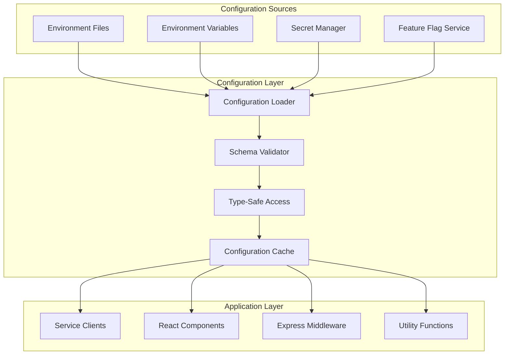

# Design Document

## Overview

This design outlines a comprehensive environment variable configuration system that provides type-safe access, runtime validation, secure credential management, and excellent developer experience across all deployment environments. The system will support multiple environments, feature flags, and secure secret management while maintaining simplicity and reliability.

## Architecture

### Configuration Layer Architecture



### Environment Hierarchy

```mermaid
graph LR
    subgraph "Configuration Precedence (Highest to Lowest)"
        Runtime[Runtime Overrides]
        Local[.env.local]
        EnvSpecific[.env.{environment}]
        Default[.env.example]
        Secrets[Secret Manager]
    end
    
    Runtime --> Local
    Local --> EnvSpecific
    EnvSpecific --> Default
    Default --> Secrets
```

## Components and Interfaces

### 1. Configuration Schema Definition

#### Core Configuration Interface
```typescript
interface EnvironmentConfig {
  // Application Configuration
  app: {
    name: string;
    version: string;
    environment: 'development' | 'staging' | 'production';
    url: string;
    port: number;
    logLevel: 'debug' | 'info' | 'warn' | 'error';
  };
  
  // Database Configuration
  database: {
    supabaseUrl: string;
    supabaseAnonKey: string;
    supabaseServiceKey?: string;
    connectionPoolSize: number;
    queryTimeout: number;
  };
  
  // AI Services Configuration
  ai: {
    openai?: {
      apiKey: string;
      model: string;
      maxTokens: number;
      temperature: number;
    };
    anthropic?: {
      apiKey: string;
      model: string;
      maxTokens: number;
    };
    hallucifix?: {
      apiKey: string;
      apiUrl: string;
    };
  };
  
  // Authentication Configuration
  auth: {
    google: {
      clientId: string;
      clientSecret: string;
      redirectUri: string;
    };
    jwt: {
      secret: string;
      expiresIn: string;
      refreshExpiresIn: string;
    };
  };
  
  // Payment Configuration
  payments?: {
    stripe: {
      publishableKey: string;
      secretKey: string;
      webhookSecret: string;
      priceIds: {
        basicMonthly: string;
        basicYearly: string;
        proMonthly: string;
        proYearly: string;
      };
    };
  };
  
  // Monitoring Configuration
  monitoring: {
    sentry?: {
      dsn: string;
      environment: string;
      tracesSampleRate: number;
    };
    analytics?: {
      googleAnalyticsId: string;
      mixpanelToken: string;
    };
    logging: {
      level: string;
      format: 'json' | 'pretty';
      destination: 'console' | 'file' | 'external';
    };
  };
  
  // Feature Flags
  features: {
    enableAnalytics: boolean;
    enablePayments: boolean;
    enableBetaFeatures: boolean;
    enableRagAnalysis: boolean;
    enableBatchProcessing: boolean;
  };
  
  // Security Configuration
  security: {
    corsOrigins: string[];
    rateLimitWindow: number;
    rateLimitMax: number;
    encryptionKey: string;
    sessionSecret: string;
  };
}
```

### 2. Configuration Validation Schema

#### Zod Schema Implementation
```typescript
import { z } from 'zod';

const environmentSchema = z.object({
  app: z.object({
    name: z.string().min(1),
    version: z.string().regex(/^\d+\.\d+\.\d+$/),
    environment: z.enum(['development', 'staging', 'production']),
    url: z.string().url(),
    port: z.number().int().min(1).max(65535),
    logLevel: z.enum(['debug', 'info', 'warn', 'error'])
  }),
  
  database: z.object({
    supabaseUrl: z.string().url(),
    supabaseAnonKey: z.string().min(1),
    supabaseServiceKey: z.string().optional(),
    connectionPoolSize: z.number().int().min(1).max(100).default(10),
    queryTimeout: z.number().int().min(1000).default(30000)
  }),
  
  ai: z.object({
    openai: z.object({
      apiKey: z.string().regex(/^sk-[a-zA-Z0-9]{48}$/),
      model: z.string().default('gpt-4'),
      maxTokens: z.number().int().min(1).max(8000).default(4000),
      temperature: z.number().min(0).max(2).default(0.1)
    }).optional(),
    
    anthropic: z.object({
      apiKey: z.string().regex(/^sk-ant-[a-zA-Z0-9-_]+$/),
      model: z.string().default('claude-3-sonnet-20240229'),
      maxTokens: z.number().int().min(1).max(4000).default(4000)
    }).optional(),
    
    hallucifix: z.object({
      apiKey: z.string().min(1),
      apiUrl: z.string().url()
    }).optional()
  }),
  
  auth: z.object({
    google: z.object({
      clientId: z.string().regex(/^[0-9]+-[a-zA-Z0-9]+\.apps\.googleusercontent\.com$/),
      clientSecret: z.string().regex(/^GOCSPX-[a-zA-Z0-9_-]+$/),
      redirectUri: z.string().url()
    }),
    
    jwt: z.object({
      secret: z.string().min(32),
      expiresIn: z.string().regex(/^\d+[smhd]$/),
      refreshExpiresIn: z.string().regex(/^\d+[smhd]$/)
    })
  }),
  
  payments: z.object({
    stripe: z.object({
      publishableKey: z.string().regex(/^pk_(test|live)_[a-zA-Z0-9]+$/),
      secretKey: z.string().regex(/^sk_(test|live)_[a-zA-Z0-9]+$/),
      webhookSecret: z.string().regex(/^whsec_[a-zA-Z0-9]+$/),
      priceIds: z.object({
        basicMonthly: z.string().regex(/^price_[a-zA-Z0-9]+$/),
        basicYearly: z.string().regex(/^price_[a-zA-Z0-9]+$/),
        proMonthly: z.string().regex(/^price_[a-zA-Z0-9]+$/),
        proYearly: z.string().regex(/^price_[a-zA-Z0-9]+$/)
      })
    })
  }).optional(),
  
  monitoring: z.object({
    sentry: z.object({
      dsn: z.string().url(),
      environment: z.string(),
      tracesSampleRate: z.number().min(0).max(1)
    }).optional(),
    
    analytics: z.object({
      googleAnalyticsId: z.string().regex(/^G-[A-Z0-9]+$/),
      mixpanelToken: z.string().min(1)
    }).optional(),
    
    logging: z.object({
      level: z.enum(['debug', 'info', 'warn', 'error']),
      format: z.enum(['json', 'pretty']),
      destination: z.enum(['console', 'file', 'external'])
    })
  }),
  
  features: z.object({
    enableAnalytics: z.boolean().default(true),
    enablePayments: z.boolean().default(false),
    enableBetaFeatures: z.boolean().default(false),
    enableRagAnalysis: z.boolean().default(true),
    enableBatchProcessing: z.boolean().default(true)
  }),
  
  security: z.object({
    corsOrigins: z.array(z.string().url()),
    rateLimitWindow: z.number().int().min(1000).default(900000), // 15 minutes
    rateLimitMax: z.number().int().min(1).default(100),
    encryptionKey: z.string().min(32),
    sessionSecret: z.string().min(32)
  })
});

export type EnvironmentConfig = z.infer<typeof environmentSchema>;
```

### 3. Configuration Loader Implementation

#### Multi-Source Configuration Loader
```typescript
class ConfigurationLoader {
  private config: EnvironmentConfig | null = null;
  private secretManager: SecretManager;
  
  constructor() {
    this.secretManager = new SecretManager();
  }

  async loadConfiguration(): Promise<EnvironmentConfig> {
    if (this.config) {
      return this.config;
    }

    // Load from multiple sources in order of precedence
    const rawConfig = await this.mergeConfigurationSources();
    
    // Validate configuration
    const validatedConfig = await this.validateConfiguration(rawConfig);
    
    // Cache the configuration
    this.config = validatedConfig;
    
    return validatedConfig;
  }

  private async mergeConfigurationSources(): Promise<any> {
    const sources = [
      await this.loadFromSecretManager(),
      this.loadFromEnvironmentFiles(),
      this.loadFromEnvironmentVariables(),
      this.loadFromRuntimeOverrides()
    ];

    // Merge sources with later sources taking precedence
    return sources.reduce((merged, source) => ({
      ...merged,
      ...source
    }), {});
  }

  private async loadFromSecretManager(): Promise<Partial<EnvironmentConfig>> {
    if (process.env.NODE_ENV !== 'production') {
      return {};
    }

    try {
      const secrets = await this.secretManager.getSecrets([
        'database/supabase-service-key',
        'auth/jwt-secret',
        'auth/google-client-secret',
        'ai/openai-api-key',
        'payments/stripe-secret-key',
        'monitoring/sentry-dsn'
      ]);

      return this.mapSecretsToConfig(secrets);
    } catch (error) {
      console.warn('Failed to load secrets from secret manager:', error);
      return {};
    }
  }

  private loadFromEnvironmentFiles(): Partial<EnvironmentConfig> {
    const environment = process.env.NODE_ENV || 'development';
    const envFiles = [
      '.env.example',
      `.env.${environment}`,
      '.env.local'
    ];

    let config = {};
    
    for (const file of envFiles) {
      try {
        const envConfig = dotenv.config({ path: file });
        if (envConfig.parsed) {
          config = { ...config, ...this.transformEnvVars(envConfig.parsed) };
        }
      } catch (error) {
        // File doesn't exist or can't be read, continue
      }
    }

    return config;
  }

  private loadFromEnvironmentVariables(): Partial<EnvironmentConfig> {
    return this.transformEnvVars(process.env);
  }

  private loadFromRuntimeOverrides(): Partial<EnvironmentConfig> {
    // Support for runtime configuration overrides
    // This could come from command line args, config service, etc.
    return {};
  }

  private transformEnvVars(envVars: Record<string, string | undefined>): Partial<EnvironmentConfig> {
    const config: any = {};

    // Transform flat environment variables to nested configuration
    Object.entries(envVars).forEach(([key, value]) => {
      if (!value) return;

      const path = this.getConfigPath(key);
      if (path) {
        this.setNestedValue(config, path, this.parseValue(value));
      }
    });

    return config;
  }

  private getConfigPath(envKey: string): string[] | null {
    const mappings: Record<string, string[]> = {
      'VITE_APP_NAME': ['app', 'name'],
      'VITE_APP_VERSION': ['app', 'version'],
      'NODE_ENV': ['app', 'environment'],
      'VITE_APP_URL': ['app', 'url'],
      'PORT': ['app', 'port'],
      'LOG_LEVEL': ['app', 'logLevel'],
      
      'VITE_SUPABASE_URL': ['database', 'supabaseUrl'],
      'VITE_SUPABASE_ANON_KEY': ['database', 'supabaseAnonKey'],
      'SUPABASE_SERVICE_KEY': ['database', 'supabaseServiceKey'],
      
      'VITE_OPENAI_API_KEY': ['ai', 'openai', 'apiKey'],
      'VITE_OPENAI_MODEL': ['ai', 'openai', 'model'],
      'VITE_OPENAI_MAX_TOKENS': ['ai', 'openai', 'maxTokens'],
      
      'VITE_GOOGLE_CLIENT_ID': ['auth', 'google', 'clientId'],
      'GOOGLE_CLIENT_SECRET': ['auth', 'google', 'clientSecret'],
      'VITE_GOOGLE_REDIRECT_URI': ['auth', 'google', 'redirectUri'],
      
      'JWT_SECRET': ['auth', 'jwt', 'secret'],
      'JWT_EXPIRES_IN': ['auth', 'jwt', 'expiresIn'],
      
      'VITE_STRIPE_PUBLISHABLE_KEY': ['payments', 'stripe', 'publishableKey'],
      'STRIPE_SECRET_KEY': ['payments', 'stripe', 'secretKey'],
      
      'VITE_SENTRY_DSN': ['monitoring', 'sentry', 'dsn'],
      'VITE_GOOGLE_ANALYTICS_ID': ['monitoring', 'analytics', 'googleAnalyticsId'],
      
      'VITE_ENABLE_ANALYTICS': ['features', 'enableAnalytics'],
      'VITE_ENABLE_PAYMENTS': ['features', 'enablePayments'],
      'VITE_ENABLE_BETA_FEATURES': ['features', 'enableBetaFeatures']
    };

    return mappings[envKey] || null;
  }

  private setNestedValue(obj: any, path: string[], value: any): void {
    const lastKey = path.pop()!;
    const target = path.reduce((current, key) => {
      if (!current[key]) current[key] = {};
      return current[key];
    }, obj);
    target[lastKey] = value;
  }

  private parseValue(value: string): any {
    // Parse boolean values
    if (value.toLowerCase() === 'true') return true;
    if (value.toLowerCase() === 'false') return false;
    
    // Parse numeric values
    if (/^\d+$/.test(value)) return parseInt(value, 10);
    if (/^\d+\.\d+$/.test(value)) return parseFloat(value);
    
    // Parse arrays (comma-separated)
    if (value.includes(',')) {
      return value.split(',').map(item => item.trim());
    }
    
    return value;
  }

  private async validateConfiguration(rawConfig: any): Promise<EnvironmentConfig> {
    try {
      const validatedConfig = environmentSchema.parse(rawConfig);
      
      // Perform additional validation
      await this.performConnectivityChecks(validatedConfig);
      
      return validatedConfig;
    } catch (error) {
      if (error instanceof z.ZodError) {
        throw new ConfigurationError(
          'Configuration validation failed',
          this.formatValidationErrors(error)
        );
      }
      throw error;
    }
  }

  private async performConnectivityChecks(config: EnvironmentConfig): Promise<void> {
    const checks: Array<() => Promise<void>> = [];

    // Check Supabase connectivity
    checks.push(async () => {
      try {
        const response = await fetch(`${config.database.supabaseUrl}/rest/v1/`, {
          headers: {
            'apikey': config.database.supabaseAnonKey,
            'Authorization': `Bearer ${config.database.supabaseAnonKey}`
          }
        });
        if (!response.ok) {
          throw new Error(`Supabase connectivity check failed: ${response.statusText}`);
        }
      } catch (error) {
        throw new Error(`Supabase configuration invalid: ${error.message}`);
      }
    });

    // Check OpenAI API key if configured
    if (config.ai.openai) {
      checks.push(async () => {
        try {
          const response = await fetch('https://api.openai.com/v1/models', {
            headers: {
              'Authorization': `Bearer ${config.ai.openai!.apiKey}`
            }
          });
          if (!response.ok) {
            throw new Error(`OpenAI API check failed: ${response.statusText}`);
          }
        } catch (error) {
          throw new Error(`OpenAI configuration invalid: ${error.message}`);
        }
      });
    }

    // Run all checks concurrently
    try {
      await Promise.all(checks.map(check => check()));
    } catch (error) {
      console.warn('Configuration connectivity check failed:', error.message);
      // Don't fail startup for connectivity issues in development
      if (config.app.environment === 'production') {
        throw error;
      }
    }
  }

  private formatValidationErrors(error: z.ZodError): string[] {
    return error.errors.map(err => {
      const path = err.path.join('.');
      return `${path}: ${err.message}`;
    });
  }
}
```

### 4. Type-Safe Configuration Access

#### Configuration Service
```typescript
class ConfigurationService {
  private static instance: ConfigurationService;
  private config: EnvironmentConfig | null = null;
  private loader: ConfigurationLoader;

  private constructor() {
    this.loader = new ConfigurationLoader();
  }

  static getInstance(): ConfigurationService {
    if (!ConfigurationService.instance) {
      ConfigurationService.instance = new ConfigurationService();
    }
    return ConfigurationService.instance;
  }

  async initialize(): Promise<void> {
    this.config = await this.loader.loadConfiguration();
  }

  get app() {
    this.ensureInitialized();
    return this.config!.app;
  }

  get database() {
    this.ensureInitialized();
    return this.config!.database;
  }

  get ai() {
    this.ensureInitialized();
    return this.config!.ai;
  }

  get auth() {
    this.ensureInitialized();
    return this.config!.auth;
  }

  get payments() {
    this.ensureInitialized();
    return this.config!.payments;
  }

  get monitoring() {
    this.ensureInitialized();
    return this.config!.monitoring;
  }

  get features() {
    this.ensureInitialized();
    return this.config!.features;
  }

  get security() {
    this.ensureInitialized();
    return this.config!.security;
  }

  // Convenience methods
  get isDevelopment(): boolean {
    return this.app.environment === 'development';
  }

  get isProduction(): boolean {
    return this.app.environment === 'production';
  }

  get isStaging(): boolean {
    return this.app.environment === 'staging';
  }

  hasOpenAI(): boolean {
    return !!this.ai.openai?.apiKey;
  }

  hasAnthropic(): boolean {
    return !!this.ai.anthropic?.apiKey;
  }

  hasStripe(): boolean {
    return !!this.payments?.stripe;
  }

  hasSentry(): boolean {
    return !!this.monitoring.sentry?.dsn;
  }

  private ensureInitialized(): void {
    if (!this.config) {
      throw new Error('Configuration not initialized. Call initialize() first.');
    }
  }
}

// Export singleton instance
export const config = ConfigurationService.getInstance();
```

### 5. Secret Management Integration

#### Secret Manager Implementation
```typescript
interface SecretManagerProvider {
  getSecret(key: string): Promise<string | null>;
  getSecrets(keys: string[]): Promise<Record<string, string>>;
  setSecret(key: string, value: string): Promise<void>;
  deleteSecret(key: string): Promise<void>;
}

class AWSSecretsManagerProvider implements SecretManagerProvider {
  private client: SecretsManagerClient;

  constructor(region: string = 'us-east-1') {
    this.client = new SecretsManagerClient({ region });
  }

  async getSecret(key: string): Promise<string | null> {
    try {
      const command = new GetSecretValueCommand({ SecretId: key });
      const response = await this.client.send(command);
      return response.SecretString || null;
    } catch (error) {
      if (error.name === 'ResourceNotFoundException') {
        return null;
      }
      throw error;
    }
  }

  async getSecrets(keys: string[]): Promise<Record<string, string>> {
    const results = await Promise.allSettled(
      keys.map(async key => ({ key, value: await this.getSecret(key) }))
    );

    const secrets: Record<string, string> = {};
    results.forEach((result, index) => {
      if (result.status === 'fulfilled' && result.value.value) {
        secrets[keys[index]] = result.value.value;
      }
    });

    return secrets;
  }

  async setSecret(key: string, value: string): Promise<void> {
    const command = new CreateSecretCommand({
      Name: key,
      SecretString: value
    });
    await this.client.send(command);
  }

  async deleteSecret(key: string): Promise<void> {
    const command = new DeleteSecretCommand({ SecretId: key });
    await this.client.send(command);
  }
}

class SecretManager {
  private provider: SecretManagerProvider;

  constructor() {
    // Choose provider based on environment
    if (process.env.AWS_REGION) {
      this.provider = new AWSSecretsManagerProvider(process.env.AWS_REGION);
    } else {
      // Fallback to environment variables in development
      this.provider = new EnvironmentSecretProvider();
    }
  }

  async getSecrets(keys: string[]): Promise<Record<string, string>> {
    return this.provider.getSecrets(keys);
  }
}
```

## Data Models

### Configuration File Structure
```
├── .env.example                 # Template with all variables and documentation
├── .env.local                   # Local development overrides (gitignored)
├── .env.development            # Development environment defaults
├── .env.staging                # Staging environment configuration
├── .env.production             # Production environment configuration
├── src/
│   ├── lib/
│   │   ├── config/
│   │   │   ├── index.ts        # Main configuration export
│   │   │   ├── loader.ts       # Configuration loader
│   │   │   ├── schema.ts       # Validation schema
│   │   │   ├── secrets.ts      # Secret management
│   │   │   └── types.ts        # TypeScript interfaces
│   │   └── env.ts              # Legacy compatibility
└── scripts/
    ├── setup-env.sh            # Environment setup script
    ├── validate-config.js      # Configuration validation script
    └── generate-env-docs.js    # Documentation generation
```

### Environment File Templates
```bash
# .env.example - Complete template with documentation

# =============================================================================
# APPLICATION CONFIGURATION
# =============================================================================

# Application basic settings
VITE_APP_NAME=HalluciFix
VITE_APP_VERSION=1.0.0
NODE_ENV=development
VITE_APP_URL=http://localhost:5173
PORT=5173
LOG_LEVEL=info

# =============================================================================
# DATABASE CONFIGURATION
# =============================================================================

# Supabase Configuration
# Get these from your Supabase project dashboard
VITE_SUPABASE_URL=https://your-project.supabase.co
VITE_SUPABASE_ANON_KEY=eyJ...your-anon-key
SUPABASE_SERVICE_KEY=eyJ...your-service-key

# =============================================================================
# AI SERVICES CONFIGURATION
# =============================================================================

# OpenAI Configuration (Optional - will use mocks if not provided)
# Get API key from https://platform.openai.com/api-keys
VITE_OPENAI_API_KEY=sk-...your-openai-key
VITE_OPENAI_MODEL=gpt-4
VITE_OPENAI_MAX_TOKENS=4000
VITE_OPENAI_TEMPERATURE=0.1

# Anthropic Configuration (Optional)
# Get API key from https://console.anthropic.com/
VITE_ANTHROPIC_API_KEY=sk-ant-...your-anthropic-key
VITE_ANTHROPIC_MODEL=claude-3-sonnet-20240229

# HalluciFix API Configuration (Optional)
VITE_HALLUCIFIX_API_KEY=hf_...your-hallucifix-key
VITE_HALLUCIFIX_API_URL=https://api.hallucifix.com

# =============================================================================
# AUTHENTICATION CONFIGURATION
# =============================================================================

# Google OAuth Configuration
# Set up OAuth 2.0 credentials in Google Cloud Console
VITE_GOOGLE_CLIENT_ID=123456789-abc.apps.googleusercontent.com
GOOGLE_CLIENT_SECRET=GOCSPX-...your-client-secret
VITE_GOOGLE_REDIRECT_URI=http://localhost:5173/auth/callback

# JWT Configuration
JWT_SECRET=your-super-secret-jwt-key-at-least-32-characters
JWT_EXPIRES_IN=24h
JWT_REFRESH_EXPIRES_IN=7d

# =============================================================================
# PAYMENT CONFIGURATION (Optional)
# =============================================================================

# Stripe Configuration
# Get keys from https://dashboard.stripe.com/apikeys
VITE_STRIPE_PUBLISHABLE_KEY=pk_test_...your-publishable-key
STRIPE_SECRET_KEY=sk_test_...your-secret-key
STRIPE_WEBHOOK_SECRET=whsec_...your-webhook-secret

# Stripe Price IDs (create products in Stripe dashboard)
STRIPE_PRICE_ID_BASIC_MONTHLY=price_...basic-monthly
STRIPE_PRICE_ID_BASIC_YEARLY=price_...basic-yearly
STRIPE_PRICE_ID_PRO_MONTHLY=price_...pro-monthly
STRIPE_PRICE_ID_PRO_YEARLY=price_...pro-yearly

# =============================================================================
# MONITORING & ANALYTICS CONFIGURATION
# =============================================================================

# Sentry Error Tracking (Optional)
# Get DSN from https://sentry.io/
VITE_SENTRY_DSN=https://...@sentry.io/...
SENTRY_AUTH_TOKEN=...your-auth-token

# Analytics (Optional)
VITE_GOOGLE_ANALYTICS_ID=G-...your-ga-id
VITE_MIXPANEL_TOKEN=...your-mixpanel-token

# Logging Configuration
LOG_FORMAT=pretty
LOG_DESTINATION=console

# =============================================================================
# FEATURE FLAGS
# =============================================================================

# Enable/disable features
VITE_ENABLE_ANALYTICS=true
VITE_ENABLE_PAYMENTS=false
VITE_ENABLE_BETA_FEATURES=false
VITE_ENABLE_RAG_ANALYSIS=true
VITE_ENABLE_BATCH_PROCESSING=true

# =============================================================================
# SECURITY CONFIGURATION
# =============================================================================

# CORS Configuration
CORS_ORIGINS=http://localhost:5173,http://localhost:3000

# Rate Limiting
RATE_LIMIT_WINDOW=900000
RATE_LIMIT_MAX=100

# Encryption
ENCRYPTION_KEY=your-32-character-encryption-key
SESSION_SECRET=your-session-secret-key
```

## Error Handling

### Configuration Error Types
```typescript
class ConfigurationError extends Error {
  constructor(
    message: string,
    public validationErrors?: string[],
    public missingKeys?: string[]
  ) {
    super(message);
    this.name = 'ConfigurationError';
  }
}

class SecretManagerError extends Error {
  constructor(message: string, public secretKey?: string) {
    super(message);
    this.name = 'SecretManagerError';
  }
}

class ConnectivityError extends Error {
  constructor(message: string, public service?: string) {
    super(message);
    this.name = 'ConnectivityError';
  }
}
```

### Startup Validation
```typescript
async function validateStartupConfiguration(): Promise<void> {
  try {
    await config.initialize();
    console.log('✅ Configuration loaded and validated successfully');
  } catch (error) {
    if (error instanceof ConfigurationError) {
      console.error('❌ Configuration validation failed:');
      if (error.validationErrors) {
        error.validationErrors.forEach(err => console.error(`  - ${err}`));
      }
      if (error.missingKeys) {
        console.error('\n📋 Missing required configuration:');
        error.missingKeys.forEach(key => console.error(`  - ${key}`));
      }
      console.error('\n📖 Please check the .env.example file for configuration guidance');
    } else {
      console.error('❌ Configuration error:', error.message);
    }
    process.exit(1);
  }
}
```

## Testing Strategy

### Configuration Testing
```typescript
describe('Configuration System', () => {
  beforeEach(() => {
    // Reset configuration instance
    jest.clearAllMocks();
  });

  it('should load configuration from environment variables', async () => {
    process.env.VITE_APP_NAME = 'Test App';
    process.env.VITE_SUPABASE_URL = 'https://test.supabase.co';
    
    const loader = new ConfigurationLoader();
    const config = await loader.loadConfiguration();
    
    expect(config.app.name).toBe('Test App');
    expect(config.database.supabaseUrl).toBe('https://test.supabase.co');
  });

  it('should validate required configuration', async () => {
    delete process.env.VITE_SUPABASE_URL;
    
    const loader = new ConfigurationLoader();
    
    await expect(loader.loadConfiguration()).rejects.toThrow(ConfigurationError);
  });

  it('should merge configuration sources correctly', async () => {
    // Test precedence: runtime > local > environment-specific > default
  });

  it('should handle feature flags correctly', async () => {
    process.env.VITE_ENABLE_PAYMENTS = 'true';
    
    const loader = new ConfigurationLoader();
    const config = await loader.loadConfiguration();
    
    expect(config.features.enablePayments).toBe(true);
  });
});
```

## Security Considerations

### Secret Protection
- Never commit secrets to version control
- Use secure secret management in production
- Implement proper access controls for secrets
- Regular secret rotation procedures
- Audit logging for secret access

### Configuration Security
- Validate all configuration inputs
- Sanitize configuration values
- Implement proper error handling without exposing secrets
- Use environment-specific configurations
- Regular security audits of configuration

## Performance Considerations

### Configuration Caching
- Cache validated configuration in memory
- Lazy loading of optional configurations
- Efficient configuration merging
- Minimal startup time impact
- Hot reload support in development

### Resource Management
- Connection pooling for external services
- Efficient secret retrieval
- Minimal memory footprint
- Graceful degradation for optional services