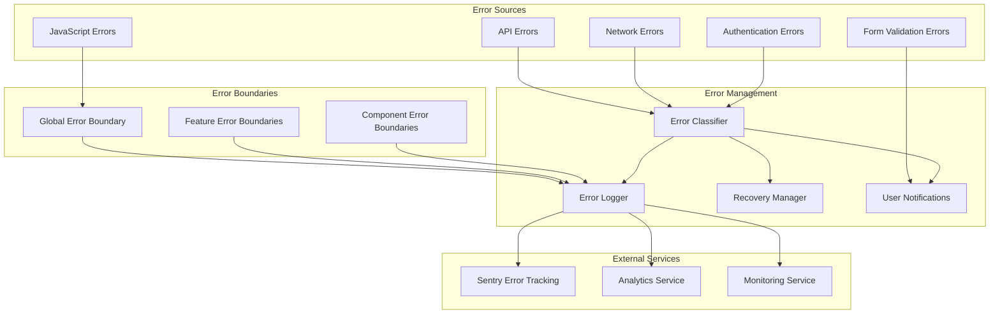
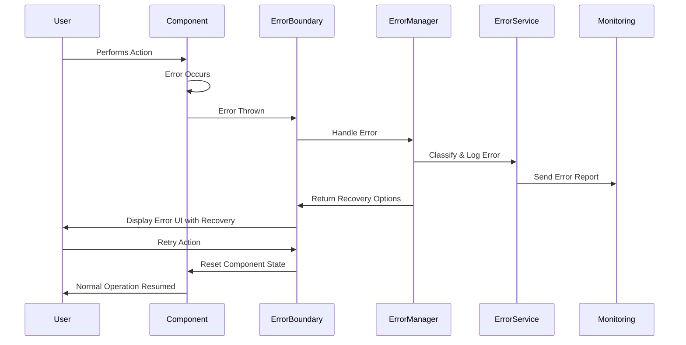

# Design Document

## Overview

This design outlines a comprehensive error handling system that provides graceful error recovery, user-friendly error messages, and robust error management throughout the application. The system includes React error boundaries, centralized API error handling, form validation, error monitoring, and automatic recovery mechanisms to ensure excellent user experience even when errors occur.

## Architecture

### Error Handling Architecture



### Error Flow Architecture



## Components and Interfaces

### 1. React Error Boundaries

#### Global Error Boundary
```typescript
interface ErrorBoundaryProps {
  children: ReactNode;
  fallback?: ReactNode;
  onError?: (error: Error, errorInfo: ErrorInfo) => void;
  level?: 'global' | 'feature' | 'component';
  resetKeys?: Array<string | number>;
  resetOnPropsChange?: boolean;
}

interface ErrorBoundaryState {
  hasError: boolean;
  error: Error | null;
  errorInfo: ErrorInfo | null;
  errorId: string | null;
  retryCount: number;
}

class ErrorBoundary extends Component<ErrorBoundaryProps, ErrorBoundaryState> {
  private resetTimeoutId: number | null = null;
  
  constructor(props: ErrorBoundaryProps) {
    super(props);
    this.state = {
      hasError: false,
      error: null,
      errorInfo: null,
      errorId: null,
      retryCount: 0
    };
  }

  static getDerivedStateFromError(error: Error): Partial<ErrorBoundaryState> {
    return {
      hasError: true,
      error,
      errorId: generateErrorId()
    };
  }

  componentDidCatch(error: Error, errorInfo: ErrorInfo) {
    this.setState({ errorInfo });
    
    // Report error to error management system
    errorManager.handleError(error, {
      errorInfo,
      level: this.props.level || 'component',
      errorId: this.state.errorId,
      retryCount: this.state.retryCount
    });
    
    // Call custom error handler if provided
    if (this.props.onError) {
      this.props.onError(error, errorInfo);
    }
  }

  componentDidUpdate(prevProps: ErrorBoundaryProps) {
    const { resetKeys, resetOnPropsChange } = this.props;
    const { hasError } = this.state;
    
    if (hasError && prevProps.resetKeys !== resetKeys) {
      if (resetKeys?.some((key, idx) => prevProps.resetKeys?.[idx] !== key)) {
        this.resetErrorBoundary();
      }
    }
    
    if (hasError && resetOnPropsChange && prevProps.children !== this.props.children) {
      this.resetErrorBoundary();
    }
  }

  resetErrorBoundary = () => {
    if (this.resetTimeoutId) {
      clearTimeout(this.resetTimeoutId);
    }
    
    this.setState({
      hasError: false,
      error: null,
      errorInfo: null,
      errorId: null,
      retryCount: 0
    });
  };

  handleRetry = () => {
    const newRetryCount = this.state.retryCount + 1;
    
    // Limit retry attempts
    if (newRetryCount > 3) {
      errorManager.reportError(new Error('Max retry attempts exceeded'), {
        originalError: this.state.error,
        retryCount: newRetryCount
      });
      return;
    }
    
    this.setState({ retryCount: newRetryCount });
    
    // Reset after a short delay to allow for cleanup
    this.resetTimeoutId = window.setTimeout(() => {
      this.resetErrorBoundary();
    }, 100);
  };

  render() {
    if (this.state.hasError) {
      if (this.props.fallback) {
        return this.props.fallback;
      }

      return (
        <ErrorFallbackUI
          error={this.state.error}
          errorInfo={this.state.errorInfo}
          errorId={this.state.errorId}
          retryCount={this.state.retryCount}
          level={this.props.level}
          onRetry={this.handleRetry}
          onReset={this.resetErrorBoundary}
        />
      );
    }

    return this.props.children;
  }
}
```

#### Error Fallback UI Components
```typescript
interface ErrorFallbackUIProps {
  error: Error | null;
  errorInfo: ErrorInfo | null;
  errorId: string | null;
  retryCount: number;
  level?: 'global' | 'feature' | 'component';
  onRetry: () => void;
  onReset: () => void;
}

const ErrorFallbackUI: React.FC<ErrorFallbackUIProps> = ({
  error,
  errorInfo,
  errorId,
  retryCount,
  level = 'component',
  onRetry,
  onReset
}) => {
  const getErrorSeverity = () => {
    if (level === 'global') return 'critical';
    if (level === 'feature') return 'high';
    return 'medium';
  };

  const getErrorMessage = () => {
    const severity = getErrorSeverity();
    
    switch (severity) {
      case 'critical':
        return {
          title: 'Something went wrong',
          message: 'We encountered an unexpected error. Please try refreshing the page or contact support if the problem persists.',
          icon: AlertTriangle,
          color: 'red'
        };
      case 'high':
        return {
          title: 'Feature temporarily unavailable',
          message: 'This feature is currently experiencing issues. Please try again or use an alternative approach.',
          icon: AlertCircle,
          color: 'orange'
        };
      default:
        return {
          title: 'Something went wrong',
          message: 'We encountered an issue loading this content. Please try again.',
          icon: RefreshCw,
          color: 'blue'
        };
    }
  };

  const errorMessage = getErrorMessage();
  const Icon = errorMessage.icon;

  return (
    <div className={`min-h-[200px] flex items-center justify-center p-6 ${
      level === 'global' ? 'min-h-screen bg-slate-50' : ''
    }`}>
      <div className="max-w-md w-full text-center">
        <div className={`w-16 h-16 mx-auto mb-4 rounded-full flex items-center justify-center ${
          errorMessage.color === 'red' ? 'bg-red-100' :
          errorMessage.color === 'orange' ? 'bg-orange-100' : 'bg-blue-100'
        }`}>
          <Icon className={`w-8 h-8 ${
            errorMessage.color === 'red' ? 'text-red-600' :
            errorMessage.color === 'orange' ? 'text-orange-600' : 'text-blue-600'
          }`} />
        </div>
        
        <h2 className="text-xl font-semibold text-slate-900 mb-2">
          {errorMessage.title}
        </h2>
        
        <p className="text-slate-600 mb-6">
          {errorMessage.message}
        </p>
        
        <div className="flex flex-col sm:flex-row gap-3 justify-center">
          <button
            onClick={onRetry}
            disabled={retryCount >= 3}
            className={`flex items-center justify-center space-x-2 px-4 py-2 rounded-lg font-medium transition-colors ${
              retryCount >= 3
                ? 'bg-slate-100 text-slate-400 cursor-not-allowed'
                : 'bg-blue-600 text-white hover:bg-blue-700'
            }`}
          >
            <RefreshCw className="w-4 h-4" />
            <span>{retryCount >= 3 ? 'Max retries reached' : 'Try Again'}</span>
          </button>
          
          {level === 'global' && (
            <button
              onClick={() => window.location.href = '/'}
              className="flex items-center justify-center space-x-2 px-4 py-2 border border-slate-300 text-slate-700 rounded-lg hover:bg-slate-50 transition-colors"
            >
              <Home className="w-4 h-4" />
              <span>Go Home</span>
            </button>
          )}
        </div>
        
        {errorId && (
          <div className="mt-6 text-xs text-slate-500">
            Error ID: {errorId}
          </div>
        )}
        
        {config.isDevelopment && error && (
          <details className="mt-6 text-left">
            <summary className="cursor-pointer text-sm text-slate-500 hover:text-slate-700">
              Error Details (Development)
            </summary>
            <pre className="mt-2 text-xs bg-slate-100 p-3 rounded overflow-auto max-h-40">
              {error.toString()}
              {errorInfo?.componentStack}
            </pre>
          </details>
        )}
      </div>
    </div>
  );
};
```

### 2. API Error Handling System

#### Error Classification and Handling
```typescript
export enum ErrorType {
  NETWORK = 'NETWORK',
  AUTHENTICATION = 'AUTHENTICATION',
  AUTHORIZATION = 'AUTHORIZATION',
  VALIDATION = 'VALIDATION',
  RATE_LIMIT = 'RATE_LIMIT',
  SERVER = 'SERVER',
  CLIENT = 'CLIENT',
  TIMEOUT = 'TIMEOUT',
  UNKNOWN = 'UNKNOWN'
}

export enum ErrorSeverity {
  LOW = 'low',
  MEDIUM = 'medium',
  HIGH = 'high',
  CRITICAL = 'critical'
}

export interface ApiError {
  type: ErrorType;
  severity: ErrorSeverity;
  message: string;
  userMessage: string;
  statusCode?: number;
  details?: any;
  retryable: boolean;
  retryAfter?: number;
  timestamp: string;
  errorId: string;
}

class ApiErrorHandler {
  static handleError(error: any, context?: any): ApiError {
    const errorId = generateErrorId();
    const timestamp = new Date().toISOString();
    
    // Network connectivity errors
    if (!navigator.onLine) {
      return {
        type: ErrorType.NETWORK,
        severity: ErrorSeverity.MEDIUM,
        message: 'No internet connection detected',
        userMessage: 'Please check your internet connection and try again.',
        retryable: true,
        timestamp,
        errorId
      };
    }

    // HTTP response errors
    if (error.response) {
      const { status, data } = error.response;
      
      switch (status) {
        case 400:
          return {
            type: ErrorType.CLIENT,
            severity: ErrorSeverity.LOW,
            message: data.message || 'Bad request',
            userMessage: 'Please check your input and try again.',
            statusCode: status,
            details: data.errors,
            retryable: false,
            timestamp,
            errorId
          };
          
        case 401:
          return {
            type: ErrorType.AUTHENTICATION,
            severity: ErrorSeverity.HIGH,
            message: 'Authentication failed',
            userMessage: 'Your session has expired. Please sign in again.',
            statusCode: status,
            retryable: false,
            timestamp,
            errorId
          };
          
        case 403:
          return {
            type: ErrorType.AUTHORIZATION,
            severity: ErrorSeverity.MEDIUM,
            message: 'Access forbidden',
            userMessage: 'You don\'t have permission to perform this action.',
            statusCode: status,
            retryable: false,
            timestamp,
            errorId
          };
          
        case 422:
          return {
            type: ErrorType.VALIDATION,
            severity: ErrorSeverity.LOW,
            message: 'Validation failed',
            userMessage: data.message || 'Please check your input and try again.',
            statusCode: status,
            details: data.errors,
            retryable: false,
            timestamp,
            errorId
          };
          
        case 429:
          const retryAfter = parseInt(error.response.headers['retry-after']) || 60;
          return {
            type: ErrorType.RATE_LIMIT,
            severity: ErrorSeverity.MEDIUM,
            message: 'Rate limit exceeded',
            userMessage: `Too many requests. Please wait ${retryAfter} seconds and try again.`,
            statusCode: status,
            retryable: true,
            retryAfter: retryAfter * 1000,
            timestamp,
            errorId
          };
          
        case 500:
        case 502:
        case 503:
        case 504:
          return {
            type: ErrorType.SERVER,
            severity: ErrorSeverity.HIGH,
            message: `Server error: ${status}`,
            userMessage: 'We\'re experiencing technical difficulties. Please try again in a few moments.',
            statusCode: status,
            retryable: true,
            timestamp,
            errorId
          };
          
        default:
          return {
            type: ErrorType.UNKNOWN,
            severity: ErrorSeverity.MEDIUM,
            message: `HTTP ${status}: ${data.message || error.response.statusText}`,
            userMessage: 'An unexpected error occurred. Please try again.',
            statusCode: status,
            retryable: false,
            timestamp,
            errorId
          };
      }
    }

    // Request timeout errors
    if (error.code === 'ECONNABORTED' || error.message?.includes('timeout')) {
      return {
        type: ErrorType.TIMEOUT,
        severity: ErrorSeverity.MEDIUM,
        message: 'Request timeout',
        userMessage: 'The request took too long to complete. Please try again.',
        retryable: true,
        timestamp,
        errorId
      };
    }

    // Network errors
    if (error.code === 'NETWORK_ERROR' || !error.response) {
      return {
        type: ErrorType.NETWORK,
        severity: ErrorSeverity.MEDIUM,
        message: 'Network error',
        userMessage: 'Unable to connect to our servers. Please check your connection and try again.',
        retryable: true,
        timestamp,
        errorId
      };
    }

    // Unknown errors
    return {
      type: ErrorType.UNKNOWN,
      severity: ErrorSeverity.MEDIUM,
      message: error.message || 'Unknown error occurred',
      userMessage: 'An unexpected error occurred. Please try again.',
      retryable: false,
      timestamp,
      errorId
    };
  }
}
```

#### Retry Mechanism with Exponential Backoff
```typescript
interface RetryConfig {
  maxRetries: number;
  baseDelay: number;
  maxDelay: number;
  backoffFactor: number;
  jitter: boolean;
}

class RetryManager {
  private static defaultConfig: RetryConfig = {
    maxRetries: 3,
    baseDelay: 1000,
    maxDelay: 30000,
    backoffFactor: 2,
    jitter: true
  };

  static async withRetry<T>(
    operation: () => Promise<T>,
    config: Partial<RetryConfig> = {}
  ): Promise<T> {
    const finalConfig = { ...this.defaultConfig, ...config };
    let lastError: any;
    
    for (let attempt = 0; attempt <= finalConfig.maxRetries; attempt++) {
      try {
        return await operation();
      } catch (error) {
        lastError = error;
        
        const apiError = ApiErrorHandler.handleError(error);
        
        // Don't retry if error is not retryable or max retries reached
        if (!apiError.retryable || attempt === finalConfig.maxRetries) {
          throw apiError;
        }
        
        // Calculate delay with exponential backoff and jitter
        let delay = Math.min(
          finalConfig.baseDelay * Math.pow(finalConfig.backoffFactor, attempt),
          finalConfig.maxDelay
        );
        
        if (finalConfig.jitter) {
          delay = delay * (0.5 + Math.random() * 0.5); // Add 0-50% jitter
        }
        
        // Use retry-after header if available
        if (apiError.retryAfter) {
          delay = Math.max(delay, apiError.retryAfter);
        }
        
        await new Promise(resolve => setTimeout(resolve, delay));
      }
    }
    
    throw lastError;
  }
}
```

### 3. Form Validation and Error Display

#### Form Error Management
```typescript
interface FormError {
  field: string;
  message: string;
  type: 'required' | 'format' | 'length' | 'custom';
}

interface FormErrorState {
  errors: Record<string, FormError>;
  touched: Record<string, boolean>;
  isValid: boolean;
}

const useFormErrors = () => {
  const [errorState, setErrorState] = useState<FormErrorState>({
    errors: {},
    touched: {},
    isValid: true
  });

  const setFieldError = useCallback((field: string, error: FormError | null) => {
    setErrorState(prev => {
      const newErrors = { ...prev.errors };
      
      if (error) {
        newErrors[field] = error;
      } else {
        delete newErrors[field];
      }
      
      return {
        ...prev,
        errors: newErrors,
        isValid: Object.keys(newErrors).length === 0
      };
    });
  }, []);

  const setFieldTouched = useCallback((field: string, touched: boolean = true) => {
    setErrorState(prev => ({
      ...prev,
      touched: {
        ...prev.touched,
        [field]: touched
      }
    }));
  }, []);

  const clearErrors = useCallback(() => {
    setErrorState({
      errors: {},
      touched: {},
      isValid: true
    });
  }, []);

  const getFieldError = useCallback((field: string): FormError | null => {
    return errorState.touched[field] ? errorState.errors[field] || null : null;
  }, [errorState]);

  return {
    errors: errorState.errors,
    touched: errorState.touched,
    isValid: errorState.isValid,
    setFieldError,
    setFieldTouched,
    clearErrors,
    getFieldError
  };
};
```

#### Accessible Error Display Components
```typescript
interface FormErrorProps {
  error?: FormError | null;
  fieldId?: string;
  className?: string;
}

export const FormError: React.FC<FormErrorProps> = ({ 
  error, 
  fieldId, 
  className = '' 
}) => {
  if (!error) return null;

  return (
    <div
      id={fieldId ? `${fieldId}-error` : undefined}
      role="alert"
      aria-live="polite"
      className={`mt-1 text-sm text-red-600 flex items-start space-x-1 ${className}`}
    >
      <AlertTriangle className="w-4 h-4 flex-shrink-0 mt-0.5" />
      <span>{error.message}</span>
    </div>
  );
};

interface FormFieldProps {
  label: string;
  error?: FormError | null;
  required?: boolean;
  children: React.ReactElement;
  helpText?: string;
}

export const FormField: React.FC<FormFieldProps> = ({
  label,
  error,
  required,
  children,
  helpText
}) => {
  const fieldId = children.props.id || `field-${Math.random().toString(36).substr(2, 9)}`;
  const hasError = !!error;

  return (
    <div className="space-y-1">
      <label
        htmlFor={fieldId}
        className={`block text-sm font-medium ${
          hasError ? 'text-red-700' : 'text-slate-700'
        }`}
      >
        {label}
        {required && <span className="text-red-500 ml-1">*</span>}
      </label>
      
      {React.cloneElement(children, {
        id: fieldId,
        'aria-invalid': hasError,
        'aria-describedby': [
          error ? `${fieldId}-error` : null,
          helpText ? `${fieldId}-help` : null
        ].filter(Boolean).join(' ') || undefined,
        className: `${children.props.className || ''} ${
          hasError ? 'border-red-300 focus:border-red-500 focus:ring-red-500' : ''
        }`.trim()
      })}
      
      {helpText && !hasError && (
        <p id={`${fieldId}-help`} className="text-sm text-slate-500">
          {helpText}
        </p>
      )}
      
      <FormError error={error} fieldId={fieldId} />
    </div>
  );
};
```

### 4. Centralized Error Management

#### Error Manager Service
```typescript
interface ErrorContext {
  userId?: string;
  sessionId?: string;
  url?: string;
  userAgent?: string;
  timestamp?: string;
  level?: 'global' | 'feature' | 'component';
  retryCount?: number;
  [key: string]: any;
}

class ErrorManager {
  private errorQueue: Array<{ error: ApiError; context: ErrorContext }> = [];
  private flushInterval: NodeJS.Timeout;

  constructor() {
    // Flush errors every 30 seconds
    this.flushInterval = setInterval(() => {
      this.flushErrors();
    }, 30000);
  }

  handleError(error: Error, context: ErrorContext = {}): ApiError {
    const apiError = ApiErrorHandler.handleError(error, context);
    
    // Add to error queue for batch processing
    this.errorQueue.push({
      error: apiError,
      context: {
        ...context,
        timestamp: apiError.timestamp,
        url: window.location.href,
        userAgent: navigator.userAgent
      }
    });

    // Log to console in development
    if (config.isDevelopment) {
      console.error('Error handled:', apiError, context);
    }

    // Send to external error tracking immediately for critical errors
    if (apiError.severity === ErrorSeverity.CRITICAL) {
      this.reportToCrashlytics(apiError, context);
    }

    return apiError;
  }

  reportError(error: Error, context: ErrorContext = {}): void {
    this.handleError(error, context);
  }

  private async flushErrors(): Promise<void> {
    if (this.errorQueue.length === 0) return;

    const errorsToFlush = [...this.errorQueue];
    this.errorQueue = [];

    try {
      // Send to error tracking service
      await this.sendToErrorTracking(errorsToFlush);
      
      // Send to analytics
      await this.sendToAnalytics(errorsToFlush);
    } catch (error) {
      console.error('Failed to flush errors:', error);
      // Re-add errors to queue for retry
      this.errorQueue.unshift(...errorsToFlush);
    }
  }

  private async sendToErrorTracking(errors: Array<{ error: ApiError; context: ErrorContext }>): Promise<void> {
    if (!config.monitoring.sentry?.dsn) return;

    for (const { error, context } of errors) {
      Sentry.withScope((scope) => {
        scope.setTag('errorType', error.type);
        scope.setTag('errorSeverity', error.severity);
        scope.setLevel(this.mapSeverityToSentryLevel(error.severity));
        scope.setContext('errorDetails', {
          errorId: error.errorId,
          statusCode: error.statusCode,
          retryable: error.retryable
        });
        scope.setContext('additionalContext', context);
        
        Sentry.captureException(new Error(error.message));
      });
    }
  }

  private async sendToAnalytics(errors: Array<{ error: ApiError; context: ErrorContext }>): Promise<void> {
    for (const { error, context } of errors) {
      // Send error metrics to analytics
      if (typeof window !== 'undefined' && window.gtag) {
        window.gtag('event', 'error_occurred', {
          error_type: error.type,
          error_severity: error.severity,
          error_id: error.errorId,
          retryable: error.retryable,
          custom_map: {
            error_message: error.message,
            user_message: error.userMessage
          }
        });
      }
    }
  }

  private async reportToCrashlytics(error: ApiError, context: ErrorContext): Promise<void> {
    // Immediate reporting for critical errors
    if (config.monitoring.sentry?.dsn) {
      Sentry.captureException(new Error(error.message), {
        tags: {
          errorType: error.type,
          errorSeverity: error.severity,
          critical: 'true'
        },
        extra: {
          errorId: error.errorId,
          context
        }
      });
    }
  }

  private mapSeverityToSentryLevel(severity: ErrorSeverity): Sentry.SeverityLevel {
    switch (severity) {
      case ErrorSeverity.CRITICAL:
        return 'fatal';
      case ErrorSeverity.HIGH:
        return 'error';
      case ErrorSeverity.MEDIUM:
        return 'warning';
      case ErrorSeverity.LOW:
        return 'info';
      default:
        return 'error';
    }
  }
}

export const errorManager = new ErrorManager();
```

## Data Models

### Error State Management
```typescript
interface GlobalErrorState {
  errors: ApiError[];
  notifications: ErrorNotification[];
  retryQueue: RetryableOperation[];
  isOnline: boolean;
  lastErrorTime: string | null;
}

interface ErrorNotification {
  id: string;
  error: ApiError;
  dismissed: boolean;
  autoHide: boolean;
  duration?: number;
  actions?: ErrorAction[];
}

interface ErrorAction {
  label: string;
  action: () => void | Promise<void>;
  type: 'primary' | 'secondary' | 'danger';
}

interface RetryableOperation {
  id: string;
  operation: () => Promise<any>;
  error: ApiError;
  retryCount: number;
  nextRetryTime: number;
  maxRetries: number;
}
```

### Error Logging Schema
```typescript
interface ErrorLogEntry {
  errorId: string;
  timestamp: string;
  type: ErrorType;
  severity: ErrorSeverity;
  message: string;
  userMessage: string;
  statusCode?: number;
  url: string;
  userAgent: string;
  userId?: string;
  sessionId?: string;
  context: Record<string, any>;
  stackTrace?: string;
  resolved: boolean;
  resolvedAt?: string;
}
```

## Error Recovery Strategies

### Automatic Recovery Mechanisms
```typescript
class ErrorRecoveryManager {
  private recoveryStrategies: Map<ErrorType, RecoveryStrategy> = new Map();

  constructor() {
    this.setupRecoveryStrategies();
  }

  private setupRecoveryStrategies() {
    this.recoveryStrategies.set(ErrorType.AUTHENTICATION, {
      canRecover: true,
      strategy: this.handleAuthenticationError.bind(this),
      maxAttempts: 1
    });

    this.recoveryStrategies.set(ErrorType.NETWORK, {
      canRecover: true,
      strategy: this.handleNetworkError.bind(this),
      maxAttempts: 3
    });

    this.recoveryStrategies.set(ErrorType.RATE_LIMIT, {
      canRecover: true,
      strategy: this.handleRateLimitError.bind(this),
      maxAttempts: 1
    });
  }

  async attemptRecovery(error: ApiError, operation: () => Promise<any>): Promise<any> {
    const strategy = this.recoveryStrategies.get(error.type);
    
    if (!strategy || !strategy.canRecover) {
      throw error;
    }

    try {
      await strategy.strategy(error);
      return await operation();
    } catch (recoveryError) {
      throw error; // Return original error if recovery fails
    }
  }

  private async handleAuthenticationError(error: ApiError): Promise<void> {
    // Attempt to refresh authentication token
    try {
      await authService.refreshToken();
    } catch (refreshError) {
      // Redirect to login if refresh fails
      window.location.href = '/auth/login';
      throw refreshError;
    }
  }

  private async handleNetworkError(error: ApiError): Promise<void> {
    // Wait for network connectivity to be restored
    return new Promise((resolve, reject) => {
      const checkConnectivity = () => {
        if (navigator.onLine) {
          resolve();
        } else {
          setTimeout(checkConnectivity, 1000);
        }
      };
      
      // Timeout after 30 seconds
      setTimeout(() => reject(new Error('Network recovery timeout')), 30000);
      checkConnectivity();
    });
  }

  private async handleRateLimitError(error: ApiError): Promise<void> {
    // Wait for the retry-after period
    const delay = error.retryAfter || 60000; // Default to 60 seconds
    await new Promise(resolve => setTimeout(resolve, delay));
  }
}
```

## Testing Strategy

### Error Boundary Testing
```typescript
describe('Error Boundaries', () => {
  it('should catch and display component errors', () => {
    const ThrowError = ({ shouldThrow }: { shouldThrow: boolean }) => {
      if (shouldThrow) {
        throw new Error('Test error');
      }
      return <div>No error</div>;
    };

    render(
      <ErrorBoundary>
        <ThrowError shouldThrow={true} />
      </ErrorBoundary>
    );

    expect(screen.getByText(/something went wrong/i)).toBeInTheDocument();
    expect(screen.getByText('Try Again')).toBeInTheDocument();
  });

  it('should reset error state when retry is clicked', async () => {
    const user = userEvent.setup();
    let shouldThrow = true;

    const ThrowError = () => {
      if (shouldThrow) {
        throw new Error('Test error');
      }
      return <div>Success</div>;
    };

    render(
      <ErrorBoundary>
        <ThrowError />
      </ErrorBoundary>
    );

    expect(screen.getByText(/something went wrong/i)).toBeInTheDocument();

    shouldThrow = false;
    await user.click(screen.getByText('Try Again'));

    expect(screen.getByText('Success')).toBeInTheDocument();
  });
});
```

### API Error Handling Testing
```typescript
describe('API Error Handling', () => {
  it('should classify errors correctly', () => {
    const networkError = { code: 'NETWORK_ERROR' };
    const result = ApiErrorHandler.handleError(networkError);
    
    expect(result.type).toBe(ErrorType.NETWORK);
    expect(result.retryable).toBe(true);
    expect(result.userMessage).toContain('connection');
  });

  it('should handle retry logic with exponential backoff', async () => {
    let attempts = 0;
    const operation = jest.fn().mockImplementation(() => {
      attempts++;
      if (attempts < 3) {
        throw new Error('Temporary failure');
      }
      return 'success';
    });

    const result = await RetryManager.withRetry(operation, {
      maxRetries: 3,
      baseDelay: 100
    });

    expect(result).toBe('success');
    expect(attempts).toBe(3);
  });
});
```

## Security Considerations

### Error Information Disclosure
- Never expose sensitive information in error messages
- Sanitize error details before logging
- Use generic error messages for users
- Implement proper error message localization
- Audit error logs for sensitive data exposure

### Error Injection Prevention
- Validate all error inputs and context
- Prevent error message injection attacks
- Sanitize user-provided error context
- Implement proper error message encoding
- Use CSP headers to prevent error-based XSS