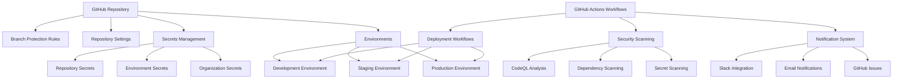
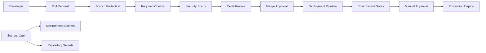

# Design Document

## Overview

This design document outlines the comprehensive configuration strategy for GitHub repository settings, GitHub Actions workflows, and secrets management for the HalluciFix application. The design focuses on security, reliability, maintainability, and compliance while ensuring efficient CI/CD operations.

## Architecture

### High-Level Architecture



### Security Architecture



## Components and Interfaces

### 1. Repository Configuration

**Purpose:** Core GitHub repository settings and security configurations

**Key Settings:**
```yaml
repository_settings:
  security:
    vulnerability_alerts: enabled
    security_advisories: enabled
    dependency_graph: enabled
    secret_scanning: enabled
    push_protection: enabled
  
  features:
    issues: enabled
    projects: enabled
    wiki: disabled
    discussions: enabled
  
  merge_settings:
    allow_merge_commits: false
    allow_squash_merging: true
    allow_rebase_merging: true
    delete_head_branches: true
```

### 2. Branch Protection Rules

**Purpose:** Enforce code quality and security standards

**Configuration:**
```yaml
branch_protection:
  main:
    required_status_checks:
      strict: true
      checks:
        - "Unit Tests"
        - "Integration Tests"
        - "Security Scan"
        - "Coverage Check"
    enforce_admins: true
    required_pull_request_reviews:
      required_approving_review_count: 2
      dismiss_stale_reviews: true
      require_code_owner_reviews: true
    restrictions:
      users: []
      teams: ["core-developers"]
    required_signatures: true
  
  develop:
    required_status_checks:
      strict: true
      checks:
        - "Unit Tests"
        - "Integration Tests"
    required_pull_request_reviews:
      required_approving_review_count: 1
      dismiss_stale_reviews: true
```

### 3. Secrets Management System

**Purpose:** Secure storage and access control for sensitive credentials

**Secret Categories:**
```yaml
repository_secrets:
  # Database and Backend Services
  VITE_SUPABASE_URL: "https://your-project.supabase.co"
  VITE_SUPABASE_ANON_KEY: "eyJ..."
  SUPABASE_SERVICE_ROLE_KEY: "eyJ..."
  DATABASE_URL: "postgresql://..."
  
  # External API Keys
  OPENAI_API_KEY: "sk-..."
  ANTHROPIC_API_KEY: "sk-ant-..."
  GOOGLE_CLIENT_ID: "123456789..."
  GOOGLE_CLIENT_SECRET: "GOCSPX-..."
  
  # Payment Processing
  STRIPE_SECRET_KEY: "sk_test_..."
  STRIPE_WEBHOOK_SECRET: "whsec_..."
  STRIPE_PUBLISHABLE_KEY: "pk_test_..."
  
  # Monitoring and Analytics
  SENTRY_DSN: "https://..."
  CODECOV_TOKEN: "..."
  
  # Notification Services
  SLACK_WEBHOOK_URL: "https://hooks.slack.com/..."
  SLACK_BOT_TOKEN: "xoxb-..."
  
  # Security and Compliance
  SECURITY_SCAN_TOKEN: "..."
  AUDIT_LOG_ENDPOINT: "https://..."
```

**Environment-Specific Secrets:**
```yaml
environments:
  development:
    secrets:
      DEPLOYMENT_TOKEN: "dev_token_..."
      API_BASE_URL: "https://api-dev.hallucifix.com"
      LOG_LEVEL: "debug"
  
  staging:
    secrets:
      DEPLOYMENT_TOKEN: "staging_token_..."
      API_BASE_URL: "https://api-staging.hallucifix.com"
      LOG_LEVEL: "info"
    protection_rules:
      required_reviewers: ["staging-approvers"]
      wait_timer: 5 # minutes
  
  production:
    secrets:
      DEPLOYMENT_TOKEN: "prod_token_..."
      API_BASE_URL: "https://api.hallucifix.com"
      LOG_LEVEL: "warn"
    protection_rules:
      required_reviewers: ["production-approvers"]
      wait_timer: 30 # minutes
      prevent_self_review: true
```

### 4. Workflow Security Configuration

**Purpose:** Secure workflow execution with minimal required permissions

**Permission Templates:**
```yaml
workflow_permissions:
  read_only:
    contents: read
    
  testing:
    contents: read
    issues: write
    pull-requests: write
    checks: write
    
  deployment:
    contents: read
    deployments: write
    environments: write
    
  security_scanning:
    contents: read
    security-events: write
    issues: write
    
  release:
    contents: write
    releases: write
    packages: write
```

**Action Security:**
```yaml
approved_actions:
  # GitHub Official Actions
  - actions/checkout@v4
  - actions/setup-node@v4
  - actions/cache@v4
  - actions/upload-artifact@v4
  - actions/download-artifact@v4
  - github/codeql-action/*@v3
  
  # Third-party Verified Actions
  - codecov/codecov-action@v4
  - trufflesecurity/trufflehog@main
  - aquasecurity/trivy-action@master
  
  # Custom Actions (pinned to SHA)
  - ./.github/actions/issue-management@abc123
```

### 5. Environment Management

**Purpose:** Controlled deployment pipeline with appropriate gates

**Environment Configuration:**
```yaml
environment_definitions:
  development:
    url: "https://dev.hallucifix.com"
    auto_deploy: true
    required_reviewers: []
    deployment_branch_policy:
      protected_branches: false
      custom_branch_policies: true
      custom_branches: ["develop", "feature/*"]
  
  staging:
    url: "https://staging.hallucifix.com"
    auto_deploy: false
    required_reviewers: ["staging-team"]
    wait_timer: 5
    deployment_branch_policy:
      protected_branches: true
      custom_branches: ["main", "develop"]
  
  production:
    url: "https://hallucifix.com"
    auto_deploy: false
    required_reviewers: ["production-approvers", "security-team"]
    wait_timer: 30
    deployment_branch_policy:
      protected_branches: true
      custom_branches: ["main"]
    prevent_self_review: true
```

## Data Models

### Secret Configuration Schema
```typescript
interface SecretConfiguration {
  name: string;
  description: string;
  scope: 'repository' | 'environment' | 'organization';
  environment?: string;
  required: boolean;
  rotation_schedule?: 'weekly' | 'monthly' | 'quarterly';
  validation_pattern?: string;
  created_at: Date;
  last_updated: Date;
  last_used: Date;
}
```

### Environment Configuration Schema
```typescript
interface EnvironmentConfiguration {
  name: string;
  description: string;
  url?: string;
  protection_rules: {
    required_reviewers: string[];
    wait_timer?: number;
    prevent_self_review?: boolean;
  };
  deployment_branch_policy: {
    protected_branches: boolean;
    custom_branch_policies?: boolean;
    custom_branches?: string[];
  };
  secrets: SecretConfiguration[];
  variables: EnvironmentVariable[];
}
```

### Workflow Security Policy
```typescript
interface WorkflowSecurityPolicy {
  workflow_name: string;
  permissions: {
    contents?: 'read' | 'write';
    issues?: 'read' | 'write';
    'pull-requests'?: 'read' | 'write';
    deployments?: 'read' | 'write';
    'security-events'?: 'write';
  };
  allowed_actions: string[];
  secret_access: string[];
  environment_access: string[];
  runner_restrictions?: {
    allowed_runners: string[];
    self_hosted_allowed: boolean;
  };
}
```

## Error Handling

### Secret Management Error Handling

**Missing Secrets:**
```yaml
secret_validation:
  on_missing_required_secret:
    action: fail_workflow
    notification: security_team
    create_issue: true
  
  on_invalid_secret_format:
    action: fail_workflow
    notification: devops_team
    retry_allowed: false
  
  on_secret_rotation_failure:
    action: alert_security_team
    fallback: use_backup_secret
    escalation_timeout: 1_hour
```

**Environment Access Errors:**
```yaml
environment_error_handling:
  deployment_approval_timeout:
    timeout: 24_hours
    action: cancel_deployment
    notification: [approvers, requester]
  
  environment_unavailable:
    retry_count: 3
    retry_delay: 5_minutes
    fallback_environment: staging
  
  protection_rule_violation:
    action: block_deployment
    notification: security_team
    audit_log: true
```

### Workflow Security Violations

**Unauthorized Action Usage:**
```yaml
security_violations:
  unauthorized_action:
    action: fail_workflow
    notification: security_team
    quarantine_workflow: true
  
  permission_escalation_attempt:
    action: fail_workflow
    notification: [security_team, repository_admins]
    create_security_incident: true
  
  secret_exposure_detected:
    action: revoke_secret
    notification: security_team
    create_security_incident: true
    rotate_affected_secrets: true
```

## Testing Strategy

### Secret Management Testing

**Secret Validation Tests:**
```yaml
secret_tests:
  format_validation:
    - test_api_key_format
    - test_url_format
    - test_token_format
  
  access_control:
    - test_environment_secret_isolation
    - test_workflow_secret_access
    - test_unauthorized_secret_access
  
  rotation_testing:
    - test_secret_rotation_process
    - test_fallback_mechanisms
    - test_rotation_notifications
```

**Environment Configuration Tests:**
```yaml
environment_tests:
  deployment_gates:
    - test_approval_requirements
    - test_wait_timer_enforcement
    - test_branch_policy_enforcement
  
  access_control:
    - test_reviewer_permissions
    - test_self_review_prevention
    - test_environment_isolation
```

### Security Testing

**Workflow Security Tests:**
```yaml
security_tests:
  permission_validation:
    - test_minimal_permissions
    - test_permission_enforcement
    - test_privilege_escalation_prevention
  
  action_security:
    - test_action_pinning
    - test_unauthorized_action_blocking
    - test_action_verification
  
  secret_security:
    - test_secret_masking
    - test_secret_injection_prevention
    - test_secret_exposure_detection
```

## Security Considerations

### Secrets Security

**Encryption and Storage:**
- All secrets encrypted at rest using GitHub's encryption
- Secrets never logged or exposed in workflow outputs
- Regular secret rotation with automated validation
- Audit trail for all secret access and modifications

**Access Control:**
- Principle of least privilege for secret access
- Environment-scoped secrets for sensitive operations
- Role-based access control for secret management
- Multi-factor authentication required for secret modifications

### Workflow Security

**Action Security:**
```yaml
action_security_policy:
  pinning_strategy: commit_sha
  verification_required: true
  allowed_sources:
    - github_marketplace_verified
    - organization_actions
    - repository_local_actions
  
  prohibited_patterns:
    - "uses: */action@main"
    - "uses: */action@master"
    - "run: curl | bash"
    - "run: wget | sh"
```

**Input Validation:**
```yaml
input_validation:
  user_inputs:
    sanitization: required
    validation_patterns: defined
    injection_prevention: enabled
  
  environment_variables:
    format_validation: required
    content_scanning: enabled
    secret_detection: enabled
```

### Compliance and Auditing

**Audit Requirements:**
```yaml
audit_configuration:
  retention_period: 90_days
  log_events:
    - secret_access
    - environment_deployments
    - workflow_executions
    - security_violations
    - approval_actions
  
  compliance_reports:
    frequency: monthly
    recipients: [compliance_team, security_team]
    format: [json, pdf]
```

## Performance Optimization

### Caching Strategy

**Secret Caching:**
```yaml
secret_caching:
  strategy: workflow_scoped
  ttl: workflow_duration
  invalidation: on_secret_rotation
  
cache_optimization:
  dependencies:
    key_strategy: lockfile_hash
    paths: [node_modules, ~/.npm]
    compression: enabled
  
  build_artifacts:
    key_strategy: source_hash
    paths: [dist, build]
    parallel_upload: enabled
```

### Resource Optimization

**Runner Selection:**
```yaml
runner_optimization:
  workflow_mapping:
    security_scans: ubuntu-latest-4-cores
    deployments: ubuntu-latest
    testing: ubuntu-latest-8-cores
  
  cost_optimization:
    auto_cancellation: enabled
    concurrent_job_limits: 10
    timeout_enforcement: strict
```

## Monitoring and Analytics

### Security Monitoring

**Security Metrics:**
```yaml
security_monitoring:
  metrics:
    - secret_rotation_compliance
    - workflow_security_violations
    - unauthorized_access_attempts
    - environment_deployment_approvals
  
  alerting:
    channels: [slack, email, pagerduty]
    escalation_rules: defined
    response_procedures: documented
```

### Operational Monitoring

**Workflow Health:**
```yaml
workflow_monitoring:
  metrics:
    - workflow_success_rate
    - deployment_frequency
    - approval_response_time
    - secret_usage_patterns
  
  dashboards:
    - security_overview
    - deployment_pipeline_health
    - secret_management_status
    - compliance_metrics
```

## Integration Points

### External Integrations

**Notification Systems:**
```yaml
integrations:
  slack:
    channels:
      security_alerts: "#security-alerts"
      deployments: "#deployments"
      general_notifications: "#ci-cd"
  
  email:
    security_team: "security@hallucifix.com"
    devops_team: "devops@hallucifix.com"
    compliance_team: "compliance@hallucifix.com"
  
  monitoring:
    sentry: error_tracking
    datadog: metrics_collection
    codecov: coverage_reporting
```

**Security Tools:**
```yaml
security_integrations:
  vulnerability_scanning:
    - github_security_advisories
    - snyk
    - dependabot
  
  code_analysis:
    - codeql
    - sonarcloud
    - semgrep
  
  secret_scanning:
    - github_secret_scanning
    - trufflehog
    - gitleaks
```

This comprehensive design provides a secure, scalable, and maintainable GitHub Actions configuration that addresses all security, compliance, and operational requirements while ensuring efficient CI/CD operations for the HalluciFix application.