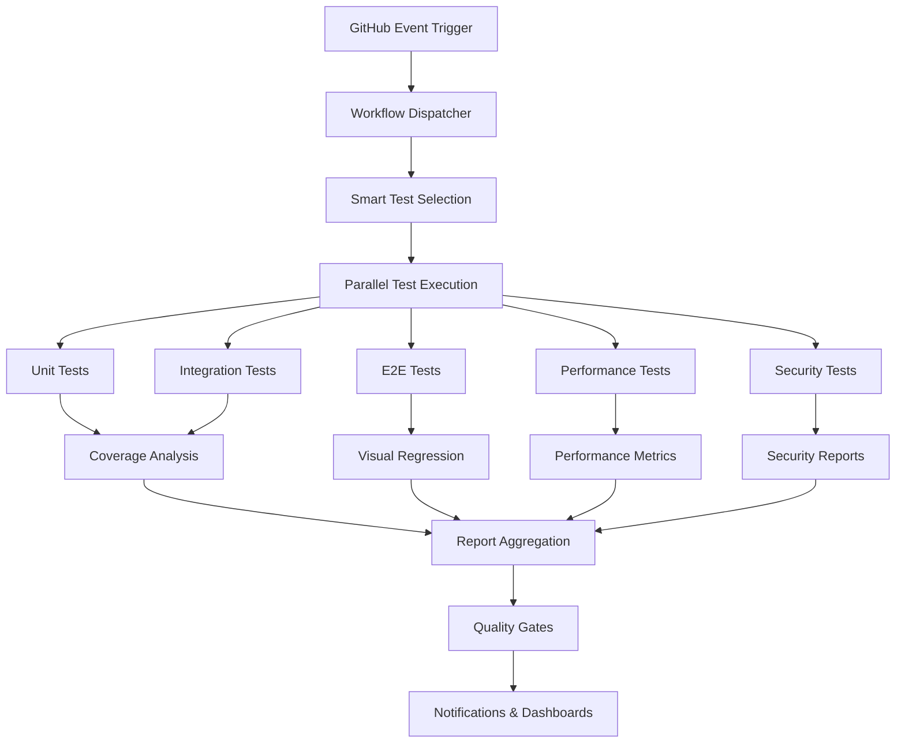

# Design Document

## Overview

This design document outlines the architecture and implementation approach for completely rewriting the GitHub Actions testing infrastructure for HalluciFix. The new system will provide comprehensive, efficient, and intelligent testing coverage with advanced reporting and optimization features.

## Architecture

### High-Level Architecture



### Workflow Structure

The testing system will consist of multiple specialized workflows:

1. **Main Test Workflow** - Comprehensive testing for main branches
2. **PR Test Workflow** - Optimized testing for pull requests
3. **Performance Monitoring** - Continuous performance tracking
4. **Security Scanning** - Automated security validation
5. **Test Analytics** - Reporting and trend analysis

## Components and Interfaces

### 1. Workflow Dispatcher

**Purpose:** Intelligent routing of test execution based on triggers and changes

**Key Features:**
- Event-based workflow triggering
- Smart test selection based on file changes
- Resource allocation optimization
- Parallel execution coordination

**Interface:**
```yaml
inputs:
  test_scope: [all, unit, integration, e2e, performance, security]
  target_branch: string
  changed_files: array
  force_full_suite: boolean
outputs:
  execution_plan: object
  estimated_duration: number
  resource_requirements: object
```

### 2. Test Execution Engine

**Purpose:** Manages parallel test execution across multiple runners

**Components:**
- **Unit Test Runner**: Vitest-based unit testing with coverage
- **Integration Test Runner**: Database and API integration testing
- **E2E Test Runner**: Playwright-based browser testing
- **Performance Test Runner**: Load testing and metrics collection
- **Security Test Runner**: Vulnerability scanning and compliance checks

**Parallelization Strategy:**
```yaml
unit_tests:
  shards: 4
  strategy: file-based
integration_tests:
  shards: 2
  strategy: feature-based
e2e_tests:
  browsers: [chromium, firefox, webkit]
  shards: 3
  strategy: test-suite-based
```

### 3. Coverage Analysis System

**Purpose:** Comprehensive code coverage tracking and enforcement

**Features:**
- Multi-layer coverage aggregation
- Trend analysis and regression detection
- Critical module coverage enforcement
- Coverage visualization and reporting

**Thresholds:**
```yaml
global_coverage:
  lines: 80%
  functions: 80%
  branches: 75%
  statements: 80%
critical_modules:
  threshold: 90%
  modules:
    - src/lib/analysisService.ts
    - src/lib/supabase.ts
    - src/lib/api.ts
    - src/hooks/useAuth.ts
```

### 4. Performance Monitoring

**Purpose:** Automated performance regression detection

**Metrics Tracked:**
- Test execution time
- Bundle size changes
- Core Web Vitals
- API response times
- Database query performance

**Baseline Management:**
```yaml
performance_baselines:
  test_execution: 15_minutes
  bundle_size: 2MB
  first_contentful_paint: 1.5s
  largest_contentful_paint: 2.5s
  cumulative_layout_shift: 0.1
```

### 5. Quality Gates

**Purpose:** Automated quality enforcement before deployment

**Gate Conditions:**
- All tests pass
- Coverage thresholds met
- No security vulnerabilities
- Performance within acceptable ranges
- No accessibility violations

### 6. Notification and Reporting System

**Purpose:** Comprehensive test result communication

**Channels:**
- GitHub PR comments
- Slack notifications
- Email alerts
- Dashboard updates
- Issue creation for failures

## Data Models

### Test Execution Record
```typescript
interface TestExecutionRecord {
  id: string;
  workflow_id: string;
  commit_sha: string;
  branch: string;
  trigger_event: 'push' | 'pull_request' | 'schedule' | 'manual';
  execution_plan: ExecutionPlan;
  start_time: Date;
  end_time?: Date;
  status: 'running' | 'success' | 'failure' | 'cancelled';
  test_results: TestResult[];
  coverage_data: CoverageData;
  performance_metrics: PerformanceMetrics;
  artifacts: Artifact[];
}
```

### Coverage Data
```typescript
interface CoverageData {
  global: CoverageMetrics;
  by_module: Record<string, CoverageMetrics>;
  trend_data: CoverageTrend[];
  regression_detected: boolean;
}

interface CoverageMetrics {
  lines: { covered: number; total: number; percentage: number };
  functions: { covered: number; total: number; percentage: number };
  branches: { covered: number; total: number; percentage: number };
  statements: { covered: number; total: number; percentage: number };
}
```

### Performance Metrics
```typescript
interface PerformanceMetrics {
  test_execution_time: number;
  bundle_size: BundleMetrics;
  web_vitals: WebVitalsMetrics;
  api_performance: ApiPerformanceMetrics;
  regression_alerts: RegressionAlert[];
}
```

## Error Handling

### Test Failure Management

**Failure Categories:**
1. **Flaky Test Failures** - Automatic retry up to 3 times
2. **Infrastructure Failures** - Retry with different runner
3. **Code Quality Failures** - Block deployment, create issue
4. **Performance Regressions** - Alert team, optional blocking

**Error Recovery Strategies:**
```yaml
retry_strategies:
  flaky_tests:
    max_retries: 3
    backoff: exponential
  infrastructure_failures:
    max_retries: 2
    runner_rotation: true
  timeout_failures:
    extend_timeout: 1.5x
    max_extensions: 1
```

### Notification Escalation
```yaml
escalation_matrix:
  test_failures:
    immediate: [slack, github_comment]
    after_1_hour: [email, github_issue]
  security_vulnerabilities:
    immediate: [slack, email, github_issue]
    severity_high: [pager_duty]
  performance_regression:
    immediate: [slack]
    after_24_hours: [email, github_issue]
```

## Testing Strategy

### Smart Test Selection

**File Change Analysis:**
```yaml
test_mapping:
  src/components/**:
    - unit_tests: src/components/**/*.test.tsx
    - e2e_tests: e2e/components/**
  src/lib/**:
    - unit_tests: src/lib/**/*.test.ts
    - integration_tests: src/test/integration/**
  src/hooks/**:
    - unit_tests: src/hooks/**/*.test.ts
    - integration_tests: src/test/hooks/**
  supabase/migrations/**:
    - integration_tests: src/test/database/**
    - full_suite: true
```

**Risk-Based Testing:**
```yaml
risk_levels:
  critical_paths:
    - authentication_flow
    - payment_processing
    - data_analysis_pipeline
  high_risk_changes:
    - database_schema
    - security_configurations
    - api_endpoints
  low_risk_changes:
    - documentation
    - styling
    - non_functional_components
```

### Test Environment Management

**Environment Provisioning:**
```yaml
test_environments:
  unit_tests:
    database: mock
    external_apis: mock
    file_system: temporary
  integration_tests:
    database: postgresql_container
    external_apis: mock_server
    file_system: temporary
  e2e_tests:
    database: postgresql_container
    external_apis: staging_endpoints
    file_system: temporary
```

**Data Management:**
```yaml
test_data_strategy:
  fixtures:
    location: src/test/fixtures/
    format: json
    versioning: true
  factories:
    location: src/test/factories/
    dynamic_generation: true
  cleanup:
    strategy: automatic
    scope: per_test_run
```

## Security Considerations

### Secrets Management
- All sensitive data stored in GitHub Secrets
- Environment-specific secret rotation
- Audit logging for secret access
- Encrypted artifact storage

### Test Data Security
- No production data in tests
- Synthetic test data generation
- PII scrubbing in test outputs
- Secure test environment isolation

### Vulnerability Scanning
```yaml
security_scans:
  dependency_check:
    tool: npm_audit
    severity_threshold: moderate
    fail_build: true
  code_scanning:
    tool: codeql
    languages: [typescript, javascript]
    schedule: daily
  container_scanning:
    tool: trivy
    base_images: [node, postgres]
```

## Performance Optimization

### Caching Strategy
```yaml
cache_layers:
  dependencies:
    key: package-lock.json
    paths: [node_modules, ~/.npm]
    ttl: 7_days
  build_artifacts:
    key: src_hash + package.json
    paths: [dist, .vite]
    ttl: 1_day
  test_results:
    key: test_files_hash
    paths: [coverage, test-results]
    ttl: 1_hour
```

### Resource Optimization
```yaml
runner_configuration:
  unit_tests:
    runner_type: ubuntu-latest
    cpu_cores: 2
    memory: 4GB
  integration_tests:
    runner_type: ubuntu-latest
    cpu_cores: 4
    memory: 8GB
  e2e_tests:
    runner_type: ubuntu-latest-4-cores
    cpu_cores: 4
    memory: 16GB
```

## Monitoring and Analytics

### Test Health Metrics
- Test execution time trends
- Flaky test identification
- Coverage trend analysis
- Performance regression tracking
- Resource utilization monitoring

### Dashboards and Reporting
```yaml
reporting_schedule:
  real_time:
    - test_execution_status
    - coverage_updates
    - performance_alerts
  daily:
    - test_health_summary
    - coverage_report
    - performance_trends
  weekly:
    - comprehensive_analytics
    - quality_metrics_review
    - optimization_recommendations
```

### Integration Points
- GitHub Actions API for workflow data
- Codecov for coverage visualization
- Slack for team notifications
- Custom dashboard for executive reporting

This design provides a robust, scalable, and intelligent testing infrastructure that will significantly improve the quality and reliability of the HalluciFix application while optimizing development workflow efficiency.