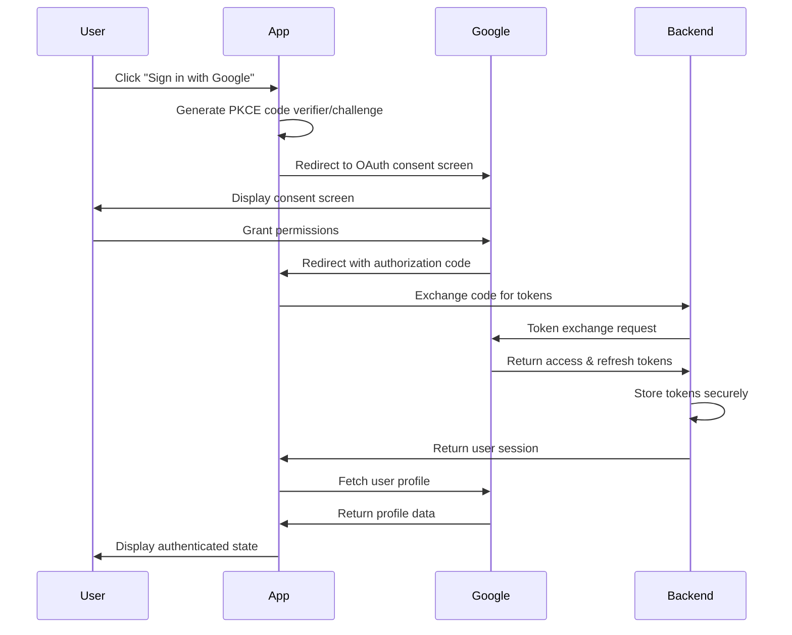
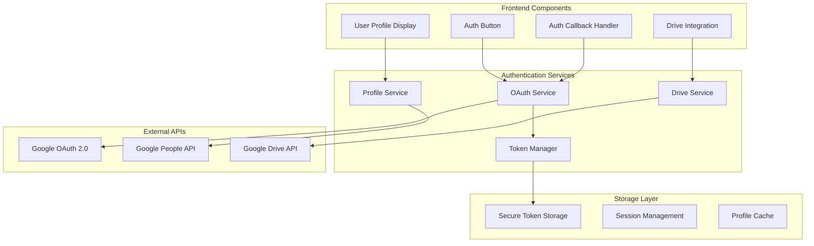

# Design Document

## Overview

This design outlines the implementation of a complete Google OAuth 2.0 authentication system that replaces mock authentication with secure, production-ready OAuth flows. The system will handle user authentication, token management, profile integration, and Google Drive API access while maintaining security best practices and providing a seamless user experience.

## Architecture

### High-Level OAuth Flow



### Component Architecture



## Components and Interfaces

### 1. OAuth Service Implementation

#### Core OAuth Interface
```typescript
interface OAuthProvider {
  name: string;
  clientId: string;
  scopes: string[];
  initiateAuth(redirectUri: string, state?: string): Promise<string>;
  handleCallback(code: string, state: string, codeVerifier: string): Promise<AuthResult>;
  refreshTokens(refreshToken: string): Promise<TokenResult>;
  revokeTokens(accessToken: string): Promise<void>;
}

interface AuthResult {
  accessToken: string;
  refreshToken: string;
  expiresIn: number;
  tokenType: string;
  scope: string;
  user: UserProfile;
}

interface TokenResult {
  accessToken: string;
  refreshToken?: string;
  expiresIn: number;
}
```

#### Google OAuth Provider
```typescript
class GoogleOAuthProvider implements OAuthProvider {
  name = 'google';
  clientId: string;
  clientSecret: string;
  scopes = [
    'openid',
    'email',
    'profile',
    'https://www.googleapis.com/auth/drive.readonly'
  ];

  constructor(config: GoogleOAuthConfig) {
    this.clientId = config.clientId;
    this.clientSecret = config.clientSecret;
  }

  async initiateAuth(redirectUri: string, state?: string): Promise<string> {
    const codeVerifier = this.generateCodeVerifier();
    const codeChallenge = await this.generateCodeChallenge(codeVerifier);
    
    // Store code verifier securely for callback
    await this.storeCodeVerifier(state || 'default', codeVerifier);
    
    const params = new URLSearchParams({
      client_id: this.clientId,
      redirect_uri: redirectUri,
      response_type: 'code',
      scope: this.scopes.join(' '),
      state: state || this.generateState(),
      code_challenge: codeChallenge,
      code_challenge_method: 'S256',
      access_type: 'offline',
      prompt: 'consent'
    });

    return `https://accounts.google.com/o/oauth2/v2/auth?${params.toString()}`;
  }

  async handleCallback(code: string, state: string, codeVerifier: string): Promise<AuthResult> {
    const tokenResponse = await this.exchangeCodeForTokens(code, codeVerifier);
    const userProfile = await this.fetchUserProfile(tokenResponse.access_token);
    
    return {
      ...tokenResponse,
      user: userProfile
    };
  }
}
```

### 2. Token Management System

#### Secure Token Storage
```typescript
interface TokenStorage {
  storeTokens(userId: string, tokens: TokenData): Promise<void>;
  getTokens(userId: string): Promise<TokenData | null>;
  refreshTokens(userId: string): Promise<TokenData>;
  revokeTokens(userId: string): Promise<void>;
}

interface TokenData {
  accessToken: string;
  refreshToken: string;
  expiresAt: Date;
  scope: string;
  tokenType: string;
}

class SecureTokenManager implements TokenStorage {
  private encryptionKey: string;
  
  constructor(encryptionKey: string) {
    this.encryptionKey = encryptionKey;
  }

  async storeTokens(userId: string, tokens: TokenData): Promise<void> {
    const encryptedTokens = await this.encryptTokens(tokens);
    
    const { error } = await supabase
      .from('user_tokens')
      .upsert({
        user_id: userId,
        provider: 'google',
        encrypted_tokens: encryptedTokens,
        expires_at: tokens.expiresAt,
        updated_at: new Date()
      });

    if (error) {
      throw new Error(`Failed to store tokens: ${error.message}`);
    }
  }

  async getTokens(userId: string): Promise<TokenData | null> {
    const { data, error } = await supabase
      .from('user_tokens')
      .select('encrypted_tokens, expires_at')
      .eq('user_id', userId)
      .eq('provider', 'google')
      .single();

    if (error || !data) {
      return null;
    }

    const tokens = await this.decryptTokens(data.encrypted_tokens);
    
    // Check if tokens need refresh
    if (new Date() >= new Date(data.expires_at)) {
      return await this.refreshTokens(userId);
    }

    return tokens;
  }

  async refreshTokens(userId: string): Promise<TokenData> {
    const currentTokens = await this.getStoredTokens(userId);
    if (!currentTokens?.refreshToken) {
      throw new Error('No refresh token available');
    }

    const oauthProvider = new GoogleOAuthProvider(config.google);
    const newTokens = await oauthProvider.refreshTokens(currentTokens.refreshToken);
    
    const updatedTokens: TokenData = {
      ...currentTokens,
      accessToken: newTokens.accessToken,
      refreshToken: newTokens.refreshToken || currentTokens.refreshToken,
      expiresAt: new Date(Date.now() + newTokens.expiresIn * 1000)
    };

    await this.storeTokens(userId, updatedTokens);
    return updatedTokens;
  }
}
```

### 3. User Profile Integration

#### Profile Service
```typescript
interface UserProfile {
  id: string;
  email: string;
  name: string;
  givenName: string;
  familyName: string;
  picture: string;
  locale: string;
  verified: boolean;
}

class GoogleProfileService {
  private tokenManager: TokenManager;

  constructor(tokenManager: TokenManager) {
    this.tokenManager = tokenManager;
  }

  async getUserProfile(userId: string): Promise<UserProfile> {
    const tokens = await this.tokenManager.getTokens(userId);
    if (!tokens) {
      throw new Error('No valid tokens found');
    }

    const response = await fetch('https://www.googleapis.com/oauth2/v2/userinfo', {
      headers: {
        'Authorization': `Bearer ${tokens.accessToken}`,
        'Accept': 'application/json'
      }
    });

    if (!response.ok) {
      if (response.status === 401) {
        // Token expired, try refresh
        const refreshedTokens = await this.tokenManager.refreshTokens(userId);
        return this.getUserProfile(userId);
      }
      throw new Error(`Profile fetch failed: ${response.statusText}`);
    }

    const profileData = await response.json();
    return this.mapGoogleProfileToUserProfile(profileData);
  }

  private mapGoogleProfileToUserProfile(googleProfile: any): UserProfile {
    return {
      id: googleProfile.id,
      email: googleProfile.email,
      name: googleProfile.name,
      givenName: googleProfile.given_name,
      familyName: googleProfile.family_name,
      picture: googleProfile.picture,
      locale: googleProfile.locale,
      verified: googleProfile.verified_email
    };
  }
}
```

### 4. Google Drive Integration

#### Drive Service Implementation
```typescript
interface DriveFile {
  id: string;
  name: string;
  mimeType: string;
  size?: number;
  modifiedTime: string;
  webViewLink: string;
  parents?: string[];
}

class GoogleDriveService {
  private tokenManager: TokenManager;
  private baseUrl = 'https://www.googleapis.com/drive/v3';

  constructor(tokenManager: TokenManager) {
    this.tokenManager = tokenManager;
  }

  async listFiles(userId: string, options: {
    folderId?: string;
    pageSize?: number;
    pageToken?: string;
    query?: string;
  } = {}): Promise<{ files: DriveFile[]; nextPageToken?: string }> {
    const tokens = await this.tokenManager.getTokens(userId);
    if (!tokens) {
      throw new Error('No valid tokens found');
    }

    const params = new URLSearchParams({
      fields: 'files(id,name,mimeType,size,modifiedTime,webViewLink,parents),nextPageToken',
      pageSize: (options.pageSize || 100).toString(),
      orderBy: 'modifiedTime desc'
    });

    if (options.folderId) {
      params.append('q', `'${options.folderId}' in parents and trashed=false`);
    } else if (options.query) {
      params.append('q', `name contains '${options.query}' and trashed=false`);
    } else {
      params.append('q', 'trashed=false');
    }

    if (options.pageToken) {
      params.append('pageToken', options.pageToken);
    }

    const response = await this.makeAuthenticatedRequest(
      userId,
      `${this.baseUrl}/files?${params.toString()}`
    );

    return {
      files: response.files || [],
      nextPageToken: response.nextPageToken
    };
  }

  async downloadFile(userId: string, fileId: string): Promise<string> {
    const tokens = await this.tokenManager.getTokens(userId);
    if (!tokens) {
      throw new Error('No valid tokens found');
    }

    // First get file metadata to determine download method
    const metadata = await this.makeAuthenticatedRequest(
      userId,
      `${this.baseUrl}/files/${fileId}?fields=mimeType,name`
    );

    let downloadUrl: string;
    
    // Handle Google Workspace files
    if (metadata.mimeType === 'application/vnd.google-apps.document') {
      downloadUrl = `${this.baseUrl}/files/${fileId}/export?mimeType=text/plain`;
    } else if (metadata.mimeType === 'application/vnd.google-apps.spreadsheet') {
      downloadUrl = `${this.baseUrl}/files/${fileId}/export?mimeType=text/csv`;
    } else {
      downloadUrl = `${this.baseUrl}/files/${fileId}?alt=media`;
    }

    const response = await this.makeAuthenticatedRequest(userId, downloadUrl, {
      responseType: 'text'
    });

    return response;
  }

  private async makeAuthenticatedRequest(
    userId: string,
    url: string,
    options: { responseType?: 'json' | 'text' } = {}
  ): Promise<any> {
    const tokens = await this.tokenManager.getTokens(userId);
    if (!tokens) {
      throw new Error('No valid tokens found');
    }

    const response = await fetch(url, {
      headers: {
        'Authorization': `Bearer ${tokens.accessToken}`,
        'Accept': options.responseType === 'text' ? 'text/plain' : 'application/json'
      }
    });

    if (!response.ok) {
      if (response.status === 401) {
        // Token expired, refresh and retry
        await this.tokenManager.refreshTokens(userId);
        return this.makeAuthenticatedRequest(userId, url, options);
      }
      throw new Error(`Drive API error: ${response.statusText}`);
    }

    return options.responseType === 'text' 
      ? await response.text()
      : await response.json();
  }
}
```

## Data Models

### Database Schema Updates
```sql
-- User tokens table for secure token storage
CREATE TABLE user_tokens (
  id UUID PRIMARY KEY DEFAULT gen_random_uuid(),
  user_id UUID NOT NULL REFERENCES users(id) ON DELETE CASCADE,
  provider VARCHAR(50) NOT NULL,
  encrypted_tokens TEXT NOT NULL,
  expires_at TIMESTAMP WITH TIME ZONE NOT NULL,
  created_at TIMESTAMP WITH TIME ZONE DEFAULT NOW(),
  updated_at TIMESTAMP WITH TIME ZONE DEFAULT NOW(),
  UNIQUE(user_id, provider)
);

-- OAuth state tracking for CSRF protection
CREATE TABLE oauth_states (
  id UUID PRIMARY KEY DEFAULT gen_random_uuid(),
  state_value VARCHAR(255) NOT NULL UNIQUE,
  code_verifier TEXT NOT NULL,
  redirect_uri TEXT NOT NULL,
  expires_at TIMESTAMP WITH TIME ZONE NOT NULL,
  created_at TIMESTAMP WITH TIME ZONE DEFAULT NOW()
);

-- Indexes for performance
CREATE INDEX idx_user_tokens_user_id ON user_tokens(user_id);
CREATE INDEX idx_user_tokens_expires_at ON user_tokens(expires_at);
CREATE INDEX idx_oauth_states_expires_at ON oauth_states(expires_at);
```

### Configuration Schema
```typescript
interface GoogleOAuthConfig {
  clientId: string;
  clientSecret: string;
  redirectUri: string;
  scopes: string[];
  tokenEncryptionKey: string;
}

interface OAuthEnvironmentConfig {
  google: GoogleOAuthConfig;
  sessionSecret: string;
  cookieSecure: boolean;
  cookieSameSite: 'strict' | 'lax' | 'none';
}
```

## Error Handling

### OAuth Error Types
```typescript
enum OAuthErrorType {
  INVALID_REQUEST = 'invalid_request',
  UNAUTHORIZED_CLIENT = 'unauthorized_client',
  ACCESS_DENIED = 'access_denied',
  UNSUPPORTED_RESPONSE_TYPE = 'unsupported_response_type',
  INVALID_SCOPE = 'invalid_scope',
  SERVER_ERROR = 'server_error',
  TEMPORARILY_UNAVAILABLE = 'temporarily_unavailable'
}

class OAuthError extends Error {
  constructor(
    public type: OAuthErrorType,
    public description?: string,
    public uri?: string
  ) {
    super(`OAuth Error: ${type}${description ? ` - ${description}` : ''}`);
  }
}
```

### Error Recovery Strategies
1. **Token Expiration**: Automatic refresh with fallback to re-authentication
2. **Network Errors**: Retry with exponential backoff
3. **Rate Limiting**: Queue requests with appropriate delays
4. **Scope Errors**: Incremental authorization requests
5. **User Denial**: Graceful degradation with retry options

## Security Implementation

### PKCE Implementation
```typescript
class PKCEHelper {
  static generateCodeVerifier(): string {
    const array = new Uint8Array(32);
    crypto.getRandomValues(array);
    return this.base64URLEncode(array);
  }

  static async generateCodeChallenge(verifier: string): Promise<string> {
    const encoder = new TextEncoder();
    const data = encoder.encode(verifier);
    const digest = await crypto.subtle.digest('SHA-256', data);
    return this.base64URLEncode(new Uint8Array(digest));
  }

  private static base64URLEncode(array: Uint8Array): string {
    return btoa(String.fromCharCode(...array))
      .replace(/\+/g, '-')
      .replace(/\//g, '_')
      .replace(/=/g, '');
  }
}
```

### Token Encryption
```typescript
class TokenEncryption {
  private algorithm = 'AES-GCM';
  private keyLength = 256;

  async encryptTokens(tokens: TokenData, key: string): Promise<string> {
    const encoder = new TextEncoder();
    const data = encoder.encode(JSON.stringify(tokens));
    
    const cryptoKey = await this.importKey(key);
    const iv = crypto.getRandomValues(new Uint8Array(12));
    
    const encrypted = await crypto.subtle.encrypt(
      { name: this.algorithm, iv },
      cryptoKey,
      data
    );

    const result = new Uint8Array(iv.length + encrypted.byteLength);
    result.set(iv);
    result.set(new Uint8Array(encrypted), iv.length);
    
    return btoa(String.fromCharCode(...result));
  }

  async decryptTokens(encryptedData: string, key: string): Promise<TokenData> {
    const data = new Uint8Array(
      atob(encryptedData).split('').map(char => char.charCodeAt(0))
    );
    
    const iv = data.slice(0, 12);
    const encrypted = data.slice(12);
    
    const cryptoKey = await this.importKey(key);
    
    const decrypted = await crypto.subtle.decrypt(
      { name: this.algorithm, iv },
      cryptoKey,
      encrypted
    );

    const decoder = new TextDecoder();
    const tokenString = decoder.decode(decrypted);
    
    return JSON.parse(tokenString);
  }

  private async importKey(key: string): Promise<CryptoKey> {
    const encoder = new TextEncoder();
    const keyData = encoder.encode(key);
    
    return crypto.subtle.importKey(
      'raw',
      keyData,
      { name: this.algorithm },
      false,
      ['encrypt', 'decrypt']
    );
  }
}
```

## Testing Strategy

### Unit Testing
- OAuth flow components
- Token management functions
- Profile service methods
- Drive API integration
- Security helpers (PKCE, encryption)

### Integration Testing
- Complete OAuth flow end-to-end
- Token refresh scenarios
- Profile data synchronization
- Drive file operations
- Error handling and recovery

### Security Testing
- CSRF protection validation
- Token encryption/decryption
- Scope validation
- State parameter verification
- Token storage security

## Performance Considerations

### Caching Strategy
- Profile data caching with TTL
- Token validation caching
- Drive file metadata caching
- API response caching

### Connection Management
- HTTP connection pooling
- Request deduplication
- Concurrent request limiting
- Retry mechanisms with backoff

## Monitoring and Observability

### Metrics to Track
- OAuth success/failure rates
- Token refresh frequency
- API response times
- Error rates by type
- User authentication patterns

### Logging Requirements
- OAuth flow events
- Token operations (without sensitive data)
- API call performance
- Error conditions
- Security events