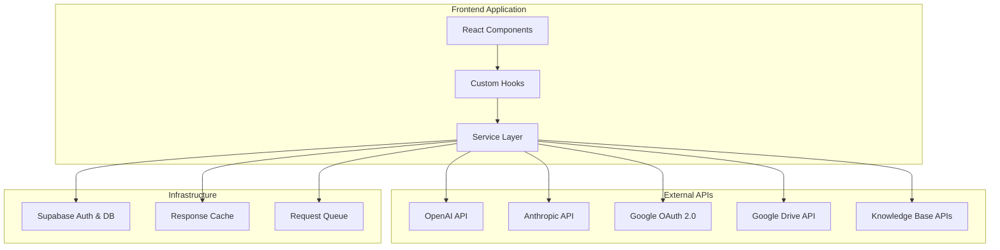

# Design Document

## Overview

This design outlines the replacement of mock service implementations with real API integrations across four key areas: AI analysis services, Google Drive integration, authentication systems, and RAG knowledge base services. The design maintains backward compatibility while enabling production-ready functionality through proper API client implementations, error handling, and configuration management.

## Architecture

### High-Level Architecture



### Service Integration Strategy

The design follows a provider pattern where each service type (AI, Auth, Drive, Knowledge) has:
- **Primary Provider**: Main API service
- **Fallback Provider**: Secondary service for redundancy
- **Mock Provider**: Development/testing fallback
- **Circuit Breaker**: Automatic failover mechanism

## Components and Interfaces

### 1. AI Analysis Service Integration

#### Provider Interface
```typescript
interface AIProvider {
  name: string;
  analyzeContent(content: string, options: AnalysisOptions): Promise<AnalysisResult>;
  validateApiKey(): Promise<boolean>;
  getRateLimit(): Promise<RateLimitInfo>;
}
```

#### OpenAI Provider Implementation
- **API Client**: Official OpenAI SDK with custom retry logic
- **Model Selection**: Support for GPT-4, GPT-3.5-turbo with configurable fallbacks
- **Rate Limiting**: Token bucket algorithm with queue management
- **Error Handling**: Exponential backoff with circuit breaker pattern

#### Anthropic Provider Implementation
- **API Client**: Official Anthropic SDK integration
- **Model Selection**: Claude-3 family with automatic model selection
- **Streaming Support**: Real-time analysis for large content
- **Cost Optimization**: Intelligent prompt engineering to minimize token usage

#### Configuration Management
```typescript
interface AIServiceConfig {
  providers: {
    openai: {
      apiKey: string;
      model: string;
      maxTokens: number;
      temperature: number;
    };
    anthropic: {
      apiKey: string;
      model: string;
      maxTokens: number;
    };
  };
  fallbackOrder: string[];
  rateLimits: Record<string, RateLimitConfig>;
}
```

### 2. Google Drive API Integration

#### OAuth 2.0 Flow Implementation
- **Authorization Code Flow**: PKCE-enabled for security
- **Scope Management**: Minimal required scopes (drive.readonly, drive.file)
- **Token Management**: Automatic refresh with secure storage
- **Multi-account Support**: Handle multiple Google accounts per user

#### Drive API Client
```typescript
interface DriveProvider {
  authenticate(): Promise<AuthResult>;
  listFiles(folderId?: string, options?: ListOptions): Promise<DriveFile[]>;
  downloadFile(fileId: string): Promise<string>;
  searchFiles(query: string, filters?: SearchFilters): Promise<DriveFile[]>;
  getFolderStructure(folderId?: string): Promise<DriveFolder>;
}
```

#### File Processing Pipeline
- **MIME Type Detection**: Automatic file type identification
- **Content Extraction**: Support for Google Docs, Sheets, PDFs, text files
- **Size Limits**: Configurable file size restrictions with chunking for large files
- **Caching**: Intelligent caching of file metadata and content

### 3. Authentication Service Enhancement

#### Multi-Provider OAuth System
```typescript
interface AuthProvider {
  name: string;
  initiateAuth(redirectUri: string): Promise<AuthUrl>;
  handleCallback(code: string, state: string): Promise<AuthResult>;
  refreshToken(refreshToken: string): Promise<TokenResult>;
  validateToken(token: string): Promise<UserInfo>;
}
```

#### Google OAuth Provider
- **OAuth 2.0 Implementation**: Full compliance with Google OAuth standards
- **JWT Token Handling**: Secure token validation and refresh
- **User Profile Integration**: Automatic user profile synchronization
- **Session Management**: Secure session handling with Supabase integration

#### Security Features
- **CSRF Protection**: State parameter validation
- **Token Encryption**: Secure token storage in Supabase
- **Audit Logging**: Comprehensive authentication event logging
- **Rate Limiting**: Login attempt throttling

### 4. RAG Knowledge Base Integration

#### Knowledge Source Providers
```typescript
interface KnowledgeProvider {
  name: string;
  search(query: string, options: SearchOptions): Promise<Document[]>;
  getReliabilityScore(): number;
  getSourceMetadata(): SourceMetadata;
}
```

#### Wikipedia Provider
- **API Integration**: Wikipedia REST API with proper attribution
- **Content Processing**: Extract and clean Wikipedia content
- **Reliability Scoring**: Dynamic reliability based on article quality metrics
- **Caching Strategy**: Aggressive caching with TTL-based invalidation

#### Academic Sources Provider
- **API Integration**: Integration with academic databases (arXiv, PubMed)
- **Citation Extraction**: Proper academic citation formatting
- **Peer Review Validation**: Verification of peer-review status
- **Impact Factor Weighting**: Source ranking based on journal impact

#### News Sources Provider
- **API Integration**: Reuters, AP News, other reputable news APIs
- **Fact-Check Integration**: Cross-reference with fact-checking services
- **Recency Weighting**: Time-based relevance scoring
- **Bias Detection**: Source bias assessment and compensation

## Data Models

### Enhanced Analysis Result
```typescript
interface EnhancedAnalysisResult extends AnalysisResult {
  providerUsed: string;
  apiResponseTime: number;
  tokenUsage?: {
    prompt: number;
    completion: number;
    total: number;
  };
  rateLimitStatus?: RateLimitStatus;
  fallbacksUsed: string[];
}
```

### API Configuration
```typescript
interface APIConfiguration {
  ai: {
    primaryProvider: string;
    providers: Record<string, ProviderConfig>;
    fallbackChain: string[];
    rateLimits: RateLimitConfig;
  };
  auth: {
    providers: Record<string, OAuthConfig>;
    sessionConfig: SessionConfig;
  };
  drive: {
    scopes: string[];
    fileSizeLimit: number;
    supportedMimeTypes: string[];
  };
  knowledge: {
    sources: Record<string, KnowledgeSourceConfig>;
    cacheTTL: number;
    maxConcurrentRequests: number;
  };
}
```

### Error Tracking
```typescript
interface APIError {
  provider: string;
  endpoint: string;
  errorCode: string;
  message: string;
  timestamp: string;
  retryCount: number;
  fallbackUsed?: string;
}
```

## Error Handling

### Circuit Breaker Pattern
- **Failure Threshold**: 5 consecutive failures trigger circuit open
- **Recovery Time**: 30-second timeout before attempting recovery
- **Health Checks**: Periodic health checks during circuit open state
- **Graceful Degradation**: Automatic fallback to secondary providers

### Retry Logic
- **Exponential Backoff**: Base delay of 1s, max delay of 30s
- **Jitter**: Random jitter to prevent thundering herd
- **Retry Conditions**: Configurable retry for specific error types
- **Max Retries**: Configurable maximum retry attempts per request

### Error Recovery Strategies
1. **API Failures**: Automatic provider failover
2. **Rate Limiting**: Request queuing with user notification
3. **Authentication Errors**: Automatic token refresh or re-authentication prompt
4. **Network Issues**: Offline mode with cached responses

## Testing Strategy

### Unit Testing
- **Provider Mocking**: Mock implementations for each external provider
- **Error Simulation**: Comprehensive error condition testing
- **Configuration Testing**: Validation of all configuration scenarios
- **Token Management**: Authentication flow testing

### Integration Testing
- **End-to-End Flows**: Complete user journey testing
- **API Contract Testing**: Validation against real API responses
- **Performance Testing**: Load testing with rate limit validation
- **Failover Testing**: Circuit breaker and fallback mechanism validation

### Security Testing
- **Token Security**: Secure token storage and transmission testing
- **OAuth Flow Security**: CSRF and state parameter validation
- **API Key Protection**: Ensure no API key exposure in logs or client
- **Rate Limit Compliance**: Verify rate limit adherence

## Performance Considerations

### Caching Strategy
- **Response Caching**: Redis-based caching for API responses
- **Cache Invalidation**: TTL-based with manual invalidation capabilities
- **Cache Warming**: Proactive caching of frequently accessed data
- **Cache Hierarchy**: Multi-level caching (memory, Redis, CDN)

### Request Optimization
- **Batch Processing**: Combine multiple requests where possible
- **Request Deduplication**: Avoid duplicate concurrent requests
- **Compression**: Enable gzip compression for large payloads
- **Connection Pooling**: Reuse HTTP connections for efficiency

### Monitoring and Metrics
- **API Response Times**: Track and alert on response time degradation
- **Error Rates**: Monitor error rates per provider and endpoint
- **Rate Limit Usage**: Track API quota consumption
- **Cost Monitoring**: Track API usage costs and budget alerts

## Security Implementation

### API Key Management
- **Environment Variables**: Secure storage in environment configuration
- **Key Rotation**: Support for API key rotation without downtime
- **Access Control**: Role-based access to different API providers
- **Audit Trail**: Comprehensive logging of API key usage

### Data Protection
- **Encryption in Transit**: TLS 1.3 for all API communications
- **Encryption at Rest**: Encrypted storage of cached responses
- **Data Minimization**: Only store necessary data from API responses
- **PII Handling**: Proper handling and anonymization of user data

### Compliance
- **GDPR Compliance**: User data handling and deletion capabilities
- **SOC 2 Compliance**: Security controls and audit requirements
- **API Terms Compliance**: Adherence to all provider terms of service
- **Data Retention**: Configurable data retention policies