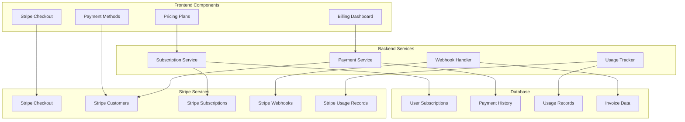
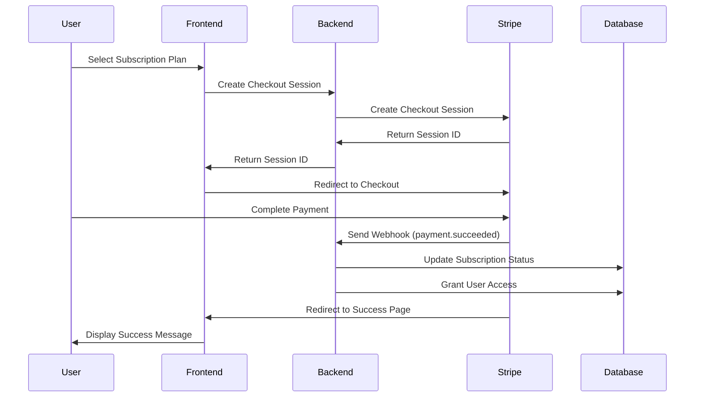

# Design Document

## Overview

This design outlines a comprehensive Stripe payment integration that provides secure subscription management, billing, and payment processing. The system will handle multiple subscription tiers, usage-based billing, secure payment processing, and comprehensive webhook integration while maintaining PCI compliance and excellent user experience.

## Architecture

### Payment Integration Architecture



### Subscription Flow Architecture



## Components and Interfaces

### 1. Subscription Management System

#### Subscription Service Interface
```typescript
interface SubscriptionPlan {
  id: string;
  name: string;
  description: string;
  price: number;
  interval: 'month' | 'year';
  currency: string;
  features: string[];
  stripePriceId: string;
  analysisLimit: number;
  priority: number;
  popular?: boolean;
}

interface UserSubscription {
  id: string;
  userId: string;
  stripeCustomerId: string;
  stripeSubscriptionId: string;
  planId: string;
  status: 'active' | 'canceled' | 'past_due' | 'unpaid' | 'trialing';
  currentPeriodStart: Date;
  currentPeriodEnd: Date;
  trialEnd?: Date;
  cancelAtPeriodEnd: boolean;
  createdAt: Date;
  updatedAt: Date;
}

class SubscriptionService {
  private stripe: Stripe;

  constructor(stripeSecretKey: string) {
    this.stripe = new Stripe(stripeSecretKey, {
      apiVersion: '2023-10-16',
      typescript: true
    });
  }

  async createCheckoutSession(
    userId: string,
    priceId: string,
    options: {
      successUrl: string;
      cancelUrl: string;
      trialPeriodDays?: number;
      couponId?: string;
    }
  ): Promise<{ sessionId: string; url: string }> {
    const user = await this.getUserById(userId);
    
    // Get or create Stripe customer
    let customer = await this.getStripeCustomer(userId);
    if (!customer) {
      customer = await this.stripe.customers.create({
        email: user.email,
        name: user.name,
        metadata: {
          userId: userId
        }
      });
      
      await this.saveStripeCustomer(userId, customer.id);
    }

    const sessionParams: Stripe.Checkout.SessionCreateParams = {
      customer: customer.id,
      line_items: [
        {
          price: priceId,
          quantity: 1
        }
      ],
      mode: 'subscription',
      success_url: options.successUrl,
      cancel_url: options.cancelUrl,
      billing_address_collection: 'required',
      customer_update: {
        address: 'auto'
      },
      metadata: {
        userId: userId,
        priceId: priceId
      }
    };

    // Add trial period if specified
    if (options.trialPeriodDays) {
      sessionParams.subscription_data = {
        trial_period_days: options.trialPeriodDays,
        metadata: {
          userId: userId
        }
      };
    }

    // Add coupon if specified
    if (options.couponId) {
      sessionParams.discounts = [
        {
          coupon: options.couponId
        }
      ];
    }

    const session = await this.stripe.checkout.sessions.create(sessionParams);

    return {
      sessionId: session.id,
      url: session.url!
    };
  }

  async createPortalSession(
    userId: string,
    returnUrl: string
  ): Promise<{ url: string }> {
    const customer = await this.getStripeCustomer(userId);
    if (!customer) {
      throw new Error('No Stripe customer found for user');
    }

    const session = await this.stripe.billingPortal.sessions.create({
      customer: customer.id,
      return_url: returnUrl
    });

    return { url: session.url };
  }

  async updateSubscription(
    subscriptionId: string,
    newPriceId: string
  ): Promise<Stripe.Subscription> {
    const subscription = await this.stripe.subscriptions.retrieve(subscriptionId);
    
    return await this.stripe.subscriptions.update(subscriptionId, {
      items: [
        {
          id: subscription.items.data[0].id,
          price: newPriceId
        }
      ],
      proration_behavior: 'create_prorations'
    });
  }

  async cancelSubscription(
    subscriptionId: string,
    cancelAtPeriodEnd: boolean = true
  ): Promise<Stripe.Subscription> {
    if (cancelAtPeriodEnd) {
      return await this.stripe.subscriptions.update(subscriptionId, {
        cancel_at_period_end: true
      });
    } else {
      return await this.stripe.subscriptions.cancel(subscriptionId);
    }
  }

  async getSubscriptionPlans(): Promise<SubscriptionPlan[]> {
    // This would typically come from a database or configuration
    return [
      {
        id: 'basic',
        name: 'Basic',
        description: 'Essential AI accuracy verification',
        price: 29,
        interval: 'month',
        currency: 'usd',
        features: [
          '1,000 analyses per month',
          'Basic hallucination detection',
          'Email support',
          'Standard accuracy reports'
        ],
        stripePriceId: config.stripe.priceIds.basicMonthly,
        analysisLimit: 1000,
        priority: 1
      },
      {
        id: 'pro',
        name: 'Pro',
        description: 'Advanced verification with team features',
        price: 99,
        interval: 'month',
        currency: 'usd',
        features: [
          '10,000 analyses per month',
          'Advanced seq-logprob analysis',
          'Team collaboration',
          'Priority support',
          'Custom integrations',
          'Advanced analytics'
        ],
        stripePriceId: config.stripe.priceIds.proMonthly,
        analysisLimit: 10000,
        priority: 2,
        popular: true
      },
      {
        id: 'enterprise',
        name: 'Enterprise',
        description: 'Custom solutions for large organizations',
        price: 0, // Custom pricing
        interval: 'month',
        currency: 'usd',
        features: [
          'Unlimited analyses',
          'Custom model training',
          'Dedicated support',
          'SLA guarantees',
          'On-premise deployment',
          'Custom integrations'
        ],
        stripePriceId: '', // Contact sales
        analysisLimit: -1, // Unlimited
        priority: 3
      }
    ];
  }
}
```

### 2. Payment Processing Components

#### Stripe Elements Integration
```typescript
// components/StripeCheckout.tsx
import { loadStripe } from '@stripe/stripe-js';
import {
  Elements,
  CardElement,
  useStripe,
  useElements
} from '@stripe/react-stripe-js';

const stripePromise = loadStripe(config.stripe.publishableKey);

interface CheckoutFormProps {
  clientSecret: string;
  onSuccess: (paymentIntent: any) => void;
  onError: (error: any) => void;
}

const CheckoutForm: React.FC<CheckoutFormProps> = ({
  clientSecret,
  onSuccess,
  onError
}) => {
  const stripe = useStripe();
  const elements = useElements();
  const [processing, setProcessing] = useState(false);

  const handleSubmit = async (event: React.FormEvent) => {
    event.preventDefault();

    if (!stripe || !elements) {
      return;
    }

    setProcessing(true);

    const cardElement = elements.getElement(CardElement);
    if (!cardElement) {
      setProcessing(false);
      return;
    }

    try {
      const { error, paymentIntent } = await stripe.confirmCardPayment(
        clientSecret,
        {
          payment_method: {
            card: cardElement,
            billing_details: {
              name: 'Customer Name', // Get from form
              email: 'customer@example.com' // Get from user context
            }
          }
        }
      );

      if (error) {
        onError(error);
      } else if (paymentIntent?.status === 'succeeded') {
        onSuccess(paymentIntent);
      }
    } catch (err) {
      onError(err);
    } finally {
      setProcessing(false);
    }
  };

  return (
    <form onSubmit={handleSubmit} className="space-y-6">
      <div className="p-4 border border-slate-200 rounded-lg">
        <CardElement
          options={{
            style: {
              base: {
                fontSize: '16px',
                color: '#424770',
                '::placeholder': {
                  color: '#aab7c4',
                },
              },
            },
          }}
        />
      </div>
      
      <button
        type="submit"
        disabled={!stripe || processing}
        className={`w-full py-3 px-4 rounded-lg font-medium transition-colors ${
          processing
            ? 'bg-slate-400 cursor-not-allowed'
            : 'bg-blue-600 hover:bg-blue-700'
        } text-white`}
      >
        {processing ? 'Processing...' : 'Complete Payment'}
      </button>
    </form>
  );
};

export const StripeCheckout: React.FC<CheckoutFormProps> = (props) => {
  return (
    <Elements stripe={stripePromise}>
      <CheckoutForm {...props} />
    </Elements>
  );
};
```

#### Subscription Plans Component
```typescript
// components/SubscriptionPlans.tsx
interface PlanCardProps {
  plan: SubscriptionPlan;
  currentPlan?: string;
  onSelect: (plan: SubscriptionPlan) => void;
  loading?: boolean;
}

const PlanCard: React.FC<PlanCardProps> = ({
  plan,
  currentPlan,
  onSelect,
  loading
}) => {
  const isCurrentPlan = currentPlan === plan.id;
  const isEnterprise = plan.id === 'enterprise';

  return (
    <div className={`relative bg-white rounded-lg border-2 p-6 ${
      plan.popular 
        ? 'border-blue-500 shadow-lg' 
        : isCurrentPlan 
        ? 'border-green-500' 
        : 'border-slate-200'
    }`}>
      {plan.popular && (
        <div className="absolute -top-3 left-1/2 transform -translate-x-1/2">
          <span className="bg-blue-500 text-white px-3 py-1 rounded-full text-sm font-medium">
            Most Popular
          </span>
        </div>
      )}
      
      {isCurrentPlan && (
        <div className="absolute -top-3 right-4">
          <span className="bg-green-500 text-white px-3 py-1 rounded-full text-sm font-medium">
            Current Plan
          </span>
        </div>
      )}
      
      <div className="text-center mb-6">
        <h3 className="text-xl font-semibold text-slate-900 mb-2">
          {plan.name}
        </h3>
        <p className="text-slate-600 mb-4">{plan.description}</p>
        
        <div className="text-3xl font-bold text-slate-900">
          {isEnterprise ? (
            'Custom'
          ) : (
            <>
              ${plan.price}
              <span className="text-lg font-normal text-slate-600">
                /{plan.interval}
              </span>
            </>
          )}
        </div>
      </div>
      
      <ul className="space-y-3 mb-6">
        {plan.features.map((feature, index) => (
          <li key={index} className="flex items-center space-x-3">
            <Check className="w-5 h-5 text-green-500 flex-shrink-0" />
            <span className="text-slate-700">{feature}</span>
          </li>
        ))}
      </ul>
      
      <button
        onClick={() => onSelect(plan)}
        disabled={loading || isCurrentPlan}
        className={`w-full py-3 px-4 rounded-lg font-medium transition-colors ${
          isCurrentPlan
            ? 'bg-green-100 text-green-800 cursor-default'
            : loading
            ? 'bg-slate-400 cursor-not-allowed text-white'
            : plan.popular
            ? 'bg-blue-600 text-white hover:bg-blue-700'
            : isEnterprise
            ? 'bg-purple-600 text-white hover:bg-purple-700'
            : 'bg-slate-100 text-slate-900 hover:bg-slate-200'
        }`}
      >
        {isCurrentPlan
          ? 'Current Plan'
          : loading
          ? 'Processing...'
          : isEnterprise
          ? 'Contact Sales'
          : 'Get Started'
        }
      </button>
    </div>
  );
};

export const SubscriptionPlans: React.FC = () => {
  const [plans, setPlans] = useState<SubscriptionPlan[]>([]);
  const [loading, setLoading] = useState(false);
  const { user } = useAuth();
  
  useEffect(() => {
    loadSubscriptionPlans();
  }, []);

  const loadSubscriptionPlans = async () => {
    try {
      const subscriptionPlans = await subscriptionService.getSubscriptionPlans();
      setPlans(subscriptionPlans);
    } catch (error) {
      console.error('Failed to load subscription plans:', error);
    }
  };

  const handlePlanSelect = async (plan: SubscriptionPlan) => {
    if (plan.id === 'enterprise') {
      // Redirect to contact sales
      window.open('mailto:sales@hallucifix.com', '_blank');
      return;
    }

    setLoading(true);
    try {
      const { sessionId } = await subscriptionService.createCheckoutSession(
        user!.id,
        plan.stripePriceId,
        {
          successUrl: `${window.location.origin}/billing/success`,
          cancelUrl: `${window.location.origin}/billing/cancel`,
          trialPeriodDays: 14
        }
      );
      
      const stripe = await stripePromise;
      if (stripe) {
        const { error } = await stripe.redirectToCheckout({ sessionId });
        if (error) {
          console.error('Stripe error:', error);
        }
      }
    } catch (error) {
      console.error('Checkout error:', error);
    } finally {
      setLoading(false);
    }
  };

  return (
    <div className="max-w-6xl mx-auto px-4 py-8">
      <div className="text-center mb-12">
        <h2 className="text-3xl font-bold text-slate-900 mb-4">
          Choose Your Plan
        </h2>
        <p className="text-xl text-slate-600">
          Start with a 14-day free trial. No credit card required.
        </p>
      </div>
      
      <div className="grid md:grid-cols-3 gap-8">
        {plans.map((plan) => (
          <PlanCard
            key={plan.id}
            plan={plan}
            onSelect={handlePlanSelect}
            loading={loading}
          />
        ))}
      </div>
    </div>
  );
};
```

### 3. Billing Dashboard

#### Billing Information Display
```typescript
// components/BillingDashboard.tsx
interface BillingInfo {
  subscription: {
    id: string;
    status: string;
    currentPeriodEnd: string;
    plan: SubscriptionPlan;
    cancelAtPeriodEnd: boolean;
    trialEnd?: string;
  };
  usage: {
    current: number;
    limit: number;
    resetDate: string;
    overage: number;
    overageCost: number;
  };
  paymentMethod: {
    brand: string;
    last4: string;
    expiryMonth: number;
    expiryYear: number;
  } | null;
  invoices: Array<{
    id: string;
    date: string;
    amount: number;
    status: string;
    downloadUrl: string;
    description: string;
  }>;
}

export const BillingDashboard: React.FC = () => {
  const [billingInfo, setBillingInfo] = useState<BillingInfo | null>(null);
  const [loading, setLoading] = useState(true);
  const { user } = useAuth();

  useEffect(() => {
    loadBillingInfo();
  }, []);

  const loadBillingInfo = async () => {
    try {
      const response = await fetch('/api/billing/info', {
        headers: {
          'Authorization': `Bearer ${await getAuthToken()}`
        }
      });
      const data = await response.json();
      setBillingInfo(data);
    } catch (error) {
      console.error('Error loading billing info:', error);
    } finally {
      setLoading(false);
    }
  };

  const handleManageBilling = async () => {
    try {
      const response = await fetch('/api/billing/portal', {
        method: 'POST',
        headers: {
          'Authorization': `Bearer ${await getAuthToken()}`
        }
      });
      const { url } = await response.json();
      window.location.href = url;
    } catch (error) {
      console.error('Error opening billing portal:', error);
    }
  };

  const handleCancelSubscription = async () => {
    if (!confirm('Are you sure you want to cancel your subscription?')) {
      return;
    }

    try {
      await fetch('/api/billing/cancel', {
        method: 'POST',
        headers: {
          'Authorization': `Bearer ${await getAuthToken()}`
        }
      });
      
      await loadBillingInfo(); // Refresh billing info
    } catch (error) {
      console.error('Error canceling subscription:', error);
    }
  };

  if (loading) {
    return <div className="animate-pulse">Loading billing information...</div>;
  }

  if (!billingInfo) {
    return <div>Error loading billing information</div>;
  }

  const { subscription, usage, paymentMethod, invoices } = billingInfo;

  return (
    <div className="max-w-4xl mx-auto space-y-6">
      {/* Subscription Status */}
      <div className="bg-white rounded-lg border border-slate-200 p-6">
        <div className="flex justify-between items-start mb-4">
          <h3 className="text-lg font-semibold text-slate-900">
            Current Subscription
          </h3>
          
          <div className="flex space-x-2">
            <button
              onClick={handleManageBilling}
              className="px-4 py-2 bg-blue-600 text-white rounded-lg hover:bg-blue-700 transition-colors"
            >
              Manage Billing
            </button>
            
            {subscription.status === 'active' && !subscription.cancelAtPeriodEnd && (
              <button
                onClick={handleCancelSubscription}
                className="px-4 py-2 border border-red-300 text-red-700 rounded-lg hover:bg-red-50 transition-colors"
              >
                Cancel Subscription
              </button>
            )}
          </div>
        </div>
        
        <div className="grid md:grid-cols-2 gap-6">
          <div>
            <div className="text-2xl font-bold text-slate-900">
              {subscription.plan.name}
            </div>
            <div className="text-slate-600">
              ${subscription.plan.price}/{subscription.plan.interval}
            </div>
            <div className="mt-2">
              <span className={`inline-flex px-2 py-1 rounded-full text-xs font-medium ${
                subscription.status === 'active'
                  ? 'bg-green-100 text-green-800'
                  : subscription.status === 'trialing'
                  ? 'bg-blue-100 text-blue-800'
                  : 'bg-yellow-100 text-yellow-800'
              }`}>
                {subscription.status === 'trialing' ? 'Trial' : subscription.status}
              </span>
            </div>
            
            {subscription.cancelAtPeriodEnd && (
              <div className="mt-2 text-sm text-orange-600">
                Subscription will cancel on {new Date(subscription.currentPeriodEnd).toLocaleDateString()}
              </div>
            )}
          </div>
          
          <div>
            <div className="text-sm text-slate-600 mb-1">
              {subscription.trialEnd ? 'Trial ends' : 'Next billing date'}
            </div>
            <div className="text-slate-900">
              {new Date(subscription.trialEnd || subscription.currentPeriodEnd).toLocaleDateString()}
            </div>
          </div>
        </div>
      </div>

      {/* Usage Tracking */}
      <div className="bg-white rounded-lg border border-slate-200 p-6">
        <h3 className="text-lg font-semibold text-slate-900 mb-4">
          Usage This Month
        </h3>
        
        <div className="mb-4">
          <div className="flex justify-between text-sm text-slate-600 mb-2">
            <span>API Calls</span>
            <span>
              {usage.current.toLocaleString()} / {usage.limit === -1 ? 'Unlimited' : usage.limit.toLocaleString()}
            </span>
          </div>
          
          {usage.limit !== -1 && (
            <div className="w-full bg-slate-200 rounded-full h-2">
              <div
                className={`h-2 rounded-full ${
                  usage.current / usage.limit > 0.9 ? 'bg-red-500' :
                  usage.current / usage.limit > 0.8 ? 'bg-yellow-500' : 'bg-blue-600'
                }`}
                style={{
                  width: `${Math.min((usage.current / usage.limit) * 100, 100)}%`
                }}
              />
            </div>
          )}
        </div>
        
        {usage.overage > 0 && (
          <div className="bg-yellow-50 border border-yellow-200 rounded-lg p-4">
            <div className="flex items-center space-x-2 text-yellow-800 mb-2">
              <AlertCircle className="w-5 h-5" />
              <span className="font-medium">Usage Overage</span>
            </div>
            <p className="text-yellow-700 text-sm">
              You've used {usage.overage.toLocaleString()} additional API calls this month.
              Additional usage cost: ${usage.overageCost.toFixed(2)}
            </p>
          </div>
        )}
        
        <div className="text-xs text-slate-500 mt-2">
          Usage resets on {new Date(usage.resetDate).toLocaleDateString()}
        </div>
      </div>

      {/* Payment Method */}
      {paymentMethod && (
        <div className="bg-white rounded-lg border border-slate-200 p-6">
          <h3 className="text-lg font-semibold text-slate-900 mb-4">
            Payment Method
          </h3>
          
          <div className="flex items-center space-x-3">
            <CreditCard className="w-8 h-8 text-slate-400" />
            <div>
              <div className="font-medium text-slate-900">
                {paymentMethod.brand.toUpperCase()} •••• {paymentMethod.last4}
              </div>
              <div className="text-sm text-slate-600">
                Expires {paymentMethod.expiryMonth.toString().padStart(2, '0')}/{paymentMethod.expiryYear}
              </div>
            </div>
          </div>
        </div>
      )}

      {/* Invoice History */}
      <div className="bg-white rounded-lg border border-slate-200 p-6">
        <h3 className="text-lg font-semibold text-slate-900 mb-4">
          Invoice History
        </h3>
        
        <div className="space-y-3">
          {invoices.map((invoice) => (
            <div key={invoice.id} className="flex items-center justify-between py-3 border-b border-slate-100 last:border-0">
              <div>
                <div className="font-medium text-slate-900">
                  ${invoice.amount.toFixed(2)}
                </div>
                <div className="text-sm text-slate-600">
                  {invoice.description} • {new Date(invoice.date).toLocaleDateString()}
                </div>
              </div>
              
              <div className="flex items-center space-x-3">
                <span className={`px-2 py-1 rounded-full text-xs font-medium ${
                  invoice.status === 'paid'
                    ? 'bg-green-100 text-green-800'
                    : invoice.status === 'open'
                    ? 'bg-blue-100 text-blue-800'
                    : 'bg-red-100 text-red-800'
                }`}>
                  {invoice.status}
                </span>
                
                <a
                  href={invoice.downloadUrl}
                  className="text-blue-600 hover:text-blue-700"
                  download
                >
                  <Download className="w-4 h-4" />
                </a>
              </div>
            </div>
          ))}
        </div>
      </div>
    </div>
  );
};
```

### 4. Webhook Integration

#### Webhook Handler Implementation
```typescript
// api/webhooks/stripe.ts
import { stripe } from '../../lib/stripe';
import { supabase } from '../../lib/supabase';

export async function handleStripeWebhook(request: Request) {
  const body = await request.text();
  const signature = request.headers.get('stripe-signature');

  if (!signature) {
    return new Response('Missing signature', { status: 400 });
  }

  let event: Stripe.Event;

  try {
    event = stripe.webhooks.constructEvent(
      body,
      signature,
      config.stripe.webhookSecret
    );
  } catch (error) {
    console.error('Webhook signature verification failed:', error);
    return new Response('Invalid signature', { status: 400 });
  }

  try {
    switch (event.type) {
      case 'checkout.session.completed':
        await handleCheckoutCompleted(event.data.object as Stripe.Checkout.Session);
        break;

      case 'customer.subscription.created':
      case 'customer.subscription.updated':
        await handleSubscriptionChange(event.data.object as Stripe.Subscription);
        break;

      case 'customer.subscription.deleted':
        await handleSubscriptionCancellation(event.data.object as Stripe.Subscription);
        break;

      case 'invoice.payment_succeeded':
        await handlePaymentSuccess(event.data.object as Stripe.Invoice);
        break;

      case 'invoice.payment_failed':
        await handlePaymentFailure(event.data.object as Stripe.Invoice);
        break;

      case 'customer.subscription.trial_will_end':
        await handleTrialWillEnd(event.data.object as Stripe.Subscription);
        break;

      default:
        console.log(`Unhandled event type: ${event.type}`);
    }

    return new Response('Webhook handled', { status: 200 });
  } catch (error) {
    console.error('Webhook handler error:', error);
    return new Response('Webhook handler failed', { status: 500 });
  }
}

async function handleCheckoutCompleted(session: Stripe.Checkout.Session) {
  const userId = session.metadata?.userId;
  if (!userId) {
    throw new Error('No userId in session metadata');
  }

  // Update user's subscription status
  const { error } = await supabase
    .from('user_subscriptions')
    .upsert({
      user_id: userId,
      stripe_customer_id: session.customer as string,
      stripe_subscription_id: session.subscription as string,
      status: 'active',
      created_at: new Date(),
      updated_at: new Date()
    });

  if (error) {
    throw new Error(`Failed to update subscription: ${error.message}`);
  }

  // Send welcome email
  await sendWelcomeEmail(userId);
}

async function handleSubscriptionChange(subscription: Stripe.Subscription) {
  const userId = subscription.metadata.userId;
  if (!userId) {
    console.warn('No userId in subscription metadata');
    return;
  }

  const { error } = await supabase
    .from('user_subscriptions')
    .upsert({
      user_id: userId,
      stripe_customer_id: subscription.customer as string,
      stripe_subscription_id: subscription.id,
      status: subscription.status,
      current_period_start: new Date(subscription.current_period_start * 1000),
      current_period_end: new Date(subscription.current_period_end * 1000),
      trial_end: subscription.trial_end ? new Date(subscription.trial_end * 1000) : null,
      cancel_at_period_end: subscription.cancel_at_period_end,
      plan_id: subscription.items.data[0].price.id,
      updated_at: new Date()
    });

  if (error) {
    throw new Error(`Failed to update subscription: ${error.message}`);
  }

  // Update user access levels based on subscription status
  await updateUserAccessLevel(userId, subscription.status);
}

async function handleSubscriptionCancellation(subscription: Stripe.Subscription) {
  const userId = subscription.metadata.userId;
  if (!userId) {
    console.warn('No userId in subscription metadata');
    return;
  }

  // Update subscription status
  const { error } = await supabase
    .from('user_subscriptions')
    .update({
      status: 'canceled',
      updated_at: new Date()
    })
    .eq('stripe_subscription_id', subscription.id);

  if (error) {
    throw new Error(`Failed to cancel subscription: ${error.message}`);
  }

  // Downgrade user access
  await updateUserAccessLevel(userId, 'canceled');

  // Send cancellation email
  await sendCancellationEmail(userId);
}

async function handlePaymentSuccess(invoice: Stripe.Invoice) {
  // Record successful payment
  const { error } = await supabase
    .from('payment_history')
    .insert({
      stripe_invoice_id: invoice.id,
      stripe_customer_id: invoice.customer as string,
      amount: invoice.amount_paid,
      currency: invoice.currency,
      status: 'paid',
      invoice_url: invoice.hosted_invoice_url,
      created_at: new Date(invoice.created * 1000)
    });

  if (error) {
    console.error('Failed to record payment:', error);
  }
}

async function handlePaymentFailure(invoice: Stripe.Invoice) {
  // Record failed payment
  const { error } = await supabase
    .from('payment_history')
    .insert({
      stripe_invoice_id: invoice.id,
      stripe_customer_id: invoice.customer as string,
      amount: invoice.amount_due,
      currency: invoice.currency,
      status: 'failed',
      created_at: new Date(invoice.created * 1000)
    });

  if (error) {
    console.error('Failed to record payment failure:', error);
  }

  // Send payment failure notification
  const subscription = await stripe.subscriptions.retrieve(invoice.subscription as string);
  const userId = subscription.metadata.userId;
  
  if (userId) {
    await sendPaymentFailureEmail(userId, invoice);
  }
}

async function handleTrialWillEnd(subscription: Stripe.Subscription) {
  const userId = subscription.metadata.userId;
  if (!userId) {
    console.warn('No userId in subscription metadata');
    return;
  }

  // Send trial ending notification
  await sendTrialEndingEmail(userId, subscription.trial_end!);
}
```

### 5. Usage Tracking System

#### Usage Tracking Implementation
```typescript
// lib/usageTracking.ts
class UsageTracker {
  static async recordApiCall(
    userId: string, 
    analysisType: string,
    tokensUsed?: number
  ): Promise<void> {
    // Record usage in database
    const { error } = await supabase
      .from('usage_records')
      .insert({
        user_id: userId,
        event_type: 'api_call',
        analysis_type: analysisType,
        tokens_used: tokensUsed || 1,
        timestamp: new Date()
      });

    if (error) {
      console.error('Failed to record usage:', error);
    }

    // Report to Stripe for usage-based billing
    await this.reportToStripe(userId, tokensUsed || 1);
  }

  static async reportToStripe(userId: string, quantity: number): Promise<void> {
    try {
      // Get user's subscription
      const { data: subscription } = await supabase
        .from('user_subscriptions')
        .select('stripe_subscription_id, plan_id')
        .eq('user_id', userId)
        .eq('status', 'active')
        .single();

      if (!subscription?.stripe_subscription_id) {
        return; // No active subscription
      }

      // Get subscription items to find usage-based pricing
      const stripeSubscription = await stripe.subscriptions.retrieve(
        subscription.stripe_subscription_id
      );

      const usageItem = stripeSubscription.items.data.find(
        item => item.price.recurring?.usage_type === 'metered'
      );

      if (usageItem) {
        await stripe.subscriptionItems.createUsageRecord(
          usageItem.id,
          {
            quantity: quantity,
            timestamp: Math.floor(Date.now() / 1000),
            action: 'increment'
          }
        );
      }
    } catch (error) {
      console.error('Failed to report usage to Stripe:', error);
    }
  }

  static async getCurrentUsage(userId: string): Promise<{
    current: number;
    limit: number;
    overage: number;
    resetDate: string;
  }> {
    // Get current billing period
    const { data: subscription } = await supabase
      .from('user_subscriptions')
      .select('current_period_start, current_period_end, plan_id')
      .eq('user_id', userId)
      .single();

    if (!subscription) {
      return { current: 0, limit: 0, overage: 0, resetDate: new Date().toISOString() };
    }

    // Get usage for current period
    const { data: usage } = await supabase
      .from('usage_records')
      .select('tokens_used')
      .eq('user_id', userId)
      .gte('timestamp', subscription.current_period_start)
      .lt('timestamp', subscription.current_period_end);

    const currentUsage = usage?.reduce((sum, record) => sum + record.tokens_used, 0) || 0;

    // Get plan limits
    const plans = await subscriptionService.getSubscriptionPlans();
    const plan = plans.find(p => p.stripePriceId === subscription.plan_id);
    const limit = plan?.analysisLimit || 0;

    const overage = limit === -1 ? 0 : Math.max(0, currentUsage - limit);

    return {
      current: currentUsage,
      limit,
      overage,
      resetDate: subscription.current_period_end
    };
  }

  static async checkUsageLimit(userId: string): Promise<{
    allowed: boolean;
    remaining: number;
    resetDate: string;
  }> {
    const usage = await this.getCurrentUsage(userId);
    
    if (usage.limit === -1) {
      // Unlimited plan
      return {
        allowed: true,
        remaining: -1,
        resetDate: usage.resetDate
      };
    }

    const remaining = Math.max(0, usage.limit - usage.current);
    
    return {
      allowed: remaining > 0,
      remaining,
      resetDate: usage.resetDate
    };
  }
}

export default UsageTracker;
```

## Data Models

### Database Schema
```sql
-- User subscriptions table
CREATE TABLE user_subscriptions (
  id UUID PRIMARY KEY DEFAULT gen_random_uuid(),
  user_id UUID NOT NULL REFERENCES users(id) ON DELETE CASCADE,
  stripe_customer_id VARCHAR(255) NOT NULL,
  stripe_subscription_id VARCHAR(255) NOT NULL,
  plan_id VARCHAR(255) NOT NULL,
  status VARCHAR(50) NOT NULL,
  current_period_start TIMESTAMP WITH TIME ZONE,
  current_period_end TIMESTAMP WITH TIME ZONE,
  trial_end TIMESTAMP WITH TIME ZONE,
  cancel_at_period_end BOOLEAN DEFAULT FALSE,
  created_at TIMESTAMP WITH TIME ZONE DEFAULT NOW(),
  updated_at TIMESTAMP WITH TIME ZONE DEFAULT NOW(),
  UNIQUE(user_id),
  UNIQUE(stripe_subscription_id)
);

-- Payment history table
CREATE TABLE payment_history (
  id UUID PRIMARY KEY DEFAULT gen_random_uuid(),
  stripe_invoice_id VARCHAR(255) NOT NULL,
  stripe_customer_id VARCHAR(255) NOT NULL,
  amount INTEGER NOT NULL,
  currency VARCHAR(3) NOT NULL,
  status VARCHAR(50) NOT NULL,
  invoice_url TEXT,
  created_at TIMESTAMP WITH TIME ZONE DEFAULT NOW(),
  UNIQUE(stripe_invoice_id)
);

-- Usage records table
CREATE TABLE usage_records (
  id UUID PRIMARY KEY DEFAULT gen_random_uuid(),
  user_id UUID NOT NULL REFERENCES users(id) ON DELETE CASCADE,
  event_type VARCHAR(50) NOT NULL,
  analysis_type VARCHAR(50),
  tokens_used INTEGER DEFAULT 1,
  timestamp TIMESTAMP WITH TIME ZONE DEFAULT NOW()
);

-- Indexes for performance
CREATE INDEX idx_user_subscriptions_user_id ON user_subscriptions(user_id);
CREATE INDEX idx_user_subscriptions_stripe_customer ON user_subscriptions(stripe_customer_id);
CREATE INDEX idx_payment_history_customer ON payment_history(stripe_customer_id);
CREATE INDEX idx_usage_records_user_timestamp ON usage_records(user_id, timestamp);
```

## Security Considerations

### PCI Compliance
- Use Stripe Elements for secure payment forms
- Never store payment card data
- Implement proper webhook signature verification
- Use HTTPS for all payment-related communications
- Regular security audits and compliance checks

### Data Protection
- Encrypt sensitive billing information
- Implement proper access controls for billing data
- Add audit logging for billing operations
- Regular security audits and compliance checks
- GDPR compliance for user billing data

## Testing Strategy

### Payment Flow Testing
- Test subscription creation and management
- Test payment processing with test cards
- Test webhook handling and idempotency
- Test usage tracking and billing
- Test error scenarios and edge cases

### Integration Testing
- Test Stripe API integration
- Test database synchronization
- Test email notifications
- Test usage-based billing
- Test subscription lifecycle management