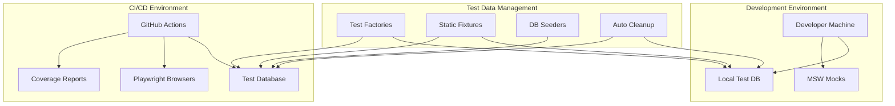
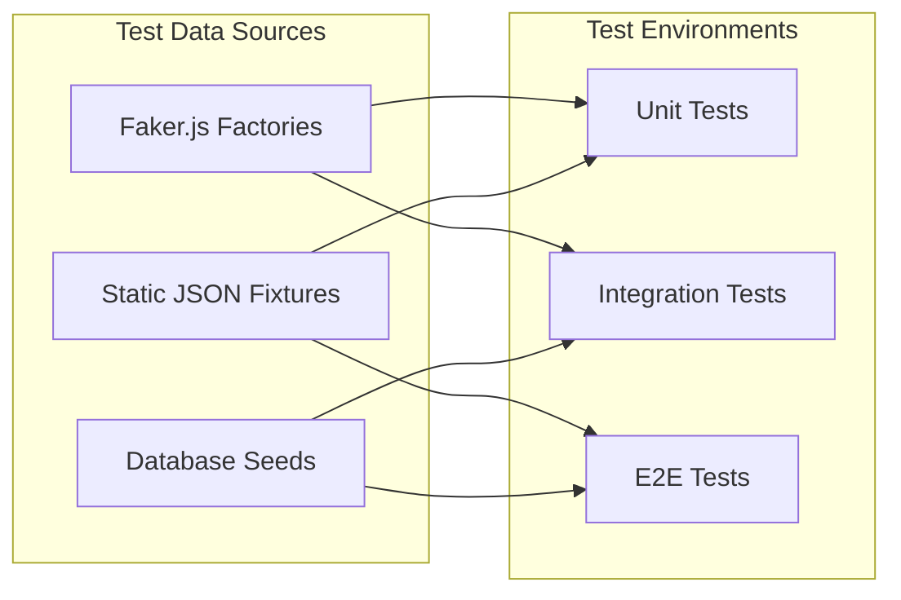

# Testing Strategy Documentation

## Overview

This document outlines the comprehensive testing strategy for the HalluciFix application, covering all aspects of quality assurance from unit tests to end-to-end testing, performance monitoring, and accessibility compliance.

## Testing Philosophy

Our testing approach follows the **Testing Pyramid** principle:
- **70% Unit Tests**: Fast, isolated tests for individual components and functions
- **20% Integration Tests**: Tests for component interactions and API integrations
- **10% End-to-End Tests**: Full user journey validation across browsers

## Testing Framework Architecture

### Core Technologies

| Layer | Technology | Purpose |
|-------|------------|---------|
| Unit Testing | Vitest + React Testing Library | Component and service testing |
| Integration Testing | Vitest + Test Database | API and database testing |
| E2E Testing | Playwright | Cross-browser user journey testing |
| Performance Testing | Playwright + Web Vitals | Performance benchmarking |
| Accessibility Testing | axe-core + Playwright | WCAG compliance validation |
| Visual Testing | Playwright Screenshots | UI regression detection |

### Test Environment Setup



## Testing Layers

### 1. Unit Testing

**Scope**: Individual components, hooks, services, and utility functions
**Tools**: Vitest, React Testing Library, jsdom
**Coverage Target**: 90% for critical modules, 80% overall

#### What to Test:
- Component rendering and props handling
- User interactions (clicks, form submissions)
- State management and side effects
- Service layer business logic
- Utility function edge cases
- Error handling and validation

#### Example Structure:
```typescript
describe('HallucinationAnalyzer', () => {
  describe('Content Analysis', () => {
    it('should analyze content and display results', async () => {
      // Arrange
      const mockContent = 'Test content with suspicious claims';
      
      // Act
      render(<HallucinationAnalyzer />);
      await user.type(screen.getByLabelText(/content/i), mockContent);
      await user.click(screen.getByRole('button', { name: /analyze/i }));
      
      // Assert
      await waitFor(() => {
        expect(screen.getByTestId('analysis-results')).toBeInTheDocument();
      });
    });
  });
});
```

### 2. Integration Testing

**Scope**: Component interactions, API integrations, database operations
**Tools**: Vitest with test database, MSW for external APIs
**Coverage Target**: All critical user workflows

#### What to Test:
- Complete analysis workflow (input → processing → storage → display)
- Authentication flows with real OAuth providers
- Database operations with transactions
- File processing pipelines
- Error handling across service boundaries

#### Example Structure:
```typescript
describe('Analysis Integration', () => {
  beforeEach(async () => {
    await setupTestDatabase();
    await seedTestData();
  });
  
  afterEach(async () => {
    await cleanupTestDatabase();
  });
  
  it('should complete full analysis workflow', async () => {
    const result = await analysisService.analyzeContent(testContent, testUser.id);
    
    expect(result.analysis).toMatchObject({
      accuracy: expect.any(Number),
      riskLevel: expect.stringMatching(/low|medium|high|critical/),
      hallucinations: expect.any(Array)
    });
    
    // Verify database storage
    const storedResult = await supabase
      .from('analysis_results')
      .select('*')
      .eq('id', result.analysis.id)
      .single();
      
    expect(storedResult.data).toBeDefined();
  });
});
```

### 3. End-to-End Testing

**Scope**: Complete user journeys across browsers and devices
**Tools**: Playwright with cross-browser support
**Coverage Target**: All critical user paths

#### What to Test:
- User authentication and session management
- Complete analysis workflows
- Google Drive integration
- Subscription and payment flows
- Mobile responsiveness
- Cross-browser compatibility

#### Example Structure:
```typescript
test.describe('Critical User Journeys', () => {
  test('complete analysis workflow', async ({ page }) => {
    const analyzerPage = new AnalyzerPage(page);
    
    await analyzerPage.goto();
    await analyzerPage.analyzeContent(testContent);
    
    const results = await analyzerPage.getAnalysisResults();
    expect(results.accuracy).toBeGreaterThan(0);
    expect(results.riskLevel).toMatch(/low|medium|high|critical/);
  });
});
```

### 4. Performance Testing

**Scope**: Core Web Vitals, load testing, performance regression detection
**Tools**: Playwright with performance APIs
**Coverage Target**: All critical operations under realistic load

#### Key Metrics:
- **First Contentful Paint (FCP)**: < 2 seconds
- **Largest Contentful Paint (LCP)**: < 2.5 seconds
- **Cumulative Layout Shift (CLS)**: < 0.1
- **First Input Delay (FID)**: < 100ms
- **Analysis Processing Time**: < 10 seconds for typical content

### 5. Accessibility Testing

**Scope**: WCAG 2.1 AA compliance, keyboard navigation, screen reader support
**Tools**: axe-core with Playwright
**Coverage Target**: All user-facing pages and components

#### Key Requirements:
- WCAG 2.1 AA compliance
- Keyboard navigation support
- Screen reader compatibility
- Color contrast ratios
- Focus management
- ARIA labels and roles

## Test Data Management

### Test Data Strategy



### Data Isolation and Cleanup

- **Unit Tests**: Automatic mock reset after each test
- **Integration Tests**: Database transaction rollback
- **E2E Tests**: Test-specific data prefixes with cleanup
- **Parallel Execution**: Isolated test data to prevent conflicts

## CI/CD Integration

### GitHub Actions Workflow

```yaml
name: Comprehensive Test Suite

on: [push, pull_request]

jobs:
  unit-tests:
    runs-on: ubuntu-latest
    steps:
      - name: Run Unit Tests
        run: npm run test:unit
      - name: Upload Coverage
        uses: codecov/codecov-action@v3

  integration-tests:
    runs-on: ubuntu-latest
    services:
      postgres:
        image: postgres:15
    steps:
      - name: Run Integration Tests
        run: npm run test:integration

  e2e-tests:
    runs-on: ubuntu-latest
    strategy:
      matrix:
        browser: [chromium, firefox, webkit]
    steps:
      - name: Install Playwright
        run: npx playwright install --with-deps
      - name: Run E2E Tests
        run: npm run test:e2e:${{ matrix.browser }}

  performance-tests:
    runs-on: ubuntu-latest
    steps:
      - name: Run Performance Tests
        run: npm run test:performance
      - name: Check Performance Budgets
        run: npm run test:performance:check

  accessibility-tests:
    runs-on: ubuntu-latest
    steps:
      - name: Run Accessibility Tests
        run: npm run test:accessibility
```

### Quality Gates

- **Unit Test Coverage**: Minimum 80% overall, 90% for critical modules
- **Integration Test Coverage**: All critical workflows must pass
- **E2E Test Coverage**: All user journeys must pass across browsers
- **Performance Budgets**: Core Web Vitals must meet thresholds
- **Accessibility Compliance**: Zero WCAG violations allowed

## Test Monitoring and Maintenance

### Flaky Test Detection
- Automatic retry mechanisms (max 2 retries)
- Flaky test reporting and tracking
- Regular review and stabilization of unstable tests

### Performance Monitoring
- Test execution time tracking
- Performance regression alerts
- Resource usage optimization

### Test Health Metrics
- Test success rates over time
- Coverage trend analysis
- Test execution performance
- Maintenance burden tracking

## Best Practices

### Test Writing Guidelines

1. **Follow AAA Pattern**: Arrange, Act, Assert
2. **Use Descriptive Names**: Test names should explain the scenario
3. **Keep Tests Isolated**: No dependencies between tests
4. **Test Behavior, Not Implementation**: Focus on user-facing behavior
5. **Use Realistic Data**: Test with data that matches production scenarios

### Code Organization

```
src/
├── components/
│   └── __tests__/           # Component unit tests
├── lib/
│   └── __tests__/           # Service unit tests
├── hooks/
│   └── __tests__/           # Hook unit tests
└── test/
    ├── setup.ts             # Global test setup
    ├── utils/               # Test utilities
    ├── factories/           # Test data factories
    ├── fixtures/            # Static test data
    └── integration/         # Integration tests

e2e/
├── pages/                   # Page object models
├── tests/                   # E2E test suites
├── performance/             # Performance tests
├── accessibility/           # Accessibility tests
└── visual/                  # Visual regression tests
```

### Debugging and Troubleshooting

1. **Use Test Debugging Tools**: Vitest UI, Playwright trace viewer
2. **Isolate Failing Tests**: Run individual tests to identify issues
3. **Check Test Data**: Verify test data setup and cleanup
4. **Review Mock Configurations**: Ensure mocks match expected behavior
5. **Analyze Coverage Reports**: Identify untested code paths

## Continuous Improvement

### Regular Reviews
- Monthly test suite health reviews
- Quarterly testing strategy assessments
- Annual tool and framework evaluations

### Metrics and KPIs
- Test coverage trends
- Test execution performance
- Bug detection effectiveness
- Developer productivity impact

### Training and Documentation
- Regular team training on testing best practices
- Documentation updates with new patterns
- Knowledge sharing sessions on testing techniques

## Conclusion

This comprehensive testing strategy ensures high code quality, reliability, and maintainability of the HalluciFix application. By following these guidelines and maintaining the testing infrastructure, we can deliver a robust product with confidence in every release.

For specific implementation details, refer to the individual testing guides and the codebase documentation.