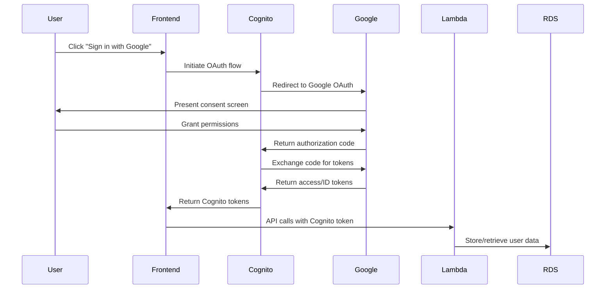

# AWS Cognito OAuth Integration Guide

This document provides comprehensive instructions for integrating Google OAuth with AWS Cognito for the HalluciFix application.

## Overview

The OAuth integration allows users to authenticate using their Google accounts while leveraging AWS Cognito for user management and session handling. This setup provides:

- Secure authentication with Google OAuth 2.0
- User profile synchronization from Google
- Access to Google Drive for document processing
- Centralized user management in AWS Cognito
- Scalable session management

## Architecture



## Prerequisites

1. **AWS Account**: With appropriate permissions for Cognito, Secrets Manager, and CloudFormation
2. **Google Cloud Project**: With OAuth 2.0 credentials configured
3. **AWS CLI**: Configured with the correct profile
4. **CDK**: Installed and bootstrapped in your AWS account

## Step-by-Step Setup

### 1. Google Cloud Console Configuration

#### 1.1 Create OAuth 2.0 Credentials

1. Navigate to [Google Cloud Console](https://console.cloud.google.com/)
2. Select your project or create a new one
3. Enable required APIs:
   ```bash
   gcloud services enable plus.googleapis.com
   gcloud services enable drive.googleapis.com
   gcloud services enable oauth2.googleapis.com
   ```

4. Go to **APIs & Services** > **Credentials**
5. Click **Create Credentials** > **OAuth 2.0 Client IDs**
6. Configure the OAuth client:
   - **Application type**: Web application
   - **Name**: `HalluciFix-{environment}`
   - **Authorized JavaScript origins**:
     - Development: `http://localhost:3000`
     - Production: `https://app.hallucifix.com`
   - **Authorized redirect URIs**:
     - Development: `http://localhost:3000/callback`
     - Production: `https://app.hallucifix.com/callback`
     - Cognito (will be updated after deployment): `https://{cognito-domain}.auth.us-east-1.amazoncognito.com/oauth2/idpresponse`

#### 1.2 Configure OAuth Consent Screen

1. Go to **OAuth consent screen**
2. Configure the consent screen:
   - **Application name**: HalluciFix
   - **User support email**: Your support email
   - **Application logo**: (Optional) Upload your logo
   - **Application home page**: Your application URL
   - **Application privacy policy**: Link to privacy policy
   - **Application terms of service**: Link to terms of service

3. Add scopes:
   - `openid`
   - `email`
   - `profile`
   - `https://www.googleapis.com/auth/drive.readonly`

4. Add test users (for development):
   - Add email addresses that can test the OAuth flow

### 2. AWS Infrastructure Setup

#### 2.1 Store Google OAuth Credentials

Use the provided script to securely store your Google OAuth credentials:

```bash
cd infrastructure
./scripts/setup-google-oauth.sh dev hallucifix YOUR_GOOGLE_CLIENT_ID YOUR_GOOGLE_CLIENT_SECRET
```

This script will:
- Validate the Google Client ID format
- Create or update the secret in AWS Secrets Manager
- Verify the secret was stored correctly

#### 2.2 Deploy Cognito Infrastructure

Deploy the Cognito stack with real Google OAuth credentials:

```bash
./scripts/deploy-cognito.sh dev hallucifix true
```

This will:
- Deploy the Cognito User Pool and Identity Pool
- Configure Google as an identity provider
- Set up the user pool client with OAuth settings
- Create the necessary IAM roles

#### 2.3 Update Redirect URIs

After deployment, you'll need to update the Google OAuth configuration with the actual Cognito domain:

1. Get the Cognito domain from the deployment output
2. Add the Cognito redirect URI to your Google OAuth client:
   ```
   https://{cognito-domain}.auth.us-east-1.amazoncognito.com/oauth2/idpresponse
   ```

### 3. Validation and Testing

#### 3.1 Validate Configuration

Run the validation script to ensure everything is configured correctly:

```bash
./scripts/test-oauth-config.sh dev hallucifix
```

This script will:
- Check that the Google OAuth secret exists
- Verify Cognito User Pool configuration
- Validate identity provider setup
- Generate test OAuth URLs

#### 3.2 Test OAuth Flow

1. Use the generated OAuth URL from the validation script
2. Open it in a browser
3. Complete the Google authentication flow
4. Verify the callback includes an authorization code
5. Check the Cognito User Pool for the new user entry

### 4. Frontend Integration

#### 4.1 Environment Variables

Update your `.env.local` file with the Google Client ID:

```env
VITE_GOOGLE_CLIENT_ID=your_google_client_id_here
```

**Important**: Never include the client secret in frontend environment variables.

#### 4.2 Update Authentication Code

The frontend authentication code will need to be updated to use Cognito instead of Supabase. This is covered in task 3.3 of the migration plan.

## Configuration Files

### AWS Secrets Manager Structure

The Google OAuth credentials are stored in AWS Secrets Manager with the following structure:

```json
{
  "clientId": "123456789-abc123.apps.googleusercontent.com",
  "clientSecret": "your-google-client-secret"
}
```

**Secret Name**: `hallucifix/google-oauth/{environment}`
**Region**: `us-east-1`

### Cognito Configuration

The Cognito User Pool is configured with:

- **Authentication flows**: SRP and password-based
- **Identity providers**: Cognito and Google
- **OAuth scopes**: `openid`, `email`, `profile`
- **OAuth flows**: Authorization code grant and implicit grant
- **Callback URLs**: Environment-specific URLs
- **Logout URLs**: Environment-specific URLs

## Security Considerations

### 1. Credential Protection

- **Client Secret**: Stored only in AWS Secrets Manager
- **Access Control**: IAM policies restrict secret access to necessary services
- **Encryption**: All secrets encrypted at rest with AWS KMS

### 2. OAuth Security

- **PKCE**: Implemented for additional security (handled by Cognito)
- **State Parameter**: Used to prevent CSRF attacks
- **Redirect URI Validation**: Strict validation of redirect URIs
- **Scope Minimization**: Only request necessary permissions

### 3. Session Management

- **Token Expiration**: Configurable token lifetimes
- **Refresh Tokens**: Secure token refresh mechanism
- **Session Invalidation**: Proper logout and session cleanup

## Troubleshooting

### Common Issues

#### 1. `redirect_uri_mismatch`

**Cause**: The redirect URI in the OAuth request doesn't match those configured in Google Cloud Console.

**Solution**:
1. Check the exact redirect URI being used
2. Ensure it matches exactly in Google Cloud Console
3. Include both application and Cognito redirect URIs

#### 2. `invalid_client`

**Cause**: The Google Client ID is incorrect or not properly configured.

**Solution**:
1. Verify the Client ID format: `[numbers]-[string].apps.googleusercontent.com`
2. Check that the secret is properly stored in AWS Secrets Manager
3. Ensure the Cognito stack was deployed with `useRealGoogleCredentials=true`

#### 3. `access_denied`

**Cause**: User denied permissions or OAuth consent screen not properly configured.

**Solution**:
1. Check OAuth consent screen configuration
2. Ensure all required scopes are approved
3. Add test users for development environment

#### 4. Secret Access Errors

**Cause**: Lambda functions can't access the Google OAuth secret.

**Solution**:
1. Check IAM permissions for Lambda execution role
2. Ensure the secret exists in the correct region
3. Verify the secret name matches exactly

### Debugging Commands

```bash
# Check secret exists
aws secretsmanager describe-secret \
    --secret-id "hallucifix/google-oauth/dev" \
    --region us-east-1

# Get Cognito User Pool configuration
aws cognito-idp describe-user-pool \
    --user-pool-id YOUR_USER_POOL_ID \
    --region us-east-1

# List identity providers
aws cognito-idp list-identity-providers \
    --user-pool-id YOUR_USER_POOL_ID \
    --region us-east-1

# Check stack outputs
aws cloudformation describe-stacks \
    --stack-name "Hallucifix-Cognito-dev" \
    --region us-east-1 \
    --query 'Stacks[0].Outputs'
```

## Monitoring and Maintenance

### 1. CloudWatch Metrics

Monitor the following metrics:
- Authentication success/failure rates
- Token refresh rates
- API Gateway request counts
- Lambda function errors

### 2. Regular Maintenance

- **Credential Rotation**: Rotate Google OAuth credentials periodically
- **Access Review**: Review and audit OAuth permissions
- **Security Updates**: Keep OAuth libraries and dependencies updated
- **Monitoring**: Set up alerts for authentication failures

### 3. Cost Optimization

- **Token Caching**: Implement appropriate token caching strategies
- **Connection Pooling**: Use connection pooling for database connections
- **Lambda Optimization**: Optimize Lambda function memory and timeout settings

## Next Steps

After completing the OAuth configuration:

1. **Frontend Integration** (Task 3.3): Update the React application to use Cognito
2. **User Migration** (Task 3.4): Migrate existing users from Supabase to Cognito
3. **Testing** (Task 3.5): Implement comprehensive authentication tests
4. **Monitoring**: Set up CloudWatch dashboards and alerts
5. **Documentation**: Update user-facing documentation

## Support

For additional support:
- Check AWS Cognito documentation
- Review Google OAuth 2.0 documentation
- Consult AWS support for infrastructure issues
- Use the validation scripts for troubleshooting